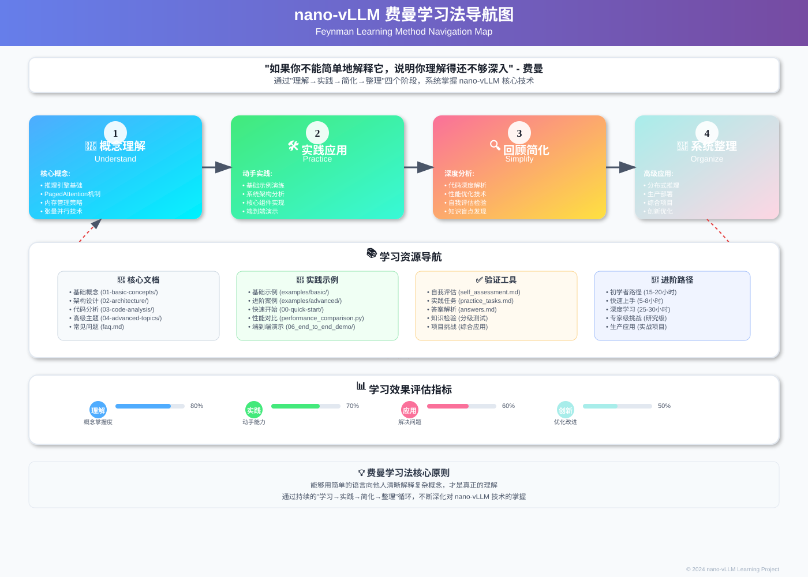

# nano-vLLM-learning 项目

## 🎯 项目核心价值

本项目基于 **nano-vLLM** 开源推理引擎，采用**费曼学习法**设计的系统化学习项目。通过"理解→实践→简化→整理"四个阶段，帮助开发者深入掌握高性能 LLM 推理系统的核心技术。

> **nano-vLLM** 是一个轻量级、高性能的大语言模型推理引擎，专注于 PagedAttention、Continuous Batching 等核心优化技术的简洁实现。

### 🔥 三大核心技术

- **PagedAttention**：革命性的注意力内存管理机制
- **Continuous Batching**：动态批处理优化技术  
- **智能调度**：高效的请求调度和资源分配策略

### 🎓 学习成果

完成学习后，你将能够：
- **深度理解** LLM 推理引擎的核心原理和关键技术
- **独立实现** 基于 PagedAttention 的推理系统
- **熟练应用** 内存优化和性能调优技术
- **具备能力** 向他人清晰解释复杂的技术概念

## 🚀 基于费曼学习法的结构化学习路径

本项目采用费曼学习法（Feynman Technique）设计学习路径，通过"概念理解 → 教学输出 → 回顾简化 → 系统整理"四个阶段，帮助你深入掌握 nano-vLLM 的核心技术。

---

## 📖 费曼四步法学习路径



*费曼学习法可视化导航图：展示完整的学习路径和方法论*

### 🧠 第一步：概念理解 (Understand)
> **目标**：建立对核心技术的基础认知

#### 必学核心概念
- [**基础概念**](./docs/01-basic-concepts/) - 推理引擎、注意力优化、内存管理、张量并行
- [**推理引擎基础**](./docs/01-basic-concepts/inference-engine-basics.md) - LLM推理原理
- [**注意力优化**](./docs/01-basic-concepts/attention-optimization.md) - PagedAttention深度解析
- [**内存管理**](./docs/01-basic-concepts/memory-management.md) - 高效内存管理技术

### 🛠️ 第二步：实践应用 (Practice)  
> **目标**：通过动手实践加深理解

#### 🎯 交互式学习路径 (推荐)
> **Jupyter Notebooks** - 边学边练，即时反馈

- [**📖 00_环境设置和快速开始**](./notebooks/00_环境设置和快速开始.ipynb) - 搭建环境，理解基础概念
- [**📖 01_基础推理和批处理**](./notebooks/01_基础推理和批处理.ipynb) - 掌握tokenization、推理和批处理
- [**📖 02_高级调度和内存管理**](./notebooks/02_高级调度和内存管理.ipynb) - 智能调度和内存优化
- [**📖 03_完整推理流程和端到端系统**](./notebooks/03_完整推理流程和端到端系统.ipynb) - 构建完整推理系统

#### 核心架构实践
- [**系统架构**](./docs/02-architecture/) - 整体设计思路、核心组件、数据流程
- [**核心组件**](./docs/02-architecture/core-components.md) - 关键模块分析
- [**数据流程**](./docs/02-architecture/data-flow.md) - 请求处理流程

#### 代码实践验证
- [**基础示例**](./examples/basic/) - 快速开始、基础用法、引擎使用
- [**进阶示例**](./examples/advanced/) - 调度器、完整推理、端到端演示

### 🔍 第三步：回顾简化 (Simplify)
> **目标**：发现理解盲点，简化复杂概念

#### 代码深度分析
- [**代码分析方法**](./docs/03-code-analysis/README.md) - 系统性代码分析方法
- [**推理引擎实现**](./docs/03-code-analysis/inference-engine.md) - 核心引擎代码解析
- [**注意力机制实现**](./docs/03-code-analysis/attention-mechanism.md) - PagedAttention代码实现
- [**内存管理实现**](./docs/03-code-analysis/memory-manager.md) - 内存管理具体实现

#### 学习效果检验
- [**自我评估**](./docs/self_assessment.md) - 知识点检验，发现盲点
- [**参考答案**](./docs/answers.md) - 深化理解，查漏补缺

### 🎯 第四步：系统整理 (Organize)
> **目标**：系统掌握高级技术，具备实际应用能力

#### 高级技术掌握
- [**架构分析**](./docs/02-architecture/) - 系统架构深度解析
- [**代码分析**](./docs/03-code-analysis/) - 核心代码实现分析
- [**高级示例**](./examples/advanced/) - 进阶实践项目

#### 综合实践项目
- [**实践任务**](./docs/practice_tasks.md) - 分级实践项目，综合应用所学知识

---

## 🎯 学习验证

### 📊 自我评估
- [**知识检验**](./docs/self_assessment.md) - 核心概念掌握度测试
- [**实践验证**](./docs/practice_tasks.md) - 动手能力验证项目

### 🚀 快速开始

#### 环境验证
```bash
# 克隆项目
git clone https://github.com/your-repo/nano-vllm-learning.git
cd nano-vllm-learning

# 安装依赖
pip install -r requirements.txt

# 运行基础示例
python examples/basic/00-quick-start/hello_vllm.py
```

#### 核心概念学习
1. **理解阶段** → 阅读 [基础概念文档](./docs/01-basic-concepts/)
2. **实践阶段** → 运行 [基础示例](./examples/basic/) 或 [交互式Notebooks](./notebooks/)
3. **简化阶段** → 完成 [自我评估](./docs/self_assessment.md)
4. **整理阶段** → 挑战 [实践任务](./docs/practice_tasks.md)

#### 🚀 两种学习方式

##### 📖 交互式学习 (推荐新手)
```bash
# 启动Jupyter Notebook
jupyter notebook notebooks/

# 或使用Google Colab
# 直接在浏览器中打开notebooks目录下的.ipynb文件
```

##### 💻 代码实践学习
```bash
# 运行基础示例
python examples/basic/00-quick-start/hello_vllm.py
```

---

## 📖 交互式学习路径详解

### 🎯 Jupyter Notebooks 学习指南

我们提供了完整的交互式学习路径，通过 Jupyter Notebooks 让你边学边练，获得即时反馈：

#### 📚 学习路径规划

| Notebook | 学习目标 | 难度 | 预计时间 | 适合人群 |
|----------|----------|------|----------|----------|
| [**00_环境设置和快速开始**](./notebooks/00_环境设置和快速开始.ipynb) | 环境搭建，基础概念 | ⭐ | 30-45分钟 | 初学者 |
| [**01_基础推理和批处理**](./notebooks/01_基础推理和批处理.ipynb) | Tokenization，推理引擎 | ⭐⭐ | 60-90分钟 | 有Python基础 |
| [**02_高级调度和内存管理**](./notebooks/02_高级调度和内存管理.ipynb) | 智能调度，内存优化 | ⭐⭐⭐ | 90-120分钟 | 有系统设计经验 |
| [**03_完整推理流程和端到端系统**](./notebooks/03_完整推理流程和端到端系统.ipynb) | 端到端系统构建 | ⭐⭐⭐⭐ | 120-150分钟 | 高级开发者 |

#### 🚀 快速开始 Notebooks

```bash
# 方式1: 本地运行
git clone https://github.com/your-repo/nano-vllm-learning.git
cd nano-vllm-learning
pip install -r requirements.txt
jupyter notebook notebooks/

# 方式2: Google Colab (推荐)
# 直接在浏览器中打开任意 .ipynb 文件
# 点击 "Open in Colab" 按钮即可开始学习
```

#### 💡 学习建议

- **循序渐进**：按照编号顺序学习，每个notebook都基于前面的知识
- **动手实践**：不要只看代码，一定要运行每个代码单元格
- **参数实验**：尝试修改参数，观察结果变化
- **笔记记录**：在notebook中添加你的理解和思考

---

## 💡 高效学习策略

基于费曼学习法的四步循环：

1. **理解** (Understand) - 学习核心概念，建立知识框架
2. **简化** (Simplify) - 用简单语言解释复杂概念
3. **实践** (Practice) - 通过代码验证理解程度
4. **验证** (Verify) - 检验学习效果，发现盲点

### 🔧 实用技巧
- **调试技巧**：使用日志和断点分析代码执行流程
- **参数实验**：修改关键参数观察性能变化
- **对比学习**：与其他推理框架对比理解设计差异

---

## 📚 学习资源

### 核心文档
- [**常见问题**](./docs/faq.md) - 学习过程中的疑难解答
- [**自我评估**](./docs/self_assessment.md) - 检验学习成果
- [**实践任务**](./docs/practice_tasks.md) - 动手练习巩固理解
- [**答案解析**](./docs/answers.md) - 实践任务参考答案

### 📖 相关论文
- [Attention Is All You Need](https://arxiv.org/abs/1706.03762) - Transformer架构基础
- [PagedAttention](https://arxiv.org/abs/2309.06180) - 高效注意力机制
- [Continuous Batching](https://arxiv.org/abs/2308.16369) - 动态批处理技术

### 🔗 相关项目
- [vLLM](https://github.com/vllm-project/vllm) - 原始vLLM项目
- [TensorRT-LLM](https://github.com/NVIDIA/TensorRT-LLM) - NVIDIA推理优化
- [Text Generation Inference](https://github.com/huggingface/text-generation-inference) - HuggingFace推理服务

---

## 🎯 学习验证

### 📝 自我评估
- [**知识检验**](./docs/self_assessment.md) - 测试核心概念掌握程度
- [**实践任务**](./docs/practice_tasks.md) - 验证动手实践能力

### 🆘 获得帮助
- [**常见问题**](./docs/faq.md) - 学习过程中的常见问题解答
- [**自我评估**](./docs/self_assessment.md) - 检验学习效果

---

## 📄 许可证

本项目采用 [MIT 许可证](LICENSE)。

---

**🚀 开始您的 nano-vLLM 学习之旅吧！选择适合您的学习路径，逐步掌握现代 LLM 推理系统的精髓。**