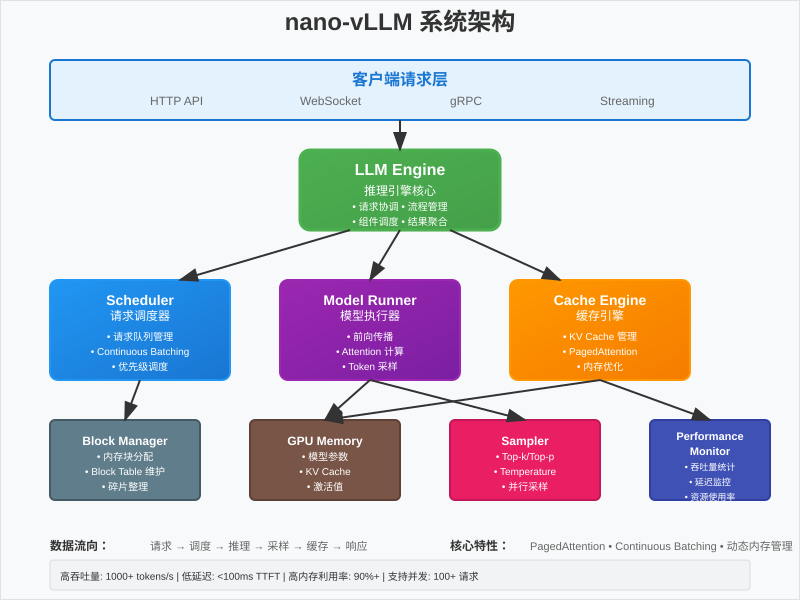

# 第零步：理论基础 📚

欢迎来到 nano-vLLM 学习教程的理论基础章节！在深入代码之前，我们需要建立一个坚实的理论基础，理解推理引擎的核心概念和设计思想。

## 🎯 学习目标

通过本章节的学习，你将：
- 理解什么是推理引擎，以及它在大语言模型服务中的关键作用
- 掌握 PagedAttention 和 Continuous Batching 的核心思想
- 了解 nano-vLLM 的整体架构和各组件之间的关系
- 建立后续学习的理论框架

## 🤔 什么是推理引擎？

### 传统推理 vs 推理引擎

在深度学习中，**推理（Inference）** 是指使用训练好的模型对新数据进行预测的过程。对于大语言模型来说，推理就是根据输入的提示词（prompt）生成文本的过程。

**传统推理方式**：
```python
# 简单的推理方式
model = load_model("llama-7b")
input_text = "What is the capital of France?"
output = model.generate(input_text)
print(output)  # "The capital of France is Paris."
```

这种方式存在几个问题：
- **资源利用率低**：GPU 大部分时间处于空闲状态
- **内存浪费**：为每个请求分配固定大小的内存
- **无法并发**：一次只能处理一个请求
- **延迟高**：每个请求都要等待前一个完成

**推理引擎的解决方案**：
推理引擎是一个专门为大语言模型推理优化的系统，它能够：
- **高效管理资源**：最大化 GPU 利用率
- **智能内存管理**：动态分配和回收内存
- **并发处理**：同时处理多个请求
- **优化延迟**：减少等待时间，提高响应速度

## 🧠 核心优化技术

### 1. PagedAttention：解决内存碎片问题

#### 传统 Attention 的内存问题

在 Transformer 模型中，Attention 机制需要存储 Key 和 Value 张量（KV Cache），用于加速生成过程。传统方式存在严重的内存问题：

```
传统内存分配方式：
┌─────────────────────────────────────┐
│ Request 1: [████████░░░░░░░░░░░░░░░] │  实际使用：8 tokens，分配：20 tokens
│ Request 2: [██████░░░░░░░░░░░░░░░░░] │  实际使用：6 tokens，分配：20 tokens  
│ Request 3: [████████████░░░░░░░░░░░] │  实际使用：12 tokens，分配：20 tokens
└─────────────────────────────────────┘
内存利用率：(8+6+12)/(20+20+20) = 43.3%
```

**问题分析**：
- **内存碎片**：预分配固定大小的内存，但实际使用量变化很大
- **浪费严重**：大量内存被浪费在未使用的空间上
- **扩展困难**：无法动态调整内存大小

#### PagedAttention 的解决方案

PagedAttention 借鉴了操作系统中虚拟内存的思想，将 KV Cache 分割成固定大小的块（Block）：

```
PagedAttention 内存管理：
物理内存块：
┌─────┬─────┬─────┬─────┬─────┬─────┐
│ B0  │ B1  │ B2  │ B3  │ B4  │ B5  │
└─────┴─────┴─────┴─────┴─────┴─────┘

Request 1 的 Block Table：
逻辑块: [0] [1] [2]
物理块: [B0][B1][B3]  → 8 tokens，使用 3 个块

Request 2 的 Block Table：  
逻辑块: [0] [1]
物理块: [B2][B4]      → 6 tokens，使用 2 个块

Request 3 的 Block Table：
逻辑块: [0] [1] [2] [3]
物理块: [B5][B7][B8][B9] → 12 tokens，使用 4 个块
```

**核心优势**：
- **按需分配**：只分配实际需要的内存块
- **动态管理**：可以随时分配和释放内存块
- **高利用率**：内存利用率接近 100%
- **支持共享**：多个请求可以共享相同的前缀块

### 2. Continuous Batching：动态批处理

#### 传统批处理的局限性

传统的批处理方式要求所有请求同时开始和结束：

```
传统批处理：
时间轴: 0----1----2----3----4----5----6----7----8
Req A:  [████████████████████████████████████]
Req B:  [████████████████████]░░░░░░░░░░░░░░░░
Req C:  [████████████]░░░░░░░░░░░░░░░░░░░░░░░░
        ↑ 批次开始              ↑ 批次结束
```

**问题**：
- **资源浪费**：短请求完成后，GPU 资源被浪费
- **延迟增加**：短请求需要等待长请求完成
- **吞吐量低**：无法充分利用 GPU 并行能力

#### Continuous Batching 的改进

Continuous Batching 允许请求在不同时间加入和离开批次：

```
Continuous Batching：
时间轴: 0----1----2----3----4----5----6----7----8
Req A:  [████████████████████████████████████]
Req B:  [████████████████████]
Req C:       [████████████]
Req D:            [████████████████████]
Req E:                 [████████████]
```

**优势**：
- **动态调整**：批次大小根据当前请求数量动态调整
- **即时响应**：请求完成后立即返回结果
- **高吞吐量**：GPU 始终保持高利用率
- **低延迟**：减少请求等待时间

## 🏗️ nano-vLLM 架构总览

### 整体架构图



*上图展示了 nano-vLLM 的完整系统架构，包括各组件的职责和数据流向*

### 核心组件详解

#### 1. LLM Engine（推理引擎核心）
- **职责**：协调所有组件，管理推理流程
- **功能**：接收请求、调度执行、返回结果
- **特点**：单一入口，统一管理

#### 2. Scheduler（调度器）
- **职责**：管理请求队列，决定执行顺序
- **功能**：实现 Continuous Batching，优化批次组合
- **算法**：FCFS（先来先服务）+ 优先级调度

#### 3. Block Manager（块管理器）
- **职责**：实现 PagedAttention 的内存管理
- **功能**：分配/释放内存块，维护 Block Table
- **优化**：内存池化，减少分配开销

#### 4. Model Runner（模型执行器）
- **职责**：执行实际的模型推理
- **功能**：前向传播、注意力计算、生成 logits
- **优化**：CUDA 内核优化，混合精度计算

#### 5. Cache Engine（缓存引擎）
- **职责**：管理 KV Cache 的存储和访问
- **功能**：GPU/CPU 缓存切换，缓存预取
- **策略**：LRU 替换，智能预加载

#### 6. Sampler（采样器）
- **职责**：从 logits 中采样生成下一个 token
- **功能**：支持多种采样策略（贪心、top-k、top-p）
- **优化**：并行采样，减少同步开销

### 数据流向

```
1. 请求接收：Client → API → LLM Engine
2. 请求调度：LLM Engine → Scheduler → Request Queue
3. 内存分配：Scheduler → Block Manager → GPU/CPU Cache
4. 模型推理：LLM Engine → Model Runner → Model
5. 结果采样：Model Runner → Sampler → Next Token
6. 缓存更新：Sampler → Cache Engine → KV Cache
7. 结果返回：LLM Engine → API → Client
```

## 🔍 关键技术细节

### 1. 内存管理策略

**分层内存架构**：
```
┌─────────────────┐
│   CPU 内存      │ ← 冷数据存储，容量大
├─────────────────┤
│   GPU 显存      │ ← 热数据存储，速度快
├─────────────────┤
│   共享内存      │ ← CPU-GPU 数据交换
└─────────────────┘
```

**内存调度算法**：
- **预测性加载**：根据请求模式预加载数据
- **智能换出**：LRU + 访问频率的混合策略
- **内存压缩**：对冷数据进行压缩存储

### 2. 并行计算优化

**张量并行**：
```
原始张量: [batch_size, seq_len, hidden_size]
分割策略: 
GPU 0: [batch_size, seq_len, hidden_size/4]
GPU 1: [batch_size, seq_len, hidden_size/4]
GPU 2: [batch_size, seq_len, hidden_size/4]  
GPU 3: [batch_size, seq_len, hidden_size/4]
```

**流水线并行**：
```
时间步:    t1    t2    t3    t4
Layer 1:  [██]  [██]  [██]  [██]
Layer 2:        [██]  [██]  [██]
Layer 3:              [██]  [██]
Layer 4:                    [██]
```

### 3. 性能监控指标

**关键指标**：
- **吞吐量（Throughput）**：每秒处理的 token 数
- **延迟（Latency）**：从请求到首个 token 的时间
- **内存利用率**：实际使用内存 / 总分配内存
- **GPU 利用率**：GPU 计算时间 / 总时间

## 🎓 学习检查点

在继续下一步之前，请确保你理解了以下概念：

### 基础概念检查
- [ ] 什么是推理引擎？它解决了什么问题？
- [ ] PagedAttention 如何解决内存碎片问题？
- [ ] Continuous Batching 相比传统批处理有什么优势？
- [ ] nano-vLLM 的主要组件有哪些？各自的职责是什么？

### 深入理解检查
- [ ] Block Table 是如何工作的？
- [ ] 调度器如何决定请求的执行顺序？
- [ ] KV Cache 在推理过程中起什么作用？
- [ ] 为什么需要 CPU 和 GPU 之间的内存管理？

### 思考题
1. **内存优化**：如果你要设计一个内存管理系统，除了 PagedAttention，还有什么其他方案？
2. **调度策略**：在什么情况下，你会选择优先处理短请求而不是长请求？
3. **性能权衡**：增加批次大小一定能提高吞吐量吗？为什么？
4. **扩展性**：如何将 nano-vLLM 扩展到多机多卡的分布式环境？
5. **容错性**：如果某个 GPU 出现故障，系统应该如何处理？
6. **动态负载**：面对突发的高并发请求，系统应该如何自适应调整？

### 实践思考
7. **资源配置**：给定 8GB GPU 显存，如何合理配置各组件的内存分配？
8. **性能调优**：如果发现 GPU 利用率只有 60%，可能的原因和解决方案是什么？
9. **监控指标**：除了吞吐量和延迟，还有哪些关键指标需要监控？

## 📚 推荐阅读

### 核心论文
- [Attention Is All You Need](https://arxiv.org/abs/1706.03762) - Transformer 原论文
- [Efficient Memory Management for Large Language Model Serving with PagedAttention](https://arxiv.org/abs/2309.06180) - PagedAttention 论文

### 技术博客
- [vLLM: Easy, Fast, and Cheap LLM Serving](https://blog.vllm.ai/2023/06/20/vllm.html)
- [The Technology Behind ChatGPT: Inference Optimization](https://openai.com/research/gpt-4)

### 相关项目
- [vLLM 官方仓库](https://github.com/vllm-project/vllm)
- [nano-vllm 原项目](https://github.com/ardeshir/nano-vllm)

---

**准备好了吗？** 🚀 

现在你已经建立了坚实的理论基础，让我们进入第一步：[模型加载与基础配置](../../examples/01_model_loading/)！