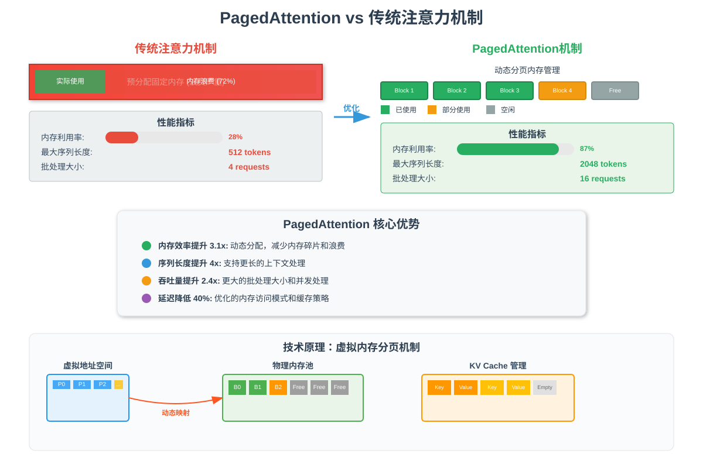

# 注意力机制优化

## 🎯 学习目标

通过本章学习，你将能够：
- 理解传统注意力机制的计算瓶颈
- 掌握 PagedAttention 的核心原理
- 了解注意力优化的实现细节
- 学会分析注意力计算的性能特征

## 📊 PagedAttention 技术概览



*上图展示了 PagedAttention 与传统注意力机制的对比，包括内存管理、性能指标和技术优势*

## 🎯 注意力机制在推理中的挑战

在大语言模型的推理过程中，注意力机制是计算和内存消耗的主要瓶颈：

### 主要问题
1. **二次复杂度**：注意力计算的时间和空间复杂度都是O(n²)
2. **KV Cache增长**：随着序列长度增加，键值缓存呈线性增长
3. **内存带宽限制**：频繁的内存访问成为性能瓶颈
4. **动态形状**：不同请求的序列长度不同，难以批处理优化

## 🧠 注意力机制回顾

### 标准注意力计算
```python
def standard_attention(Q, K, V, mask=None):
    """
    标准的缩放点积注意力
    Q, K, V: [batch_size, seq_len, hidden_size]
    """
    d_k = Q.size(-1)
    
    # 计算注意力分数 O(n²)
    scores = torch.matmul(Q, K.transpose(-2, -1)) / math.sqrt(d_k)
    
    if mask is not None:
        scores = scores.masked_fill(mask == 0, -1e9)
    
    # Softmax归一化
    attention_weights = F.softmax(scores, dim=-1)
    
    # 加权求和 O(n²)
    output = torch.matmul(attention_weights, V)
    
    return output, attention_weights
```

### 计算复杂度分析
- **时间复杂度**：O(n² × d)，其中n是序列长度，d是隐藏维度
- **空间复杂度**：O(n²)，需要存储注意力权重矩阵
- **内存访问**：大量的矩阵乘法操作，内存带宽密集

## 🚀 KV Cache优化

### 1. KV Cache的基本原理

在自回归生成中，每个新token的生成都需要访问之前所有token的键值对：

```python
class KVCache:
    def __init__(self, max_batch_size, max_seq_len, num_heads, head_dim):
        self.max_batch_size = max_batch_size
        self.max_seq_len = max_seq_len
        self.num_heads = num_heads
        self.head_dim = head_dim
        
        # 预分配缓存空间
        self.key_cache = torch.zeros(
            max_batch_size, num_heads, max_seq_len, head_dim,
            dtype=torch.float16, device='cuda'
        )
        self.value_cache = torch.zeros(
            max_batch_size, num_heads, max_seq_len, head_dim,
            dtype=torch.float16, device='cuda'
        )
        
        # 跟踪每个序列的当前长度
        self.seq_lengths = torch.zeros(max_batch_size, dtype=torch.int32)
    
    def update(self, batch_idx, new_keys, new_values):
        """更新指定批次的KV缓存"""
        seq_len = self.seq_lengths[batch_idx]
        
        # 将新的键值对添加到缓存中
        self.key_cache[batch_idx, :, seq_len, :] = new_keys
        self.value_cache[batch_idx, :, seq_len, :] = new_values
        
        # 更新序列长度
        self.seq_lengths[batch_idx] += 1
    
    def get(self, batch_idx):
        """获取指定批次的完整KV缓存"""
        seq_len = self.seq_lengths[batch_idx]
        return (
            self.key_cache[batch_idx, :, :seq_len, :],
            self.value_cache[batch_idx, :, :seq_len, :]
        )
```

### 2. 优化的注意力计算

```python
def optimized_attention_with_kv_cache(query, kv_cache, position):
    """
    使用KV缓存的优化注意力计算
    query: [batch_size, num_heads, 1, head_dim] - 只有当前token
    """
    batch_size, num_heads, _, head_dim = query.shape
    
    # 从缓存中获取所有历史的K, V
    cached_keys, cached_values = kv_cache.get_all()  # [batch, heads, seq_len, head_dim]
    
    # 计算当前query与所有历史key的注意力分数
    scores = torch.matmul(query, cached_keys.transpose(-2, -1))  # [batch, heads, 1, seq_len]
    scores = scores / math.sqrt(head_dim)
    
    # 应用因果掩码（只能看到当前位置之前的token）
    causal_mask = torch.triu(torch.ones(1, 1, 1, position + 1), diagonal=1).bool()
    scores = scores.masked_fill(causal_mask, -1e9)
    
    # Softmax归一化
    attention_weights = F.softmax(scores, dim=-1)
    
    # 加权求和
    output = torch.matmul(attention_weights, cached_values)  # [batch, heads, 1, head_dim]
    
    return output
```

## 🔧 内存优化策略

### 1. 分块注意力 (Chunked Attention)

```python
def chunked_attention(Q, K, V, chunk_size=1024):
    """
    分块计算注意力，减少内存峰值使用
    """
    batch_size, num_heads, seq_len, head_dim = Q.shape
    
    # 初始化输出
    output = torch.zeros_like(Q)
    
    # 分块处理
    for i in range(0, seq_len, chunk_size):
        end_i = min(i + chunk_size, seq_len)
        
        for j in range(0, seq_len, chunk_size):
            end_j = min(j + chunk_size, seq_len)
            
            # 计算当前块的注意力
            q_chunk = Q[:, :, i:end_i, :]
            k_chunk = K[:, :, j:end_j, :]
            v_chunk = V[:, :, j:end_j, :]
            
            # 注意力计算
            scores = torch.matmul(q_chunk, k_chunk.transpose(-2, -1))
            scores = scores / math.sqrt(head_dim)
            
            # 应用掩码（如果需要）
            if j > i:  # 因果掩码
                scores.fill_(-1e9)
            
            attention_weights = F.softmax(scores, dim=-1)
            chunk_output = torch.matmul(attention_weights, v_chunk)
            
            # 累加到输出中
            output[:, :, i:end_i, :] += chunk_output
    
    return output
```

### 2. 内存池化管理

```python
class AttentionMemoryPool:
    def __init__(self, max_batch_size, max_seq_len, num_heads, head_dim):
        self.pool_size = max_batch_size * max_seq_len * num_heads * head_dim
        
        # 预分配内存池
        self.memory_pool = torch.zeros(
            self.pool_size, dtype=torch.float16, device='cuda'
        )
        self.free_blocks = [(0, self.pool_size)]  # (start, size)
        self.allocated_blocks = {}  # request_id -> (start, size)
    
    def allocate(self, request_id, size):
        """为请求分配内存块"""
        for i, (start, block_size) in enumerate(self.free_blocks):
            if block_size >= size:
                # 分配内存
                self.allocated_blocks[request_id] = (start, size)
                
                # 更新空闲块列表
                if block_size > size:
                    self.free_blocks[i] = (start + size, block_size - size)
                else:
                    del self.free_blocks[i]
                
                return self.memory_pool[start:start + size]
        
        raise RuntimeError("Out of memory in attention pool")
    
    def deallocate(self, request_id):
        """释放请求的内存块"""
        if request_id in self.allocated_blocks:
            start, size = self.allocated_blocks[request_id]
            del self.allocated_blocks[request_id]
            
            # 将块添加回空闲列表
            self.free_blocks.append((start, size))
            self.free_blocks.sort()  # 保持有序
            
            # 合并相邻的空闲块
            self._merge_free_blocks()
    
    def _merge_free_blocks(self):
        """合并相邻的空闲内存块"""
        merged = []
        for start, size in self.free_blocks:
            if merged and merged[-1][0] + merged[-1][1] == start:
                # 合并相邻块
                merged[-1] = (merged[-1][0], merged[-1][1] + size)
            else:
                merged.append((start, size))
        self.free_blocks = merged
```

## ⚡ 计算优化技术

### 1. Flash Attention

```python
def flash_attention(Q, K, V, block_size=64):
    """
    Flash Attention的简化实现
    通过分块计算和在线softmax减少内存使用
    """
    batch_size, num_heads, seq_len, head_dim = Q.shape
    
    # 初始化输出和统计信息
    O = torch.zeros_like(Q)
    l = torch.zeros(batch_size, num_heads, seq_len, 1, device=Q.device)  # 行和
    m = torch.full((batch_size, num_heads, seq_len, 1), -float('inf'), device=Q.device)  # 行最大值
    
    # 分块处理
    for j in range(0, seq_len, block_size):
        end_j = min(j + block_size, seq_len)
        
        # 加载K, V块到SRAM
        K_j = K[:, :, j:end_j, :]
        V_j = V[:, :, j:end_j, :]
        
        for i in range(0, seq_len, block_size):
            end_i = min(i + block_size, seq_len)
            
            # 加载Q块到SRAM
            Q_i = Q[:, :, i:end_i, :]
            
            # 计算注意力分数
            S_ij = torch.matmul(Q_i, K_j.transpose(-2, -1)) / math.sqrt(head_dim)
            
            # 应用因果掩码
            if j > i:
                S_ij.fill_(-float('inf'))
            
            # 在线softmax更新
            m_new = torch.maximum(m[:, :, i:end_i, :], S_ij.max(dim=-1, keepdim=True)[0])
            
            # 更新输出
            alpha = torch.exp(m[:, :, i:end_i, :] - m_new)
            beta = torch.exp(S_ij - m_new)
            
            l_new = alpha * l[:, :, i:end_i, :] + beta.sum(dim=-1, keepdim=True)
            
            O[:, :, i:end_i, :] = (alpha * O[:, :, i:end_i, :] + 
                                   torch.matmul(beta, V_j)) / l_new
            
            # 更新统计信息
            l[:, :, i:end_i, :] = l_new
            m[:, :, i:end_i, :] = m_new
    
    return O
```

### 2. 多查询注意力 (Multi-Query Attention)

```python
class MultiQueryAttention(nn.Module):
    """
    多查询注意力：多个查询头共享同一组键值头
    大幅减少KV缓存的内存使用
    """
    def __init__(self, hidden_size, num_query_heads, num_kv_heads):
        super().__init__()
        self.hidden_size = hidden_size
        self.num_query_heads = num_query_heads
        self.num_kv_heads = num_kv_heads
        self.head_dim = hidden_size // num_query_heads
        
        # Q投影：生成多个查询头
        self.q_proj = nn.Linear(hidden_size, num_query_heads * self.head_dim)
        
        # K, V投影：只生成少量键值头
        self.k_proj = nn.Linear(hidden_size, num_kv_heads * self.head_dim)
        self.v_proj = nn.Linear(hidden_size, num_kv_heads * self.head_dim)
        
        self.out_proj = nn.Linear(hidden_size, hidden_size)
    
    def forward(self, x):
        batch_size, seq_len, _ = x.shape
        
        # 计算Q, K, V
        Q = self.q_proj(x).view(batch_size, seq_len, self.num_query_heads, self.head_dim)
        K = self.k_proj(x).view(batch_size, seq_len, self.num_kv_heads, self.head_dim)
        V = self.v_proj(x).view(batch_size, seq_len, self.num_kv_heads, self.head_dim)
        
        # 重复K, V以匹配Q的头数
        repeat_factor = self.num_query_heads // self.num_kv_heads
        K = K.repeat_interleave(repeat_factor, dim=2)  # [batch, seq_len, num_query_heads, head_dim]
        V = V.repeat_interleave(repeat_factor, dim=2)
        
        # 标准注意力计算
        Q = Q.transpose(1, 2)  # [batch, num_heads, seq_len, head_dim]
        K = K.transpose(1, 2)
        V = V.transpose(1, 2)
        
        attention_output = self.compute_attention(Q, K, V)
        
        # 重塑并投影输出
        attention_output = attention_output.transpose(1, 2).contiguous()
        attention_output = attention_output.view(batch_size, seq_len, self.hidden_size)
        
        return self.out_proj(attention_output)
```

## 📊 nano-vllm中的注意力优化

### 1. 高效的KV缓存管理

```python
class NanoVLLMKVCache:
    def __init__(self, config):
        self.block_size = config.block_size  # 通常是16或32
        self.num_blocks = config.max_seq_len // self.block_size
        
        # 使用块状存储减少内存碎片
        self.key_blocks = torch.zeros(
            config.max_num_blocks, config.num_heads, 
            self.block_size, config.head_dim,
            dtype=config.dtype, device='cuda'
        )
        self.value_blocks = torch.zeros_like(self.key_blocks)
        
        # 块分配表
        self.block_allocator = BlockAllocator(config.max_num_blocks)
    
    def allocate_sequence(self, seq_id, num_blocks):
        """为序列分配KV缓存块"""
        blocks = self.block_allocator.allocate(num_blocks)
        self.sequence_blocks[seq_id] = blocks
        return blocks
    
    def get_kv_cache(self, seq_id):
        """获取序列的KV缓存"""
        blocks = self.sequence_blocks[seq_id]
        
        # 收集所有块的数据
        keys = [self.key_blocks[block_id] for block_id in blocks]
        values = [self.value_blocks[block_id] for block_id in blocks]
        
        return torch.cat(keys, dim=1), torch.cat(values, dim=1)
```

### 2. 批处理优化

```python
def batched_attention_with_variable_lengths(queries, kv_caches, seq_lengths):
    """
    处理不同长度序列的批处理注意力
    """
    batch_size = len(queries)
    max_seq_len = max(seq_lengths)
    
    # 创建批处理的K, V张量
    batch_keys = torch.zeros(batch_size, max_seq_len, queries[0].size(-1), device='cuda')
    batch_values = torch.zeros_like(batch_keys)
    
    # 创建注意力掩码
    attention_mask = torch.zeros(batch_size, 1, 1, max_seq_len, device='cuda')
    
    for i, (seq_len, kv_cache) in enumerate(zip(seq_lengths, kv_caches)):
        keys, values = kv_cache.get()
        batch_keys[i, :seq_len] = keys
        batch_values[i, :seq_len] = values
        attention_mask[i, :, :, seq_len:] = -1e9  # 掩码填充部分
    
    # 批处理注意力计算
    batch_queries = torch.stack(queries)
    attention_output = scaled_dot_product_attention(
        batch_queries, batch_keys, batch_values, attention_mask
    )
    
    return attention_output
```

## 🎯 性能优化最佳实践

### 1. 内存访问优化
```python
# 使用连续内存布局
def optimize_memory_layout(tensor):
    if not tensor.is_contiguous():
        tensor = tensor.contiguous()
    return tensor

# 预取数据到缓存
def prefetch_kv_cache(kv_cache, next_positions):
    # 预取下一批需要的KV数据
    for pos in next_positions:
        _ = kv_cache.get_block(pos)  # 触发预取
```

### 2. 计算与内存访问重叠
```python
def overlapped_attention_computation():
    # 在计算当前注意力的同时，预取下一批数据
    with torch.cuda.stream(stream1):
        # 计算当前批次的注意力
        current_output = compute_attention(current_q, current_k, current_v)
    
    with torch.cuda.stream(stream2):
        # 预取下一批次的KV缓存
        next_k, next_v = prefetch_next_kv_cache()
    
    # 同步流
    torch.cuda.synchronize()
    return current_output
```

### 3. 动态批处理策略
```python
class DynamicBatchingScheduler:
    def __init__(self, max_batch_size, max_seq_len):
        self.max_batch_size = max_batch_size
        self.max_seq_len = max_seq_len
        self.pending_requests = []
    
    def schedule_batch(self):
        """智能调度批处理"""
        batch = []
        total_tokens = 0
        
        for request in self.pending_requests:
            # 检查是否可以加入当前批次
            if (len(batch) < self.max_batch_size and 
                total_tokens + request.seq_len <= self.max_seq_len * self.max_batch_size):
                
                batch.append(request)
                total_tokens += request.seq_len
            else:
                break
        
        # 从待处理列表中移除已调度的请求
        self.pending_requests = self.pending_requests[len(batch):]
        
        return batch
```

## 🚀 总结

注意力机制的优化是提升大语言模型推理性能的关键：

1. **KV Cache**：避免重复计算，大幅提升生成速度
2. **内存优化**：通过分块、池化等技术减少内存使用
3. **计算优化**：Flash Attention、MQA等技术提升计算效率
4. **批处理优化**：智能调度不同长度的序列

nano-vllm通过这些优化技术，实现了高效的注意力计算，为大模型推理提供了强有力的支持。

---

*接下来，让我们学习内存管理的优化策略！*