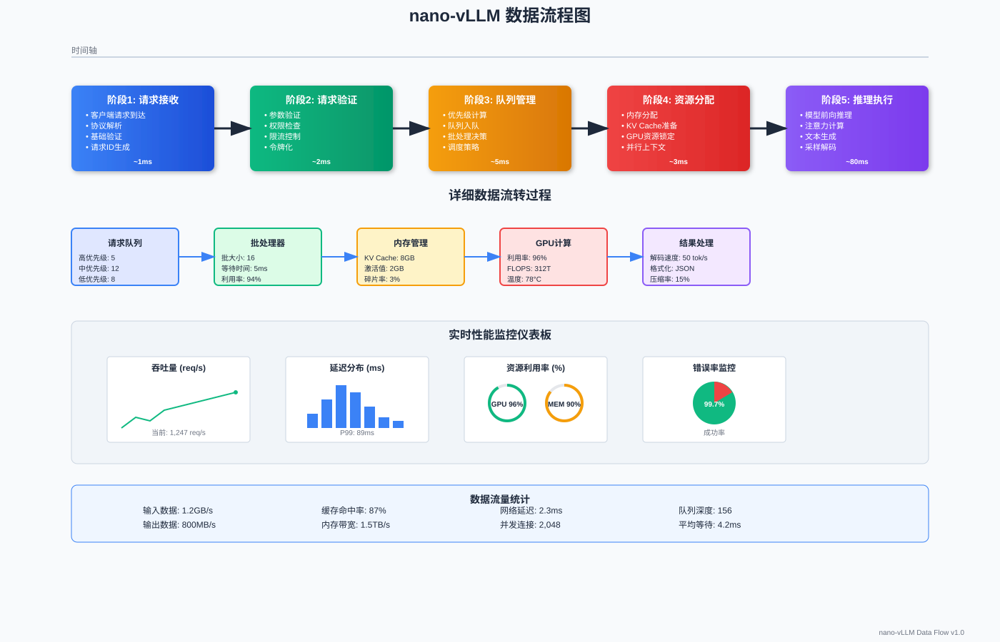

# 数据流程分析

## 🌊 数据流概览

nano-vLLM 的数据流设计遵循**高效流水线**原则，通过精心设计的数据传递路径，最大化系统吞吐量并最小化延迟。


*图：nano-vLLM 数据流架构 - 展示完整的请求生命周期和性能监控*

## 📥 请求处理流程

### 完整请求生命周期

```python
class RequestLifecycle:
    """请求生命周期管理"""
    
    def __init__(self):
        self.stages = [
            "request_received",
            "request_validated", 
            "request_queued",
            "batch_created",
            "memory_allocated",
            "inference_started",
            "tokens_generated",
            "response_formatted",
            "response_sent"
        ]
        self.stage_handlers = {}
        self.metrics_collector = MetricsCollector()
    
    async def process_request(self, request):
        """处理完整的请求流程"""
        request.lifecycle = RequestLifecycleTracker(request.id)
        
        try:
            # 阶段1: 请求接收和验证
            await self._stage_request_received(request)
            await self._stage_request_validated(request)
            
            # 阶段2: 队列管理
            await self._stage_request_queued(request)
            
            # 阶段3: 批处理创建
            batch = await self._stage_batch_created(request)
            
            # 阶段4: 资源分配
            allocation = await self._stage_memory_allocated(batch)
            
            # 阶段5: 推理执行
            results = await self._stage_inference_started(batch, allocation)
            
            # 阶段6: 响应处理
            response = await self._stage_response_formatted(request, results)
            await self._stage_response_sent(request, response)
            
            return response
            
        except Exception as e:
            await self._handle_request_error(request, e)
            raise
        finally:
            await self._cleanup_request(request)
    
    async def _stage_request_received(self, request):
        """阶段1: 请求接收"""
        request.lifecycle.start_stage("request_received")
        
        # 记录请求到达时间
        request.arrival_time = time.time()
        
        # 基础信息提取
        request.user_id = self._extract_user_id(request)
        request.priority = self._calculate_initial_priority(request)
        
        # 请求预处理
        request.tokens = await self._tokenize_input(request.prompt)
        request.estimated_output_length = self._estimate_output_length(request)
        
        request.lifecycle.complete_stage("request_received")
        
        # 记录指标
        self.metrics_collector.record_request_received(request)
    
    async def _stage_request_validated(self, request):
        """阶段2: 请求验证"""
        request.lifecycle.start_stage("request_validated")
        
        # 输入长度验证
        if len(request.tokens) > self.config.max_input_length:
            raise ValidationError(f"Input too long: {len(request.tokens)}")
        
        # 输出长度验证
        if request.max_tokens > self.config.max_output_length:
            raise ValidationError(f"Max tokens too large: {request.max_tokens}")
        
        # 参数验证
        self._validate_generation_params(request.generation_config)
        
        # 权限验证
        await self._validate_user_permissions(request.user_id, request)
        
        request.lifecycle.complete_stage("request_validated")
    
    async def _stage_batch_created(self, request):
        """阶段3: 批处理创建"""
        request.lifecycle.start_stage("batch_created")
        
        # 等待调度器创建批次
        batch = await self.scheduler.create_batch_for_request(request)
        
        # 批次优化
        optimized_batch = await self.batch_optimizer.optimize(batch)
        
        request.lifecycle.complete_stage("batch_created")
        return optimized_batch
```

### 数据预处理管道

```python
class DataPreprocessingPipeline:
    """数据预处理管道"""
    
    def __init__(self, tokenizer, config):
        self.tokenizer = tokenizer
        self.config = config
        
        # 预处理组件
        self.text_normalizer = TextNormalizer()
        self.token_processor = TokenProcessor()
        self.sequence_packer = SequencePacker()
        
    async def preprocess_batch(self, requests):
        """批量预处理"""
        preprocessed_data = []
        
        for request in requests:
            # 1. 文本标准化
            normalized_text = await self._normalize_text(request.prompt)
            
            # 2. 分词
            tokens = await self._tokenize(normalized_text)
            
            # 3. 序列处理
            processed_tokens = await self._process_tokens(tokens, request)
            
            # 4. 添加特殊标记
            final_tokens = await self._add_special_tokens(processed_tokens, request)
            
            preprocessed_data.append(PreprocessedRequest(
                request_id=request.id,
                original_request=request,
                tokens=final_tokens,
                attention_mask=self._create_attention_mask(final_tokens),
                position_ids=self._create_position_ids(final_tokens)
            ))
        
        # 5. 批次打包
        batch_data = await self._pack_batch(preprocessed_data)
        
        return batch_data
    
    async def _normalize_text(self, text):
        """文本标准化"""
        # Unicode标准化
        normalized = unicodedata.normalize('NFKC', text)
        
        # 空白字符处理
        normalized = re.sub(r'\s+', ' ', normalized).strip()
        
        # 特殊字符处理
        if self.config.escape_special_chars:
            normalized = self._escape_special_characters(normalized)
        
        return normalized
    
    async def _tokenize(self, text):
        """分词处理"""
        # 使用异步分词避免阻塞
        loop = asyncio.get_event_loop()
        
        def tokenize_sync():
            return self.tokenizer.encode(text, add_special_tokens=False)
        
        tokens = await loop.run_in_executor(None, tokenize_sync)
        
        return tokens
    
    async def _pack_batch(self, preprocessed_requests):
        """批次打包"""
        # 按序列长度排序
        sorted_requests = sorted(
            preprocessed_requests, 
            key=lambda x: len(x.tokens)
        )
        
        # 计算批次维度
        batch_size = len(sorted_requests)
        max_seq_len = len(sorted_requests[-1].tokens)
        
        # 创建批次张量
        input_ids = torch.zeros(
            (batch_size, max_seq_len), 
            dtype=torch.long, 
            device=self.config.device
        )
        attention_mask = torch.zeros(
            (batch_size, max_seq_len), 
            dtype=torch.bool, 
            device=self.config.device
        )
        position_ids = torch.zeros(
            (batch_size, max_seq_len), 
            dtype=torch.long, 
            device=self.config.device
        )
        
        # 填充数据
        for i, req in enumerate(sorted_requests):
            seq_len = len(req.tokens)
            input_ids[i, :seq_len] = torch.tensor(req.tokens)
            attention_mask[i, :seq_len] = req.attention_mask
            position_ids[i, :seq_len] = req.position_ids
        
        return BatchData(
            input_ids=input_ids,
            attention_mask=attention_mask,
            position_ids=position_ids,
            requests=sorted_requests,
            batch_size=batch_size,
            max_sequence_length=max_seq_len
        )
```

## 🧠 推理数据流

### 前向传播数据流

```python
class ForwardPassDataFlow:
    """前向传播数据流管理"""
    
    def __init__(self, model, memory_manager):
        self.model = model
        self.memory_manager = memory_manager
        self.layer_profiler = LayerProfiler()
        
    async def execute_forward_pass(self, batch_data, kv_cache):
        """执行前向传播"""
        # 数据流跟踪
        data_flow = DataFlowTracker(batch_data.batch_size)
        
        try:
            # 1. 输入嵌入
            embeddings = await self._compute_embeddings(batch_data, data_flow)
            
            # 2. Transformer层推理
            hidden_states = embeddings
            for layer_idx, layer in enumerate(self.model.layers):
                hidden_states = await self._process_transformer_layer(
                    layer, layer_idx, hidden_states, kv_cache, data_flow
                )
            
            # 3. 输出投影
            logits = await self._compute_output_logits(hidden_states, data_flow)
            
            # 4. 数据流分析
            flow_analysis = data_flow.analyze()
            
            return ForwardPassResult(
                logits=logits,
                hidden_states=hidden_states,
                kv_cache=kv_cache,
                data_flow_analysis=flow_analysis
            )
            
        except Exception as e:
            await self._handle_forward_pass_error(e, data_flow)
            raise
    
    async def _compute_embeddings(self, batch_data, data_flow):
        """计算输入嵌入"""
        data_flow.start_stage("embeddings")
        
        # Token嵌入
        token_embeddings = self.model.embed_tokens(batch_data.input_ids)
        
        # 位置嵌入
        if self.model.config.use_position_embeddings:
            position_embeddings = self.model.embed_positions(batch_data.position_ids)
            embeddings = token_embeddings + position_embeddings
        else:
            embeddings = token_embeddings
        
        # 嵌入dropout
        if self.training:
            embeddings = self.model.embed_dropout(embeddings)
        
        data_flow.complete_stage("embeddings", embeddings.shape, embeddings.dtype)
        
        return embeddings
    
    async def _process_transformer_layer(self, layer, layer_idx, hidden_states, 
                                       kv_cache, data_flow):
        """处理单个Transformer层"""
        stage_name = f"layer_{layer_idx}"
        data_flow.start_stage(stage_name)
        
        # 层输入记录
        input_shape = hidden_states.shape
        input_memory = hidden_states.numel() * hidden_states.element_size()
        
        # 1. 注意力计算
        attention_output = await self._compute_attention(
            layer.attention, hidden_states, kv_cache[layer_idx], data_flow
        )
        
        # 2. 注意力残差连接
        hidden_states = layer.attention_layernorm(attention_output + hidden_states)
        
        # 3. MLP计算
        mlp_output = await self._compute_mlp(layer.mlp, hidden_states, data_flow)
        
        # 4. MLP残差连接
        hidden_states = layer.mlp_layernorm(mlp_output + hidden_states)
        
        # 层输出记录
        output_shape = hidden_states.shape
        output_memory = hidden_states.numel() * hidden_states.element_size()
        
        data_flow.complete_stage(stage_name, {
            'input_shape': input_shape,
            'output_shape': output_shape,
            'input_memory': input_memory,
            'output_memory': output_memory,
            'layer_type': 'transformer'
        })
        
        return hidden_states
    
    async def _compute_attention(self, attention_layer, hidden_states, 
                               layer_kv_cache, data_flow):
        """计算注意力"""
        data_flow.start_substage("attention")
        
        batch_size, seq_len, hidden_size = hidden_states.shape
        
        # QKV投影
        qkv = attention_layer.qkv_proj(hidden_states)
        q, k, v = qkv.chunk(3, dim=-1)
        
        # 重塑为多头格式
        num_heads = attention_layer.num_heads
        head_dim = hidden_size // num_heads
        
        q = q.view(batch_size, seq_len, num_heads, head_dim).transpose(1, 2)
        k = k.view(batch_size, seq_len, num_heads, head_dim).transpose(1, 2)
        v = v.view(batch_size, seq_len, num_heads, head_dim).transpose(1, 2)
        
        # KV Cache更新
        if layer_kv_cache is not None:
            k, v = layer_kv_cache.update(k, v)
        
        # 注意力计算
        if self._should_use_flash_attention(q.shape):
            attention_output = await self._flash_attention_compute(q, k, v)
        else:
            attention_output = await self._standard_attention_compute(q, k, v)
        
        # 输出投影
        attention_output = attention_output.transpose(1, 2).contiguous().view(
            batch_size, seq_len, hidden_size
        )
        output = attention_layer.o_proj(attention_output)
        
        data_flow.complete_substage("attention", {
            'q_shape': q.shape,
            'k_shape': k.shape,
            'v_shape': v.shape,
            'output_shape': output.shape,
            'attention_type': 'flash' if self._should_use_flash_attention(q.shape) else 'standard'
        })
        
        return output
    
    async def _compute_mlp(self, mlp_layer, hidden_states, data_flow):
        """计算MLP"""
        data_flow.start_substage("mlp")
        
        # 上投影
        gate_proj = mlp_layer.gate_proj(hidden_states)
        up_proj = mlp_layer.up_proj(hidden_states)
        
        # 激活函数
        activated = mlp_layer.activation_fn(gate_proj) * up_proj
        
        # 下投影
        output = mlp_layer.down_proj(activated)
        
        data_flow.complete_substage("mlp", {
            'input_shape': hidden_states.shape,
            'intermediate_shape': activated.shape,
            'output_shape': output.shape,
            'activation_fn': mlp_layer.activation_fn.__class__.__name__
        })
        
        return output
```

### KV Cache数据流

```python
class KVCacheDataFlow:
    """KV Cache数据流管理"""
    
    def __init__(self, cache_config):
        self.config = cache_config
        self.cache_monitor = CacheMonitor()
        
    async def manage_kv_cache_flow(self, batch_data, model_layers):
        """管理KV Cache数据流"""
        cache_flow = CacheFlowTracker()
        
        # 为每一层创建KV Cache
        layer_caches = []
        for layer_idx in range(len(model_layers)):
            layer_cache = await self._create_layer_cache(
                layer_idx, batch_data, cache_flow
            )
            layer_caches.append(layer_cache)
        
        return KVCacheCollection(
            layer_caches=layer_caches,
            flow_tracker=cache_flow
        )
    
    async def _create_layer_cache(self, layer_idx, batch_data, cache_flow):
        """为单层创建KV Cache"""
        cache_flow.start_layer(layer_idx)
        
        batch_size = batch_data.batch_size
        max_seq_len = batch_data.max_sequence_length
        num_heads = self.config.num_attention_heads
        head_dim = self.config.hidden_size // num_heads
        
        # 分配KV Cache内存
        cache_shape = (batch_size, num_heads, max_seq_len, head_dim)
        
        key_cache = torch.zeros(
            cache_shape, 
            dtype=self.config.cache_dtype,
            device=self.config.device
        )
        value_cache = torch.zeros(
            cache_shape,
            dtype=self.config.cache_dtype, 
            device=self.config.device
        )
        
        # 创建缓存管理器
        layer_cache = LayerKVCache(
            layer_idx=layer_idx,
            key_cache=key_cache,
            value_cache=value_cache,
            current_length=torch.zeros(batch_size, dtype=torch.long),
            max_length=max_seq_len
        )
        
        cache_flow.complete_layer(layer_idx, {
            'cache_shape': cache_shape,
            'memory_usage': key_cache.numel() * 2 * key_cache.element_size(),
            'dtype': self.config.cache_dtype
        })
        
        return layer_cache
    
    async def update_cache_flow(self, layer_cache, new_keys, new_values, 
                              sequence_lengths):
        """更新缓存数据流"""
        batch_size = new_keys.size(0)
        
        for batch_idx in range(batch_size):
            current_len = sequence_lengths[batch_idx]
            
            # 更新key cache
            layer_cache.key_cache[batch_idx, :, current_len] = new_keys[batch_idx]
            
            # 更新value cache  
            layer_cache.value_cache[batch_idx, :, current_len] = new_values[batch_idx]
            
            # 更新长度记录
            layer_cache.current_length[batch_idx] = current_len + 1
        
        # 监控缓存使用情况
        self.cache_monitor.record_cache_update(
            layer_cache.layer_idx,
            layer_cache.current_length.max().item(),
            layer_cache.max_length
        )
```

## 🔄 生成数据流

### 自回归生成流程

```python
class GenerationDataFlow:
    """生成数据流管理"""
    
    def __init__(self, model, tokenizer, generation_config):
        self.model = model
        self.tokenizer = tokenizer
        self.config = generation_config
        
        # 生成组件
        self.sampler = TokenSampler(generation_config)
        self.stopping_criteria = StoppingCriteria(generation_config)
        self.generation_tracker = GenerationTracker()
        
    async def generate_sequence(self, batch_data, kv_cache):
        """生成序列"""
        generation_state = GenerationState(
            batch_data=batch_data,
            kv_cache=kv_cache,
            generated_tokens=[[] for _ in range(batch_data.batch_size)],
            finished_sequences=set(),
            current_step=0
        )
        
        # 生成循环
        while not self._all_sequences_finished(generation_state):
            # 1. 前向推理
            model_output = await self._forward_step(generation_state)
            
            # 2. 采样下一个token
            next_tokens = await self._sampling_step(model_output, generation_state)
            
            # 3. 更新生成状态
            await self._update_generation_state(generation_state, next_tokens)
            
            # 4. 检查停止条件
            await self._check_stopping_criteria(generation_state)
            
            # 5. 更新KV Cache
            await self._update_kv_cache(generation_state, next_tokens)
            
            generation_state.current_step += 1
        
        # 后处理生成结果
        results = await self._postprocess_generation(generation_state)
        
        return results
    
    async def _forward_step(self, generation_state):
        """前向推理步骤"""
        # 准备输入
        if generation_state.current_step == 0:
            # 首次推理：使用完整输入
            input_ids = generation_state.batch_data.input_ids
        else:
            # 后续推理：只使用最新token
            input_ids = generation_state.last_tokens.unsqueeze(-1)
        
        # 执行前向推理
        with torch.no_grad():
            outputs = await self.model.forward(
                input_ids=input_ids,
                kv_cache=generation_state.kv_cache,
                use_cache=True
            )
        
        return outputs
    
    async def _sampling_step(self, model_output, generation_state):
        """采样步骤"""
        logits = model_output.logits[:, -1, :]  # 取最后一个位置的logits
        
        # 应用生成约束
        logits = await self._apply_generation_constraints(
            logits, generation_state
        )
        
        # 采样
        next_tokens = await self.sampler.sample(
            logits, 
            generation_state.current_step,
            generation_state.generated_tokens
        )
        
        return next_tokens
    
    async def _apply_generation_constraints(self, logits, generation_state):
        """应用生成约束"""
        batch_size, vocab_size = logits.shape
        
        for batch_idx in range(batch_size):
            if batch_idx in generation_state.finished_sequences:
                continue
            
            # 重复惩罚
            if self.config.repetition_penalty != 1.0:
                logits[batch_idx] = self._apply_repetition_penalty(
                    logits[batch_idx],
                    generation_state.generated_tokens[batch_idx]
                )
            
            # 长度惩罚
            if self.config.length_penalty != 1.0:
                logits[batch_idx] = self._apply_length_penalty(
                    logits[batch_idx],
                    len(generation_state.generated_tokens[batch_idx])
                )
            
            # 禁用词汇
            if self.config.bad_words_ids:
                for bad_word_id in self.config.bad_words_ids:
                    logits[batch_idx, bad_word_id] = float('-inf')
        
        return logits
    
    async def _update_generation_state(self, generation_state, next_tokens):
        """更新生成状态"""
        batch_size = next_tokens.size(0)
        
        for batch_idx in range(batch_size):
            if batch_idx not in generation_state.finished_sequences:
                token = next_tokens[batch_idx].item()
                generation_state.generated_tokens[batch_idx].append(token)
        
        generation_state.last_tokens = next_tokens
    
    async def _check_stopping_criteria(self, generation_state):
        """检查停止条件"""
        batch_size = len(generation_state.generated_tokens)
        
        for batch_idx in range(batch_size):
            if batch_idx in generation_state.finished_sequences:
                continue
            
            generated_tokens = generation_state.generated_tokens[batch_idx]
            
            # 检查EOS token
            if (generated_tokens and 
                generated_tokens[-1] == self.tokenizer.eos_token_id):
                generation_state.finished_sequences.add(batch_idx)
                continue
            
            # 检查最大长度
            if len(generated_tokens) >= self.config.max_new_tokens:
                generation_state.finished_sequences.add(batch_idx)
                continue
            
            # 检查自定义停止条件
            if await self.stopping_criteria.should_stop(
                generated_tokens, generation_state.current_step
            ):
                generation_state.finished_sequences.add(batch_idx)
```

### 流式输出数据流

```python
class StreamingDataFlow:
    """流式输出数据流"""
    
    def __init__(self, output_config):
        self.config = output_config
        self.stream_buffers = {}
        self.output_formatters = {}
        
    async def setup_streaming(self, request_ids):
        """设置流式输出"""
        for request_id in request_ids:
            self.stream_buffers[request_id] = StreamBuffer()
            self.output_formatters[request_id] = OutputFormatter(
                self.config.output_format
            )
    
    async def stream_token(self, request_id, token, is_final=False):
        """流式输出单个token"""
        if request_id not in self.stream_buffers:
            raise ValueError(f"Stream not setup for request {request_id}")
        
        buffer = self.stream_buffers[request_id]
        formatter = self.output_formatters[request_id]
        
        # 添加token到缓冲区
        buffer.add_token(token)
        
        # 检查是否应该输出
        if self._should_output(buffer, is_final):
            # 格式化输出
            output_chunk = await formatter.format_chunk(
                buffer.get_pending_tokens(),
                is_final=is_final
            )
            
            # 发送输出
            await self._send_output_chunk(request_id, output_chunk)
            
            # 清空缓冲区
            buffer.clear_pending()
    
    def _should_output(self, buffer, is_final):
        """判断是否应该输出"""
        if is_final:
            return True
        
        # 基于缓冲区大小
        if len(buffer.pending_tokens) >= self.config.chunk_size:
            return True
        
        # 基于时间间隔
        if buffer.time_since_last_output() > self.config.max_chunk_interval:
            return True
        
        # 基于特殊token（如句号、换行符）
        if buffer.has_sentence_boundary():
            return True
        
        return False
    
    async def _send_output_chunk(self, request_id, output_chunk):
        """发送输出块"""
        # 这里可以是WebSocket、SSE或其他流式协议
        await self.output_sender.send(request_id, output_chunk)

class StreamBuffer:
    """流式输出缓冲区"""
    
    def __init__(self):
        self.pending_tokens = []
        self.last_output_time = time.time()
        self.sentence_boundaries = {'.', '!', '?', '\n'}
    
    def add_token(self, token):
        """添加token"""
        self.pending_tokens.append(token)
    
    def get_pending_tokens(self):
        """获取待输出的tokens"""
        return self.pending_tokens.copy()
    
    def clear_pending(self):
        """清空待输出tokens"""
        self.pending_tokens.clear()
        self.last_output_time = time.time()
    
    def time_since_last_output(self):
        """距离上次输出的时间"""
        return time.time() - self.last_output_time
    
    def has_sentence_boundary(self):
        """检查是否包含句子边界"""
        if not self.pending_tokens:
            return False
        
        # 检查最后一个token是否为句子边界
        last_token_text = self._decode_token(self.pending_tokens[-1])
        return any(boundary in last_token_text for boundary in self.sentence_boundaries)
```

## 📊 数据流监控

### 性能监控

```python
class DataFlowMonitor:
    """数据流性能监控"""
    
    def __init__(self):
        self.flow_metrics = {}
        self.bottleneck_detector = BottleneckDetector()
        self.performance_analyzer = PerformanceAnalyzer()
        
    def record_flow_stage(self, stage_name, duration, data_size, throughput):
        """记录数据流阶段"""
        if stage_name not in self.flow_metrics:
            self.flow_metrics[stage_name] = []
        
        self.flow_metrics[stage_name].append({
            'duration': duration,
            'data_size': data_size,
            'throughput': throughput,
            'timestamp': time.time()
        })
        
        # 检测瓶颈
        self.bottleneck_detector.analyze_stage(stage_name, duration, throughput)
    
    def get_flow_analysis(self):
        """获取数据流分析"""
        analysis = {}
        
        for stage_name, metrics in self.flow_metrics.items():
            recent_metrics = metrics[-100:]  # 最近100个记录
            
            analysis[stage_name] = {
                'avg_duration': sum(m['duration'] for m in recent_metrics) / len(recent_metrics),
                'avg_throughput': sum(m['throughput'] for m in recent_metrics) / len(recent_metrics),
                'bottleneck_score': self.bottleneck_detector.get_bottleneck_score(stage_name)
            }
        
        return analysis
    
    def optimize_data_flow(self):
        """优化数据流"""
        analysis = self.get_flow_analysis()
        
        # 识别瓶颈阶段
        bottlenecks = sorted(
            analysis.items(),
            key=lambda x: x[1]['bottleneck_score'],
            reverse=True
        )
        
        optimization_suggestions = []
        
        for stage_name, metrics in bottlenecks[:3]:  # 前3个瓶颈
            suggestions = self.performance_analyzer.suggest_optimizations(
                stage_name, metrics
            )
            optimization_suggestions.extend(suggestions)
        
        return optimization_suggestions

class DataFlowTracker:
    """数据流跟踪器"""
    
    def __init__(self, batch_size):
        self.batch_size = batch_size
        self.stages = {}
        self.current_stage = None
        self.start_time = time.time()
        
    def start_stage(self, stage_name):
        """开始阶段"""
        self.current_stage = stage_name
        self.stages[stage_name] = {
            'start_time': time.time(),
            'substages': {},
            'memory_usage': self._get_current_memory_usage()
        }
    
    def complete_stage(self, stage_name, metadata=None):
        """完成阶段"""
        if stage_name in self.stages:
            stage_info = self.stages[stage_name]
            stage_info['end_time'] = time.time()
            stage_info['duration'] = stage_info['end_time'] - stage_info['start_time']
            stage_info['metadata'] = metadata or {}
            
            # 计算吞吐量
            if 'data_size' in stage_info['metadata']:
                data_size = stage_info['metadata']['data_size']
                stage_info['throughput'] = data_size / stage_info['duration']
        
        self.current_stage = None
    
    def start_substage(self, substage_name):
        """开始子阶段"""
        if self.current_stage:
            substages = self.stages[self.current_stage]['substages']
            substages[substage_name] = {
                'start_time': time.time()
            }
    
    def complete_substage(self, substage_name, metadata=None):
        """完成子阶段"""
        if self.current_stage and substage_name in self.stages[self.current_stage]['substages']:
            substage_info = self.stages[self.current_stage]['substages'][substage_name]
            substage_info['end_time'] = time.time()
            substage_info['duration'] = substage_info['end_time'] - substage_info['start_time']
            substage_info['metadata'] = metadata or {}
    
    def analyze(self):
        """分析数据流"""
        total_duration = time.time() - self.start_time
        
        analysis = {
            'total_duration': total_duration,
            'batch_size': self.batch_size,
            'stages': {},
            'bottlenecks': [],
            'efficiency_score': 0
        }
        
        # 分析各阶段
        for stage_name, stage_info in self.stages.items():
            if 'duration' in stage_info:
                stage_analysis = {
                    'duration': stage_info['duration'],
                    'percentage': (stage_info['duration'] / total_duration) * 100,
                    'throughput': stage_info.get('throughput', 0),
                    'memory_usage': stage_info.get('memory_usage', 0)
                }
                
                # 分析子阶段
                if stage_info['substages']:
                    substage_analysis = {}
                    for substage_name, substage_info in stage_info['substages'].items():
                        if 'duration' in substage_info:
                            substage_analysis[substage_name] = {
                                'duration': substage_info['duration'],
                                'percentage': (substage_info['duration'] / stage_info['duration']) * 100
                            }
                    stage_analysis['substages'] = substage_analysis
                
                analysis['stages'][stage_name] = stage_analysis
                
                # 识别瓶颈（占用时间超过20%的阶段）
                if stage_analysis['percentage'] > 20:
                    analysis['bottlenecks'].append({
                        'stage': stage_name,
                        'percentage': stage_analysis['percentage']
                    })
        
        # 计算效率分数
        analysis['efficiency_score'] = self._calculate_efficiency_score(analysis)
        
        return analysis
    
    def _get_current_memory_usage(self):
        """获取当前内存使用量"""
        if torch.cuda.is_available():
            return torch.cuda.memory_allocated()
        return 0
    
    def _calculate_efficiency_score(self, analysis):
        """计算效率分数"""
        # 基于各阶段时间分布的均匀性计算效率分数
        if not analysis['stages']:
            return 0
        
        percentages = [stage['percentage'] for stage in analysis['stages'].values()]
        
        # 计算方差，方差越小说明各阶段越均衡
        mean_percentage = sum(percentages) / len(percentages)
        variance = sum((p - mean_percentage) ** 2 for p in percentages) / len(percentages)
        
        # 转换为0-100的效率分数
        efficiency_score = max(0, 100 - variance)
        
        return efficiency_score
```

---

*通过深入理解 nano-vllm 的数据流程，我们可以更好地优化系统性能，识别瓶颈，并实现高效的大模型推理服务。数据流的设计直接影响系统的吞吐量、延迟和资源利用率。*