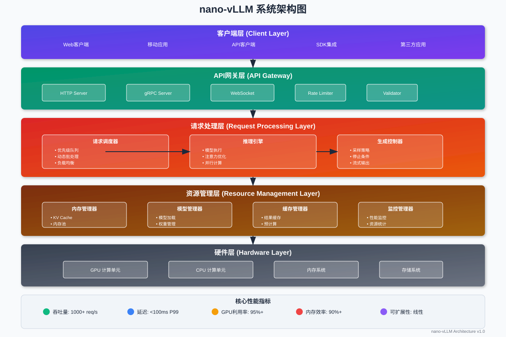
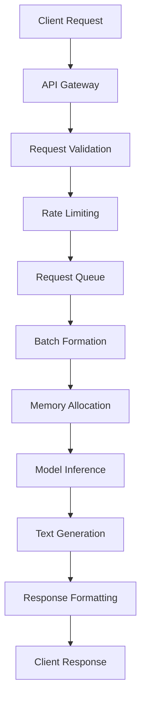

# nano-vllm 整体架构

## 🏗️ 架构概览

nano-vllm 是一个高性能的大语言模型推理引擎，采用模块化设计，专注于提供高吞吐量、低延迟的推理服务。

## 🏗️ 系统架构概览

nano-vLLM 采用**分层模块化架构**，通过清晰的职责分离和高效的组件协作，实现高性能的大语言模型推理服务。


*图：nano-vLLM 系统架构 - 展示分层结构、核心组件和数据流*

### 核心设计理念

1. **简洁高效** - 去除不必要的复杂性，专注核心功能
2. **模块化** - 清晰的模块边界，便于维护和扩展
3. **性能优先** - 每个设计决策都以性能为首要考虑
4. **资源优化** - 最大化硬件资源利用率

## 🎯 系统架构图

```
┌─────────────────────────────────────────────────────────────┐
│                        Client Layer                         │
├─────────────────────────────────────────────────────────────┤
│                     API Gateway                             │
│  ┌─────────────┐  ┌─────────────┐  ┌─────────────┐         │
│  │ HTTP Server │  │ gRPC Server │  │ WebSocket   │         │
│  └─────────────┘  └─────────────┘  └─────────────┘         │
├─────────────────────────────────────────────────────────────┤
│                   Request Processing Layer                  │
│  ┌─────────────────────────────────────────────────────────┐ │
│  │              Request Scheduler                          │ │
│  │  ┌─────────────┐  ┌─────────────┐  ┌─────────────┐     │ │
│  │  │ Queue Mgr   │  │ Batch Mgr   │  │ Priority Mgr│     │ │
│  │  └─────────────┘  └─────────────┘  └─────────────┘     │ │
│  └─────────────────────────────────────────────────────────┘ │
├─────────────────────────────────────────────────────────────┤
│                    Inference Engine Layer                   │
│  ┌─────────────────────────────────────────────────────────┐ │
│  │                 Inference Engine                        │ │
│  │  ┌─────────────┐  ┌─────────────┐  ┌─────────────┐     │ │
│  │  │ Model Exec  │  │ Attention   │  │ Generation  │     │ │
│  │  │ Engine      │  │ Engine      │  │ Engine      │     │ │
│  │  └─────────────┘  └─────────────┘  └─────────────┘     │ │
│  └─────────────────────────────────────────────────────────┘ │
├─────────────────────────────────────────────────────────────┤
│                    Resource Management Layer                │
│  ┌─────────────┐  ┌─────────────┐  ┌─────────────┐         │
│  │ Memory Mgr  │  │ Model Mgr   │  │ Cache Mgr   │         │
│  └─────────────┘  └─────────────┘  └─────────────┘         │
├─────────────────────────────────────────────────────────────┤
│                      Hardware Layer                         │
│  ┌─────────────┐  ┌─────────────┐  ┌─────────────┐         │
│  │ GPU Compute │  │ CPU Compute │  │ Memory      │         │
│  └─────────────┘  └─────────────┘  └─────────────┘         │
└─────────────────────────────────────────────────────────────┘
```

## 🔧 核心模块详解

### 1. API Gateway (接口网关)

**职责**：
- 接收和路由客户端请求
- 协议转换和适配
- 请求验证和限流
- 响应格式化

**关键特性**：
```python
class APIGateway:
    def __init__(self):
        self.http_server = HTTPServer()
        self.grpc_server = GRPCServer()
        self.websocket_server = WebSocketServer()
        self.rate_limiter = RateLimiter()
        self.request_validator = RequestValidator()
    
    async def handle_request(self, request):
        # 1. 请求验证
        if not self.request_validator.validate(request):
            return ErrorResponse("Invalid request")
        
        # 2. 限流检查
        if not self.rate_limiter.allow(request.client_id):
            return ErrorResponse("Rate limit exceeded")
        
        # 3. 路由到调度器
        response = await self.scheduler.schedule(request)
        
        # 4. 格式化响应
        return self.format_response(response, request.format)
```

### 2. Request Scheduler (请求调度器)

**职责**：
- 请求队列管理
- 动态批处理
- 优先级调度
- 负载均衡

**核心算法**：
```python
class RequestScheduler:
    def __init__(self, max_batch_size=32, max_wait_time=10):
        self.request_queue = PriorityQueue()
        self.batch_manager = BatchManager(max_batch_size)
        self.max_wait_time = max_wait_time
        
    async def schedule(self, request):
        # 1. 请求入队
        await self.request_queue.put(request)
        
        # 2. 批处理决策
        if self.should_create_batch():
            batch = await self.create_batch()
            return await self.inference_engine.process_batch(batch)
        
        # 3. 等待或立即处理
        return await self.wait_or_process(request)
    
    def should_create_batch(self):
        """批处理触发条件"""
        return (
            self.request_queue.qsize() >= self.batch_manager.optimal_size or
            self.get_oldest_request_wait_time() > self.max_wait_time
        )
```

### 3. Inference Engine (推理引擎)

**职责**：
- 模型前向推理
- 注意力计算优化
- 文本生成控制
- 并行计算协调

**架构设计**：
```python
class InferenceEngine:
    def __init__(self, model_config):
        self.model_executor = ModelExecutor(model_config)
        self.attention_engine = AttentionEngine(model_config)
        self.generation_engine = GenerationEngine(model_config)
        self.parallel_manager = ParallelManager()
    
    async def process_batch(self, batch):
        """批量推理处理"""
        # 1. 输入预处理
        input_tensors = self.preprocess_batch(batch)
        
        # 2. 模型推理
        with self.parallel_manager.context():
            hidden_states = await self.model_executor.forward(input_tensors)
        
        # 3. 生成处理
        outputs = await self.generation_engine.generate(
            hidden_states, batch.generation_configs
        )
        
        # 4. 后处理
        return self.postprocess_outputs(outputs, batch)
```

### 4. Memory Manager (内存管理器)

**职责**：
- GPU/CPU内存分配
- KV Cache管理
- 内存池化
- 垃圾回收

**管理策略**：
```python
class MemoryManager:
    def __init__(self, gpu_memory_gb=16):
        self.gpu_pool = GPUMemoryPool(gpu_memory_gb * 0.8)  # 80%用于推理
        self.kv_cache_manager = KVCacheManager()
        self.allocation_tracker = AllocationTracker()
        
    def allocate_for_batch(self, batch):
        """为批次分配内存"""
        memory_plan = self.plan_memory_allocation(batch)
        
        allocations = {}
        for request in batch.requests:
            # KV Cache分配
            kv_blocks = self.kv_cache_manager.allocate(
                request.seq_id, request.max_tokens
            )
            
            # 激活值内存分配
            activation_memory = self.gpu_pool.allocate(
                request.activation_size
            )
            
            allocations[request.seq_id] = {
                'kv_cache': kv_blocks,
                'activations': activation_memory
            }
        
        return allocations
```

## 🔄 数据流向分析

### 1. 请求处理流程



### 2. 内存数据流

```python
def trace_memory_flow():
    """追踪内存中数据的流向"""
    
    # 1. 输入数据加载
    input_tokens = load_from_cpu_to_gpu(request.tokens)
    
    # 2. 嵌入层处理
    embeddings = embedding_layer(input_tokens)  # GPU内存
    
    # 3. Transformer层处理
    for layer in transformer_layers:
        # 注意力计算
        attention_output = layer.attention(embeddings)
        
        # KV Cache更新
        kv_cache.update(layer_id, attention_output.k, attention_output.v)
        
        # MLP处理
        embeddings = layer.mlp(attention_output)
    
    # 4. 输出层处理
    logits = output_layer(embeddings)
    
    # 5. 采样和生成
    next_token = sample(logits)
    
    return next_token
```

### 3. 并发处理机制

```python
class ConcurrentProcessor:
    def __init__(self, num_workers=4):
        self.workers = [Worker(i) for i in range(num_workers)]
        self.task_queue = asyncio.Queue()
        self.result_queue = asyncio.Queue()
    
    async def process_concurrent_batches(self, batches):
        """并发处理多个批次"""
        # 1. 任务分发
        tasks = []
        for batch in batches:
            task = asyncio.create_task(self.process_single_batch(batch))
            tasks.append(task)
        
        # 2. 并发执行
        results = await asyncio.gather(*tasks, return_exceptions=True)
        
        # 3. 结果合并
        return self.merge_results(results)
    
    async def process_single_batch(self, batch):
        """处理单个批次"""
        # GPU资源分配
        gpu_context = await self.acquire_gpu_context()
        
        try:
            # 推理执行
            result = await self.inference_engine.process(batch)
            return result
        finally:
            # 资源释放
            await self.release_gpu_context(gpu_context)
```

## ⚡ 性能优化设计

### 1. 计算优化

```python
class ComputeOptimizer:
    def __init__(self):
        self.kernel_cache = {}
        self.fusion_optimizer = KernelFusionOptimizer()
        
    def optimize_attention_computation(self, query, key, value):
        """优化注意力计算"""
        # 1. 内核融合
        if self.can_fuse_qkv():
            return self.fused_qkv_attention(query, key, value)
        
        # 2. Flash Attention
        if self.supports_flash_attention():
            return self.flash_attention(query, key, value)
        
        # 3. 标准实现
        return self.standard_attention(query, key, value)
    
    def fused_qkv_attention(self, q, k, v):
        """融合QKV计算的注意力"""
        # 使用自定义CUDA内核
        kernel_key = f"fused_qkv_{q.shape}"
        if kernel_key not in self.kernel_cache:
            self.kernel_cache[kernel_key] = compile_fused_kernel(q.shape)
        
        return self.kernel_cache[kernel_key](q, k, v)
```

### 2. 内存优化

```python
class MemoryOptimizer:
    def __init__(self):
        self.memory_planner = MemoryPlanner()
        self.recompute_scheduler = RecomputeScheduler()
    
    def optimize_memory_usage(self, model, batch):
        """优化内存使用"""
        # 1. 内存规划
        memory_plan = self.memory_planner.plan(model, batch)
        
        # 2. 重计算策略
        if memory_plan.requires_recompute:
            return self.recompute_scheduler.schedule(model, batch)
        
        # 3. 标准执行
        return model.forward(batch)
    
    def gradient_checkpointing_inference(self, model, inputs):
        """推理中的检查点技术（重计算）"""
        checkpoints = []
        
        for i, layer in enumerate(model.layers):
            if i % 2 == 0:  # 每两层保存一个检查点
                checkpoints.append(inputs.clone())
            
            inputs = layer(inputs)
            
            # 如果内存不足，释放中间结果
            if self.memory_pressure_high():
                torch.cuda.empty_cache()
        
        return inputs
```

### 3. 通信优化

```python
class CommunicationOptimizer:
    def __init__(self, world_size):
        self.world_size = world_size
        self.communication_scheduler = CommunicationScheduler()
    
    def optimize_tensor_parallel_communication(self, tensor):
        """优化张量并行通信"""
        # 1. 通信调度
        comm_plan = self.communication_scheduler.plan(tensor)
        
        # 2. 异步通信
        if comm_plan.can_overlap:
            return self.async_all_reduce(tensor)
        
        # 3. 同步通信
        return self.sync_all_reduce(tensor)
    
    async def async_all_reduce(self, tensor):
        """异步AllReduce"""
        # 启动异步通信
        comm_handle = torch.distributed.all_reduce(
            tensor, async_op=True
        )
        
        # 在通信期间执行其他计算
        other_computation_result = await self.do_other_computation()
        
        # 等待通信完成
        comm_handle.wait()
        
        return tensor, other_computation_result
```

## 🎯 架构优势

### 1. 高性能
- **批处理优化**：动态批处理最大化GPU利用率
- **内存优化**：精细的内存管理减少内存碎片
- **计算优化**：内核融合和Flash Attention加速计算
- **并行优化**：多层次并行提升吞吐量

### 2. 高可扩展性
- **模块化设计**：清晰的模块边界便于扩展
- **插件架构**：支持自定义组件
- **配置驱动**：灵活的配置系统
- **接口标准化**：统一的接口规范

### 3. 高可靠性
- **错误隔离**：模块间错误不会相互影响
- **资源管理**：完善的资源分配和回收机制
- **监控体系**：全面的性能和健康监控
- **降级策略**：多层次的服务降级机制

### 4. 易维护性
- **代码组织**：清晰的代码结构和命名规范
- **文档完善**：详细的API和架构文档
- **测试覆盖**：全面的单元测试和集成测试
- **调试工具**：丰富的调试和分析工具

## 🔍 架构权衡

### 1. 复杂性 vs 性能
- **选择**：适度的复杂性换取显著的性能提升
- **权衡**：在代码可维护性和性能优化间找到平衡
- **策略**：核心路径高度优化，非核心路径保持简洁

### 2. 内存 vs 计算
- **选择**：优先内存效率，适度增加计算开销
- **权衡**：在内存使用和计算复杂度间权衡
- **策略**：使用重计算技术在内存受限时降低内存使用

### 3. 延迟 vs 吞吐量
- **选择**：在保证合理延迟的前提下最大化吞吐量
- **权衡**：批处理大小的动态调整
- **策略**：根据负载特征自适应调整策略

## 🚀 未来演进方向

### 1. 架构演进
- **微服务化**：进一步模块化，支持独立部署
- **云原生**：更好的容器化和Kubernetes支持
- **边缘计算**：支持边缘设备的轻量化部署

### 2. 性能优化
- **硬件适配**：更好的新硬件支持（如新GPU架构）
- **算法优化**：集成最新的推理优化算法
- **系统优化**：更深层次的系统级优化

### 3. 功能扩展
- **多模态支持**：图像、音频等多模态输入
- **流式处理**：更好的流式推理支持
- **个性化**：用户个性化模型支持

---

*nano-vllm的架构设计体现了在性能、可扩展性和可维护性之间的精心平衡，为高效的大模型推理提供了坚实的基础。*