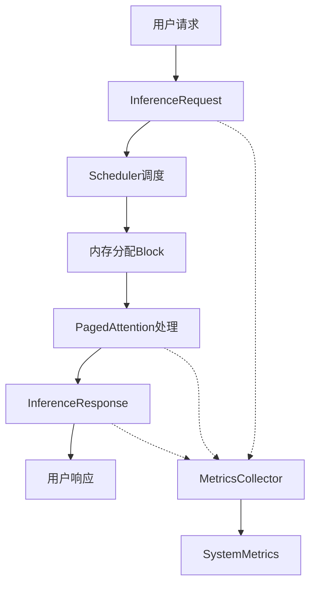

# 4.1 核心数据结构详解

> 🎯 **本节目标**：深入理解 nano-vLLM 中的核心数据结构设计，掌握每个组件的作用和实现细节

## 📋 数据结构概览

nano-vLLM 的核心数据结构可以分为以下几类：

1. **枚举类型** - 定义系统状态
2. **请求相关** - 处理用户输入和输出
3. **内存管理** - 管理 KV Cache 和内存分配
4. **系统监控** - 收集性能指标

## 🔍 逐行代码分析

### 1. 枚举类型定义

```python
class RequestStatus(Enum):
    """请求状态枚举
    
    这个枚举定义了请求在系统中的生命周期状态
    """
    WAITING = "waiting"      # 🟡 等待调度 - 请求已提交但未开始处理
    RUNNING = "running"      # 🟢 正在执行 - 请求正在GPU上处理
    SWAPPED = "swapped"      # 🔄 已交换到CPU - 暂时移出GPU内存
    FINISHED = "finished"    # ✅ 已完成 - 请求处理完毕
    FAILED = "failed"        # ❌ 执行失败 - 处理过程中出现错误
```

**设计思路分析**：
- 使用枚举确保状态的类型安全
- 状态转换路径：`WAITING → RUNNING → FINISHED/FAILED`
- 支持内存交换：`RUNNING ⇄ SWAPPED`

```python
class BlockStatus(Enum):
    """内存块状态枚举
    
    管理 PagedAttention 中内存块的生命周期
    """
    FREE = "free"           # 🆓 空闲 - 可以被分配使用
    ALLOCATED = "allocated" # 📦 已分配 - 正在被某个序列使用
    SWAPPED = "swapped"     # 💾 已交换 - 数据在CPU内存中
```

**关键设计点**：
- 内存块的三态管理
- 支持 GPU ↔ CPU 内存交换
- 为内存回收提供状态追踪

### 2. 生成参数配置

```python
@dataclass
class GenerationParams:
    """生成参数配置类
    
    封装了文本生成的所有可调参数
    """
    max_tokens: int = 100                    # 🔢 最大生成token数量
    temperature: float = 1.0                 # 🌡️ 温度参数，控制随机性
    top_p: float = 1.0                      # 🎯 nucleus sampling 参数
    top_k: int = -1                         # 🔝 top-k sampling 参数
    stop_sequences: List[str] = field(default_factory=list)  # 🛑 停止序列
    stream: bool = False                    # 🌊 是否流式输出
```

**参数详解**：
- `max_tokens`: 防止无限生成，控制输出长度
- `temperature`: 0.0 = 确定性，1.0 = 标准随机性，>1.0 = 更随机
- `top_p`: nucleus sampling，保留累积概率为 p 的 token
- `top_k`: 只考虑概率最高的 k 个 token
- `stop_sequences`: 遇到这些序列时停止生成
- `stream`: 支持实时输出，提升用户体验

### 3. 推理请求对象

```python
@dataclass
class InferenceRequest:
    """推理请求的完整数据结构"""
    
    # === 基本信息 ===
    request_id: str                         # 🆔 唯一标识符
    prompt: str                             # 📝 输入提示文本
    params: GenerationParams                # ⚙️ 生成参数
    arrival_time: float = field(default_factory=time.time)  # ⏰ 到达时间
    priority: int = 0                       # 🏆 优先级（数字越大优先级越高）
    status: RequestStatus = RequestStatus.WAITING  # 📊 当前状态
    
    # === 内部处理状态 ===
    prompt_tokens: List[int] = field(default_factory=list)     # 🔤 编码后的输入token
    generated_tokens: List[int] = field(default_factory=list)  # 🎯 生成的token序列
    block_table: List[int] = field(default_factory=list)       # 📋 内存块映射表
    num_blocks: int = 0                     # 🧱 分配的内存块数量
    
    # === 时间追踪 ===
    start_time: Optional[float] = None      # ⏱️ 开始处理时间
    finish_time: Optional[float] = None     # 🏁 完成时间
```

**设计亮点**：
1. **分离关注点**：基本信息 vs 内部状态
2. **时间追踪**：支持延迟分析和性能监控
3. **内存管理**：`block_table` 实现逻辑到物理地址映射
4. **状态管理**：完整的生命周期追踪

### 4. 推理响应对象

```python
@dataclass
class InferenceResponse:
    """推理响应的标准格式"""
    
    # === 基本结果 ===
    request_id: str                         # 🆔 对应的请求ID
    generated_text: str                     # 📄 生成的文本结果
    generated_tokens: List[int]             # 🔢 生成的token序列
    
    # === 统计信息 ===
    prompt_tokens: int                      # 📊 输入token数量
    completion_tokens: int                  # 📈 生成token数量
    total_tokens: int                       # 📋 总token数量
    
    # === 元信息 ===
    finish_reason: str                      # 🏁 结束原因（max_tokens/stop_sequence/eos）
    generation_time: float                  # ⏱️ 生成耗时（秒）
    tokens_per_second: float               # 🚀 生成速度（token/秒）
```

**响应设计原则**：
- **完整性**：包含所有必要的结果和元数据
- **可追溯性**：通过 `request_id` 关联请求
- **性能监控**：提供时间和速度指标
- **标准化**：遵循 OpenAI API 风格

### 5. 系统指标对象

```python
@dataclass
class SystemMetrics:
    """系统性能指标的完整集合"""
    
    timestamp: float = field(default_factory=time.time)  # ⏰ 指标时间戳
    
    # === 吞吐量指标 ===
    requests_per_second: float = 0.0       # 📊 每秒处理请求数
    tokens_per_second: float = 0.0         # 🚀 每秒生成token数
    
    # === 延迟指标 ===
    avg_latency: float = 0.0               # 📈 平均延迟
    p95_latency: float = 0.0               # 📊 95分位延迟
    p99_latency: float = 0.0               # 📊 99分位延迟
    
    # === 内存指标 ===
    gpu_memory_used: float = 0.0           # 💾 GPU内存使用量（GB）
    gpu_memory_total: float = 0.0          # 💾 GPU内存总量（GB）
    gpu_memory_utilization: float = 0.0    # 📊 GPU内存使用率
    kv_cache_usage: float = 0.0            # 🧠 KV Cache使用率
    
    # === 队列指标 ===
    waiting_requests: int = 0              # 🟡 等待队列长度
    running_requests: int = 0              # 🟢 运行队列长度
    swapped_requests: int = 0              # 🔄 交换队列长度
    
    # === 错误指标 ===
    total_requests: int = 0                # 📊 总请求数
    successful_requests: int = 0           # ✅ 成功请求数
    failed_requests: int = 0               # ❌ 失败请求数
    error_rate: float = 0.0                # 📊 错误率
```

**指标体系设计**：
1. **多维度监控**：吞吐量、延迟、内存、队列、错误
2. **分位数统计**：P95/P99 延迟更能反映用户体验
3. **资源监控**：GPU 内存和 KV Cache 使用情况
4. **实时性**：带时间戳的快照数据

## 🔄 数据流转关系



## 💡 设计模式分析

### 1. 数据类模式 (Dataclass Pattern)
- **优势**：自动生成 `__init__`、`__repr__` 等方法
- **类型安全**：配合类型注解提供编译时检查
- **可扩展性**：易于添加新字段

### 2. 状态机模式 (State Machine Pattern)
- **请求状态**：`WAITING → RUNNING → FINISHED/FAILED`
- **内存状态**：`FREE → ALLOCATED → FREE`
- **清晰的状态转换**：避免非法状态

### 3. 组合模式 (Composition Pattern)
- `InferenceRequest` 包含 `GenerationParams`
- 松耦合设计，便于独立测试和修改

## 🧪 实践练习

### 练习1：创建请求对象
```python
# 创建一个推理请求
request = InferenceRequest(
    request_id="req_001",
    prompt="解释什么是人工智能",
    params=GenerationParams(
        max_tokens=200,
        temperature=0.7,
        top_p=0.9
    ),
    priority=1
)

print(f"请求状态: {request.status}")
print(f"到达时间: {request.arrival_time}")
```

### 练习2：状态转换
```python
# 模拟请求状态转换
request.status = RequestStatus.RUNNING
request.start_time = time.time()

# 处理完成
request.status = RequestStatus.FINISHED
request.finish_time = time.time()

# 计算处理时间
processing_time = request.finish_time - request.start_time
print(f"处理耗时: {processing_time:.3f}秒")
```

## 📚 小结

本节深入分析了 nano-vLLM 的核心数据结构：

1. **枚举类型**：提供类型安全的状态管理
2. **请求对象**：封装完整的请求生命周期
3. **响应对象**：标准化的结果格式
4. **指标对象**：全面的性能监控

这些数据结构为整个系统提供了：
- 🔒 **类型安全**：编译时错误检查
- 📊 **状态管理**：清晰的生命周期追踪
- 🔍 **可观测性**：完整的性能指标
- 🔧 **可维护性**：模块化的设计

**下一节预告**：我们将学习这些数据结构如何在内存管理系统中发挥作用。

---

> 💡 **学习提示**：尝试修改这些数据结构，观察对系统行为的影响，这有助于深入理解设计思路。