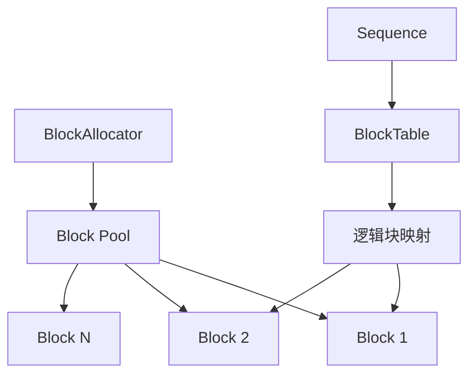
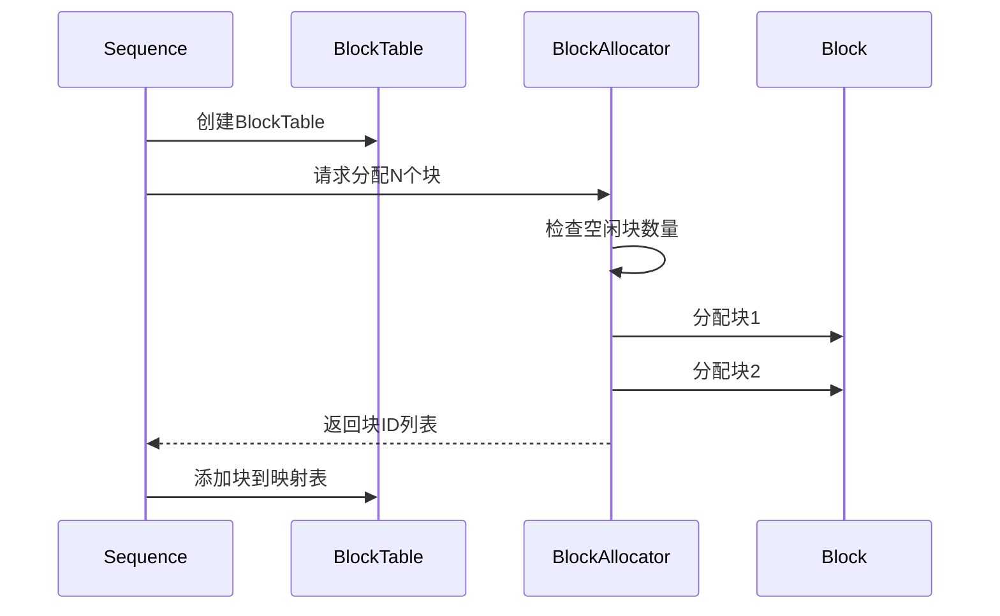
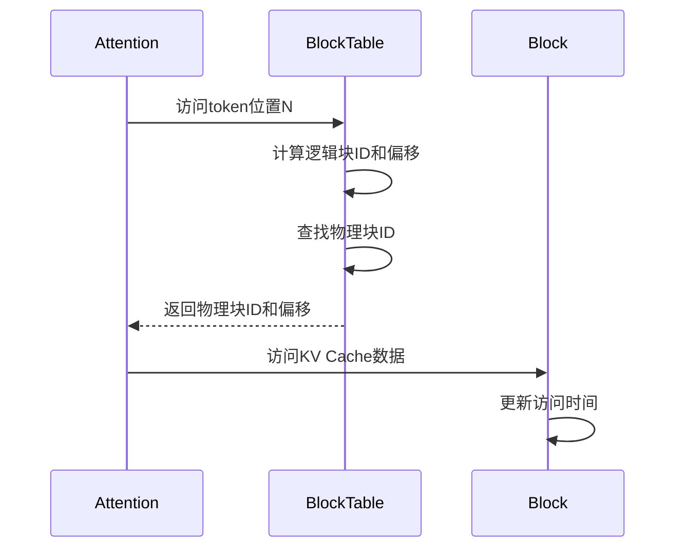
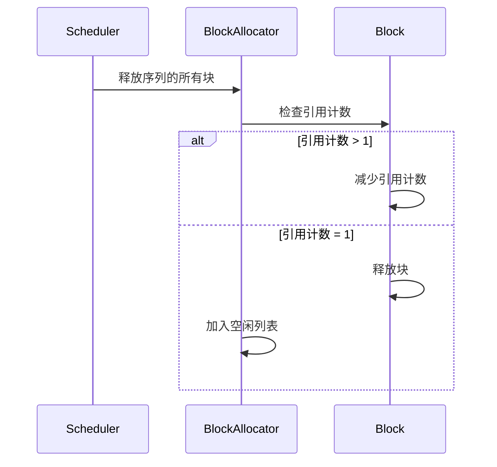

# 4.2 内存管理系统

> 🎯 **本节目标**：深入理解 PagedAttention 的内存管理机制，掌握 Block、BlockTable 和 BlockAllocator 的实现原理

## 🧠 内存管理核心概念

nano-vLLM 的内存管理系统基于 **PagedAttention** 论文，将 KV Cache 分割成固定大小的块（Block），实现高效的内存分配和管理。

### PagedAttention 可视化原理


上图清晰展示了 PagedAttention 与传统注意力机制的区别：
- **传统方式**：为每个序列分配连续的大块内存，容易产生内存碎片
- **PagedAttention**：将 KV Cache 分割成固定大小的页面，按需分配，显著提升内存利用率

### 核心组件关系


## 🧱 Block 类详解

### 完整代码分析

```python
class Block:
    """KV Cache内存块
    
    每个Block代表一个固定大小的内存区域，用于存储KV Cache数据
    """
    
    def __init__(self, block_id: int, block_size: int, device: str = "cuda"):
        """初始化内存块
        
        Args:
            block_id: 块的唯一标识符
            block_size: 块大小（通常是16个token）
            device: 设备类型（cuda/cpu）
        """
        self.block_id = block_id                    # 🆔 块ID，全局唯一
        self.block_size = block_size                # 📏 块大小（token数量）
        self.device = device                        # 🖥️ 设备类型
        self.status = BlockStatus.FREE              # 📊 初始状态为空闲
        self.ref_count = 0                          # 🔢 引用计数，支持共享
        self.data = None                            # 💾 实际的KV Cache数据
        self.last_accessed = time.time()            # ⏰ 最后访问时间（用于LRU）
        
        print(f"🧱 创建Block {block_id} (大小: {block_size}, 设备: {device})")
```

**设计要点分析**：
1. **引用计数**：支持多个序列共享相同的前缀块
2. **设备感知**：支持 GPU/CPU 混合内存管理
3. **LRU支持**：`last_accessed` 用于内存回收策略
4. **状态管理**：清晰的生命周期状态

### 内存分配方法

```python
def allocate(self):
    """分配内存块
    
    将空闲块标记为已分配状态
    """
    # 🔍 状态检查：只有空闲块才能被分配
    if self.status != BlockStatus.FREE:
        raise RuntimeError(f"Block {self.block_id} 不是空闲状态")
    
    # 📦 状态转换：FREE → ALLOCATED
    self.status = BlockStatus.ALLOCATED
    self.ref_count = 1                      # 🔢 初始引用计数为1
    self.last_accessed = time.time()        # ⏰ 更新访问时间
    
    print(f"📦 分配Block {self.block_id} (引用计数: {self.ref_count})")
```

**关键机制**：
- **状态验证**：确保只有空闲块被分配
- **原子操作**：状态转换是原子的，避免竞态条件
- **时间戳更新**：为LRU算法提供数据

### 引用计数管理

```python
def add_ref(self):
    """增加引用计数
    
    当多个序列共享相同前缀时使用
    """
    # 🔍 状态检查：只有已分配的块才能增加引用
    if self.status != BlockStatus.ALLOCATED:
        raise RuntimeError(f"Block {self.block_id} 未分配")
    
    self.ref_count += 1                     # 📈 引用计数递增
    self.last_accessed = time.time()        # ⏰ 更新访问时间
    
    print(f"📈 Block {self.block_id} 引用计数增加到 {self.ref_count}")

def remove_ref(self):
    """减少引用计数
    
    当序列完成或被移除时调用
    """
    # 🔍 引用计数检查
    if self.ref_count <= 0:
        raise RuntimeError(f"Block {self.block_id} 引用计数已为0")
    
    self.ref_count -= 1                     # 📉 引用计数递减
    print(f"📉 Block {self.block_id} 引用计数减少到 {self.ref_count}")
    
    # 🗑️ 自动回收：引用计数为0时自动释放
    if self.ref_count == 0:
        self.free()
```

**引用计数的优势**：
1. **内存共享**：多个序列可以共享相同的前缀块
2. **自动回收**：引用计数为0时自动释放
3. **内存效率**：避免重复存储相同的KV Cache

### 内存释放

```python
def free(self):
    """释放内存块
    
    清理所有状态，返回到空闲池
    """
    self.status = BlockStatus.FREE          # 📊 状态重置为空闲
    self.ref_count = 0                      # 🔢 引用计数清零
    self.data = None                        # 💾 清理数据（实际实现中会清理GPU内存）
    
    print(f"🗑️  释放Block {self.block_id}")
```

## 📋 BlockTable 类详解

### 逻辑到物理地址映射

```python
class BlockTable:
    """Block Table - 管理逻辑到物理块的映射
    
    为每个序列维护一个逻辑块到物理块的映射表
    """
    
    def __init__(self, sequence_id: str):
        """初始化块表
        
        Args:
            sequence_id: 序列的唯一标识符
        """
        self.sequence_id = sequence_id              # 🆔 序列ID
        self.logical_blocks: List[int] = []         # 📋 逻辑块到物理块的映射
        self.block_size = 16                        # 📏 每个块的token数量
        
        print(f"📋 创建BlockTable for sequence {sequence_id}")
```

**设计思路**：
- **逻辑抽象**：序列看到的是连续的逻辑地址空间
- **物理映射**：实际存储在不连续的物理块中
- **灵活分配**：支持动态扩展和内存碎片整理

### 块管理操作

```python
def add_block(self, physical_block_id: int):
    """添加物理块到映射表
    
    Args:
        physical_block_id: 物理块的ID
    """
    self.logical_blocks.append(physical_block_id)   # 📝 添加到映射表末尾
    logical_block_id = len(self.logical_blocks) - 1 # 🔢 计算逻辑块ID
    
    print(f"➕ BlockTable {self.sequence_id}: 添加物理块 {physical_block_id} -> 逻辑块 {logical_block_id}")

def get_physical_block_id(self, logical_block_id: int) -> int:
    """根据逻辑块ID获取物理块ID
    
    Args:
        logical_block_id: 逻辑块ID
        
    Returns:
        对应的物理块ID
    """
    # 🔍 边界检查
    if logical_block_id >= len(self.logical_blocks):
        raise IndexError(f"逻辑块 {logical_block_id} 不存在")
    
    physical_id = self.logical_blocks[logical_block_id]  # 🔍 查找映射
    print(f"🔍 BlockTable {self.sequence_id}: 逻辑块 {logical_block_id} -> 物理块 {physical_id}")
    return physical_id
```

### Token位置计算

```python
def get_block_offset(self, token_position: int) -> Tuple[int, int]:
    """计算token在块中的位置
    
    Args:
        token_position: token在序列中的绝对位置
        
    Returns:
        (logical_block_id, block_offset): 逻辑块ID和块内偏移
    """
    logical_block_id = token_position // self.block_size    # 🧮 计算逻辑块ID
    block_offset = token_position % self.block_size         # 🧮 计算块内偏移
    
    print(f"📍 BlockTable {self.sequence_id}: token位置 {token_position} -> 块 {logical_block_id}, 偏移 {block_offset}")
    return logical_block_id, block_offset
```

**地址计算示例**：
```
假设 block_size = 16
token_position = 35

logical_block_id = 35 // 16 = 2    # 第2个逻辑块
block_offset = 35 % 16 = 3         # 块内第3个位置
```

## 🏭 BlockAllocator 类详解

### 内存池管理

```python
class BlockAllocator:
    """内存块分配器
    
    管理整个系统的内存块池，负责分配和回收
    """
    
    def __init__(self, num_blocks: int, block_size: int, device: str = "cuda"):
        """初始化分配器
        
        Args:
            num_blocks: 总块数量
            block_size: 每块大小（token数）
            device: 设备类型
        """
        self.num_blocks = num_blocks                # 🔢 总块数量
        self.block_size = block_size                # 📏 块大小
        self.device = device                        # 🖥️ 设备类型
        
        # 🏭 创建所有内存块
        self.blocks = [Block(i, block_size, device) for i in range(num_blocks)]
        
        # 📋 维护空闲块列表
        self.free_blocks = list(range(num_blocks))  # 初始时所有块都空闲
        
        print(f"🏭 创建BlockAllocator: {num_blocks}个块，每块{block_size}个token，设备{device}")
```

**内存池设计**：
- **预分配**：启动时分配所有内存块
- **空闲列表**：使用列表管理空闲块，O(1)分配
- **设备感知**：支持多设备内存管理

### 批量分配算法

```python
def allocate(self, num_blocks: int) -> List[int]:
    """批量分配内存块
    
    Args:
        num_blocks: 需要分配的块数量
        
    Returns:
        分配的物理块ID列表，失败时返回空列表
    """
    print(f"🔍 请求分配 {num_blocks} 个块 (可用: {len(self.free_blocks)})")
    
    # 🔍 内存检查：确保有足够的空闲块
    if len(self.free_blocks) < num_blocks:
        print(f"❌ 内存不足！需要 {num_blocks} 个块，但只有 {len(self.free_blocks)} 个可用")
        return []  # 分配失败，返回空列表
    
    # 📦 批量分配
    allocated_blocks = []
    for _ in range(num_blocks):
        block_id = self.free_blocks.pop(0)      # 🎯 从空闲列表头部取块（FIFO）
        self.blocks[block_id].allocate()        # 📦 标记为已分配
        allocated_blocks.append(block_id)       # 📝 记录分配的块
    
    print(f"✅ 成功分配块: {allocated_blocks}")
    print(f"📊 当前内存状态: {len(self.free_blocks)}/{self.num_blocks} 块可用")
    
    return allocated_blocks
```

**分配策略分析**：
1. **原子性检查**：先检查再分配，避免部分分配
2. **FIFO策略**：从头部取块，简单高效
3. **失败处理**：内存不足时返回空列表，调用者处理

### 智能回收算法

```python
def free(self, block_ids: List[int]):
    """批量释放内存块
    
    Args:
        block_ids: 要释放的物理块ID列表
    """
    print(f"🗑️  请求释放块: {block_ids}")
    
    for block_id in block_ids:
        # 🔍 有效性检查
        if block_id >= len(self.blocks):
            print(f"⚠️  无效的块ID: {block_id}")
            continue
        
        block = self.blocks[block_id]
        
        # 🔍 状态检查
        if block.status == BlockStatus.FREE:
            print(f"⚠️  块 {block_id} 已经是空闲状态")
            continue
        
        # 🔢 引用计数处理
        if block.ref_count > 1:
            # 📉 多引用：只减少计数，不释放
            print(f"📉 块 {block_id} 引用计数 {block.ref_count} > 1，减少引用")
            block.remove_ref()
        else:
            # 🧹 单引用：清理并回收
            print(f"🧹 清理块 {block_id} 的KV Cache数据")
            block.free()                        # 🗑️ 释放块
            self.free_blocks.append(block_id)   # 📋 加入空闲列表
    
    print(f"📊 释放后内存状态: {len(self.free_blocks)}/{self.num_blocks} 块可用")
```

**回收策略特点**：
1. **引用计数感知**：支持共享块的正确回收
2. **错误容忍**：跳过无效块，继续处理其他块
3. **状态一致性**：确保内存状态的正确性

### 内存使用统计

```python
def get_memory_usage(self) -> Dict[str, Any]:
    """获取详细的内存使用情况
    
    Returns:
        包含各种内存指标的字典
    """
    used_blocks = self.num_blocks - len(self.free_blocks)   # 🧮 计算已用块数
    usage_ratio = used_blocks / self.num_blocks             # 📊 计算使用率
    
    return {
        "total_blocks": self.num_blocks,        # 🔢 总块数
        "used_blocks": used_blocks,             # 📦 已用块数
        "free_blocks": len(self.free_blocks),   # 🆓 空闲块数
        "usage_ratio": usage_ratio,             # 📊 使用率
        "block_size": self.block_size,          # 📏 块大小
        "device": self.device                   # 🖥️ 设备类型
    }
```

## 🔄 内存管理工作流程

### 1. 序列创建流程


### 2. Token访问流程


### 3. 内存回收流程


## 🧪 实践示例

### 示例1：基本内存分配

```python
# 创建内存分配器
allocator = BlockAllocator(num_blocks=100, block_size=16, device="cuda")

# 为序列分配内存
sequence_id = "seq_001"
block_table = BlockTable(sequence_id)

# 分配3个块
block_ids = allocator.allocate(3)
if block_ids:
    for block_id in block_ids:
        block_table.add_block(block_id)
    print(f"✅ 序列 {sequence_id} 分配了 {len(block_ids)} 个块")
else:
    print("❌ 内存分配失败")

# 查看内存使用情况
usage = allocator.get_memory_usage()
print(f"📊 内存使用率: {usage['usage_ratio']:.2%}")
```

### 示例2：Token位置计算

```python
# 计算token在块中的位置
token_position = 35
logical_block_id, block_offset = block_table.get_block_offset(token_position)

# 获取物理块ID
physical_block_id = block_table.get_physical_block_id(logical_block_id)

print(f"Token {token_position} 位于:")
print(f"  逻辑块: {logical_block_id}")
print(f"  物理块: {physical_block_id}")
print(f"  块内偏移: {block_offset}")
```

### 示例3：内存共享

```python
# 模拟前缀共享
prefix_blocks = [0, 1, 2]  # 共享的前缀块

# 为两个序列共享前缀
for seq_id in ["seq_A", "seq_B"]:
    for block_id in prefix_blocks:
        allocator.blocks[block_id].add_ref()  # 增加引用计数
    print(f"序列 {seq_id} 共享前缀块")

# 释放一个序列
for block_id in prefix_blocks:
    allocator.blocks[block_id].remove_ref()  # 减少引用计数
print("序列A释放，但前缀块仍被序列B使用")
```

## 📊 性能优化要点

### 1. 内存分配优化
- **批量分配**：减少分配调用次数
- **预分配**：启动时分配所有内存
- **对齐优化**：内存对齐提升访问效率

### 2. 缓存友好设计
- **局部性原理**：相邻token存储在同一块中
- **预取策略**：提前加载可能访问的块
- **LRU替换**：基于访问时间的智能替换

### 3. 并发安全
- **原子操作**：引用计数的原子更新
- **锁粒度**：细粒度锁减少竞争
- **无锁设计**：使用无锁数据结构

## 📚 小结

本节深入分析了 nano-vLLM 的内存管理系统：

1. **Block**：基础内存单元，支持引用计数和状态管理
2. **BlockTable**：逻辑到物理地址映射，支持灵活的内存布局
3. **BlockAllocator**：内存池管理器，提供高效的分配和回收

**核心优势**：
- 🚀 **高效分配**：O(1)时间复杂度的分配和回收
- 💾 **内存共享**：通过引用计数支持前缀共享
- 🔧 **灵活管理**：支持动态扩展和内存碎片整理
- 📊 **可观测性**：完整的内存使用统计

**下一节预告**：我们将学习请求调度器如何利用这套内存管理系统来优化推理性能。

---

> 💡 **学习提示**：尝试修改块大小和分配策略，观察对内存使用效率的影响。