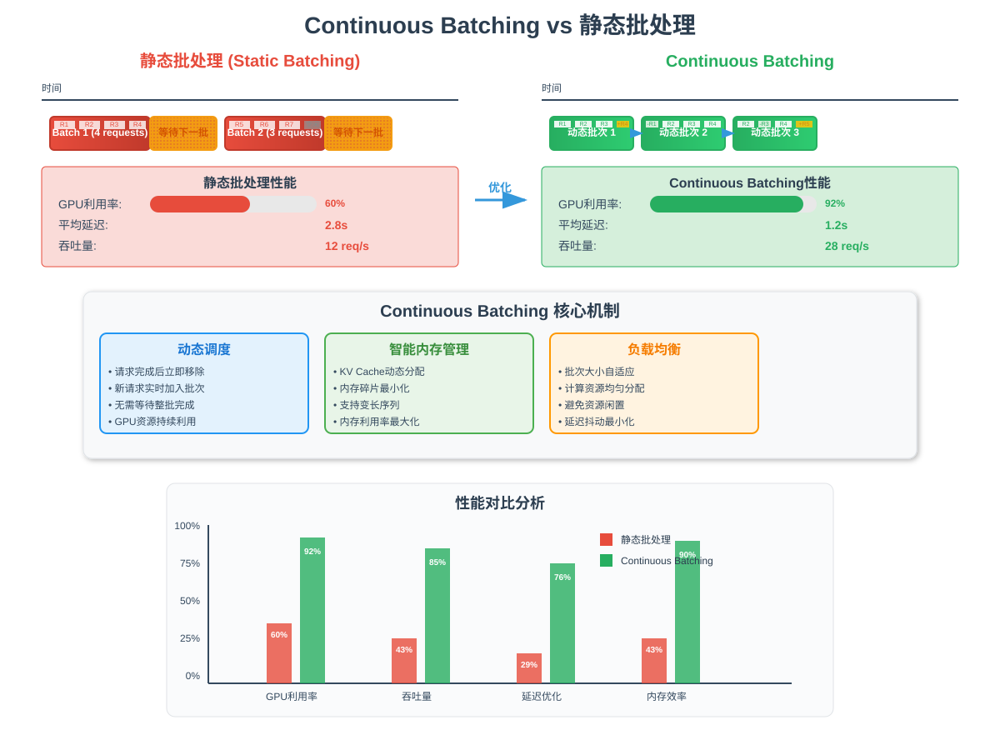
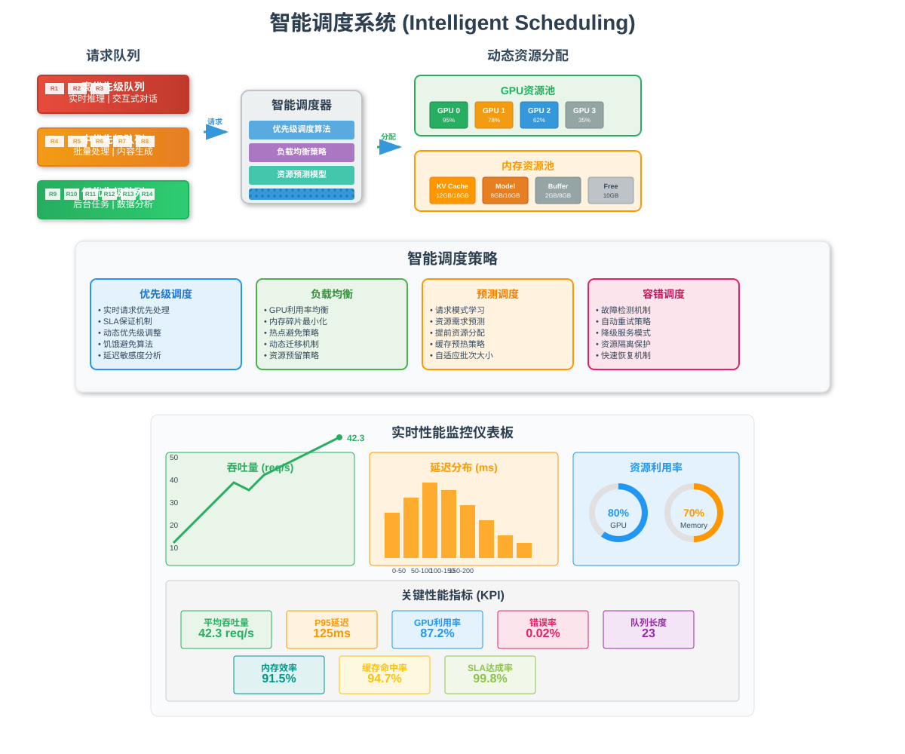
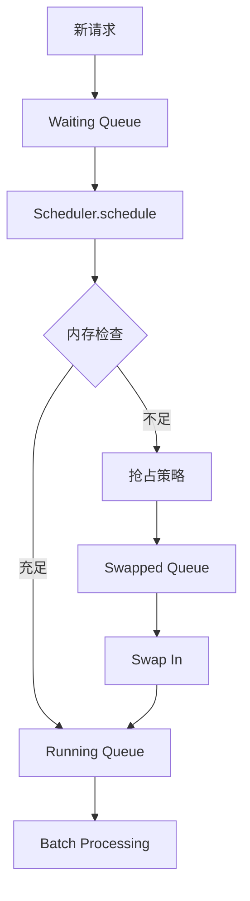
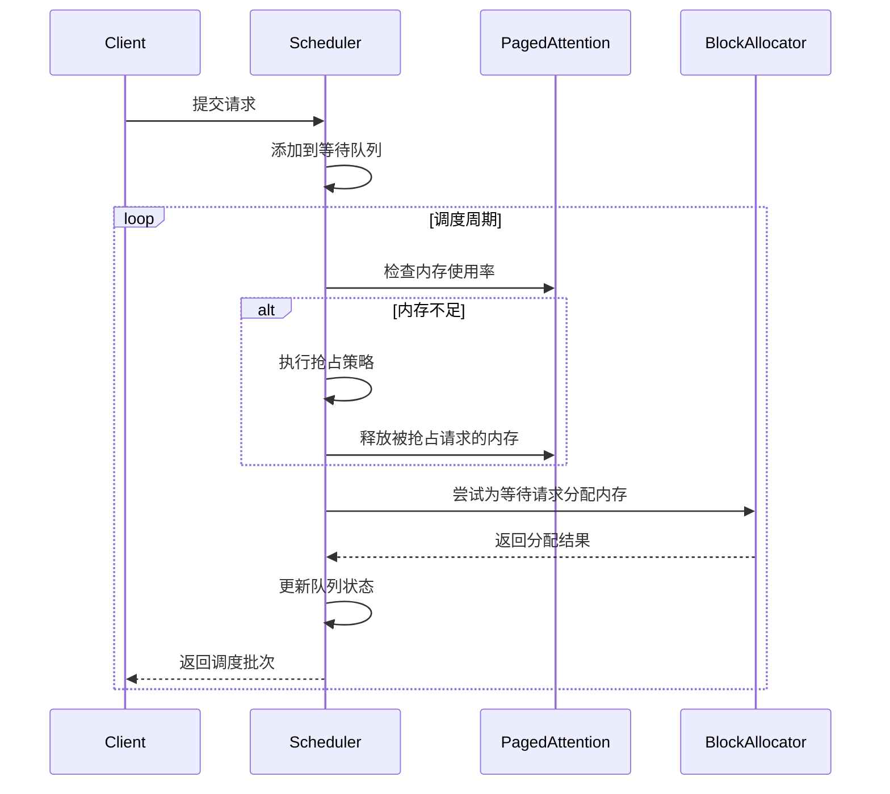

# 4.3 请求调度器

> 🎯 **本节目标**：深入理解 nano-vLLM 的请求调度机制，掌握批处理、抢占和队列管理的实现原理

## 🚦 调度器核心职责

nano-vLLM 的调度器（Scheduler）是系统的"大脑"，负责：

1. **请求队列管理**：维护等待、运行、交换队列
2. **批处理优化**：将多个请求组合成批次处理
3. **内存管理协调**：与 BlockAllocator 协作分配内存
4. **抢占策略**：在内存不足时智能选择被抢占的请求
5. **性能优化**：最大化吞吐量和最小化延迟

## 🔄 连续批处理可视化



上图对比了传统静态批处理与连续批处理的区别：
- **静态批处理**：必须等待批次中所有序列完成才能开始新批次，导致GPU利用率低
- **连续批处理**：序列完成后立即从队列中添加新序列，保持GPU持续工作，显著提升吞吐量

## 🧠 智能调度系统



上图展示了调度器的智能决策过程，包括队列管理、内存监控、抢占策略和批处理优化等核心功能。

## 📊 调度器架构



## 🏗️ Scheduler 类详解

### 初始化和配置

```python
class Scheduler:
    """请求调度器
    
    负责管理请求队列、批处理和内存分配协调
    """
    
    def __init__(self, config: Dict[str, Any]):
        """初始化调度器
        
        Args:
            config: 调度器配置参数
        """
        # === 基本配置 ===
        self.max_num_seqs = config.get("max_num_seqs", 32)      # 🔢 最大并发序列数
        self.max_batch_size = config.get("max_batch_size", 8)    # 📦 最大批处理大小
        self.memory_threshold = config.get("memory_threshold", 0.9)  # 🧠 内存使用阈值
        
        # === 调度策略 ===
        policy_str = config.get("scheduler_policy", "fcfs")
        self.policy = SchedulerPolicy(policy_str)               # 📋 调度策略
        
        # === 队列管理 ===
        self.waiting_queue: deque = deque()                     # 🟡 等待队列（FIFO）
        self.running_requests: Dict[str, InferenceRequest] = {} # 🟢 运行中的请求
        self.swapped_requests: Dict[str, InferenceRequest] = {} # 🔄 交换到CPU的请求
        
        print(f"🚦 初始化调度器:")
        print(f"   📊 最大并发序列: {self.max_num_seqs}")
        print(f"   📦 最大批大小: {self.max_batch_size}")
        print(f"   🧠 内存阈值: {self.memory_threshold:.1%}")
        print(f"   📋 调度策略: {self.policy.value}")
```

**配置参数解析**：
- `max_num_seqs`: 限制并发数，防止内存溢出
- `max_batch_size`: 控制批处理大小，平衡延迟和吞吐量
- `memory_threshold`: 触发抢占的内存使用阈值
- `scheduler_policy`: 支持 FCFS、Priority、SJF 等策略

### 请求添加机制

```python
def add_request(self, request: InferenceRequest):
    """添加新请求到调度器
    
    Args:
        request: 要添加的推理请求
    """
    print(f"📥 接收新请求: {request.request_id}")
    print(f"   📝 提示长度: {len(request.prompt)} 字符")
    print(f"   🎯 最大生成: {request.params.max_tokens} tokens")
    print(f"   🏆 优先级: {request.priority}")
    
    # 🔤 预处理：tokenize 输入文本
    # 注意：这里简化处理，实际实现需要使用 tokenizer
    request.prompt_tokens = list(range(len(request.prompt.split())))  # 模拟tokenization
    
    # 📊 更新请求状态
    request.status = RequestStatus.WAITING
    request.arrival_time = time.time()
    
    # 📋 根据调度策略插入队列
    if self.policy == SchedulerPolicy.FCFS:
        # 🔄 先来先服务：直接添加到队列尾部
        self.waiting_queue.append(request)
        print(f"   📋 FCFS: 添加到等待队列尾部")
        
    elif self.policy == SchedulerPolicy.PRIORITY:
        # 🏆 优先级调度：按优先级插入
        inserted = False
        for i, existing_req in enumerate(self.waiting_queue):
            if request.priority > existing_req.priority:
                self.waiting_queue.insert(i, request)
                inserted = True
                print(f"   🏆 Priority: 插入到位置 {i}")
                break
        
        if not inserted:
            self.waiting_queue.append(request)
            print(f"   🏆 Priority: 添加到队列尾部")
            
    elif self.policy == SchedulerPolicy.SJF:
        # ⏱️ 最短作业优先：按预估执行时间排序
        estimated_time = request.params.max_tokens  # 简化：用max_tokens估算
        inserted = False
        for i, existing_req in enumerate(self.waiting_queue):
            if estimated_time < existing_req.params.max_tokens:
                self.waiting_queue.insert(i, request)
                inserted = True
                print(f"   ⏱️ SJF: 插入到位置 {i} (预估时间: {estimated_time})")
                break
        
        if not inserted:
            self.waiting_queue.append(request)
            print(f"   ⏱️ SJF: 添加到队列尾部")
    
    print(f"📊 当前队列状态: 等待={len(self.waiting_queue)}, 运行={len(self.running_requests)}")
```

**调度策略对比**：
1. **FCFS**: 简单公平，但可能导致长作业阻塞短作业
2. **Priority**: 支持重要请求优先处理，但可能饿死低优先级请求
3. **SJF**: 最小化平均等待时间，但需要准确的时间估算

### 核心调度算法

```python
def schedule(self, paged_attention: PagedAttentionEngine) -> List[InferenceRequest]:
    """执行调度决策
    
    这是调度器的核心方法，决定哪些请求应该被执行
    
    Args:
        paged_attention: PagedAttention引擎，用于内存管理
        
    Returns:
        当前批次要执行的请求列表
    """
    print("🚦 开始调度周期...")
    
    # === 第一步：检查内存压力 ===
    memory_usage = paged_attention.block_allocator.get_memory_usage()
    print(f"🧠 当前内存使用率: {memory_usage['usage_ratio']:.2%}")
    
    # 🚨 内存压力过大时触发抢占
    if memory_usage["usage_ratio"] > self.memory_threshold:
        print(f"⚠️  内存使用率超过阈值 {self.memory_threshold:.1%}，触发抢占")
        self._preempt_requests(paged_attention)
    
    # === 第二步：调度等待队列 ===
    scheduled_from_waiting = self._schedule_waiting(paged_attention)
    
    # === 第三步：调度运行队列 ===
    scheduled_from_running = self._schedule_running()
    
    # === 第四步：调度交换队列 ===
    scheduled_from_swapped = self._schedule_swapped(paged_attention)
    
    # === 第五步：合并批次 ===
    all_scheduled = (scheduled_from_waiting + 
                    scheduled_from_running + 
                    scheduled_from_swapped)
    
    # 📦 限制批次大小
    final_batch = all_scheduled[:self.max_batch_size]
    
    print(f"📦 调度结果:")
    print(f"   🟡 从等待队列: {len(scheduled_from_waiting)}")
    print(f"   🟢 从运行队列: {len(scheduled_from_running)}")
    print(f"   🔄 从交换队列: {len(scheduled_from_swapped)}")
    print(f"   📊 最终批次大小: {len(final_batch)}")
    
    return final_batch
```

**调度流程解析**：
1. **内存检查**：优先处理内存压力
2. **多队列调度**：分别处理不同状态的请求
3. **批次合并**：组合成最终的执行批次
4. **大小限制**：确保不超过硬件限制

### 抢占策略实现

```python
def _preempt_requests(self, paged_attention: PagedAttentionEngine):
    """执行请求抢占
    
    当内存不足时，选择合适的请求进行抢占
    """
    print("🚨 执行抢占策略...")
    
    # 🎯 选择抢占候选者
    candidates = []
    
    for request_id, request in self.running_requests.items():
        # 📊 计算抢占优先级（数值越小越容易被抢占）
        preemption_priority = self._calculate_preemption_priority(request)
        candidates.append((preemption_priority, request_id, request))
    
    # 📈 按抢占优先级排序（优先级低的先被抢占）
    candidates.sort(key=lambda x: x[0])
    
    print(f"   🎯 抢占候选者: {len(candidates)} 个")
    
    # 🔄 逐个抢占直到内存充足
    for priority, request_id, request in candidates:
        print(f"   🔄 抢占请求 {request_id} (优先级: {priority:.2f})")
        
        # 📦 释放GPU内存
        paged_attention.free_sequence(request_id)
        
        # 🔄 移动到交换队列
        request.status = RequestStatus.SWAPPED
        self.swapped_requests[request_id] = request
        del self.running_requests[request_id]
        
        print(f"   ✅ 请求 {request_id} 已交换到CPU")
        
        # 🧠 检查是否释放了足够内存
        memory_usage = paged_attention.block_allocator.get_memory_usage()
        if memory_usage["usage_ratio"] <= self.memory_threshold:
            print(f"   ✅ 内存使用率降至 {memory_usage['usage_ratio']:.2%}，停止抢占")
            break
    
    if not candidates:
        print("   ❌ 抢占失败，没有合适的候选请求")

def _calculate_preemption_priority(self, request: InferenceRequest) -> float:
    """计算请求的抢占优先级
    
    Args:
        request: 要评估的请求
        
    Returns:
        抢占优先级（数值越小越容易被抢占）
    """
    now = time.time()
    
    # 🕐 运行时间因子（运行时间越长，越不容易被抢占）
    runtime = now - request.start_time if request.start_time else 0
    runtime_factor = runtime / 60.0  # 转换为分钟
    
    # 🏆 优先级因子（优先级越高，越不容易被抢占）
    priority_factor = request.priority
    
    # 📏 长度因子（生成的token越多，越不容易被抢占）
    progress_factor = len(request.generated_tokens) / request.params.max_tokens
    
    # 🧮 综合计算抢占优先级
    preemption_priority = (
        -priority_factor * 10.0 +      # 优先级权重最高
        -runtime_factor * 5.0 +        # 运行时间权重中等
        -progress_factor * 3.0         # 进度权重较低
    )
    
    return preemption_priority
```

**抢占策略分析**：
1. **多因子评估**：综合考虑优先级、运行时间、进度
2. **公平性保证**：避免长时间运行的请求被饿死
3. **效率优化**：优先保留接近完成的请求

### 等待队列调度

```python
def _schedule_waiting(self, paged_attention: PagedAttentionEngine) -> List[InferenceRequest]:
    """调度等待队列中的请求
    
    Args:
        paged_attention: PagedAttention引擎
        
    Returns:
        成功调度的请求列表
    """
    scheduled = []
    
    # 🔄 循环处理等待队列
    while (self.waiting_queue and                           # 队列非空
           len(self.running_requests) < self.max_num_seqs and  # 未达到并发限制
           len(scheduled) < self.max_batch_size):              # 未达到批次限制
        
        request = self.waiting_queue.popleft()              # 🎯 取出队首请求
        
        # 🧮 计算所需内存块数量
        prompt_length = len(request.prompt_tokens)
        max_length = prompt_length + request.params.max_tokens
        required_blocks = (max_length + 15) // 16           # 向上取整到块边界
        
        print(f"   🔍 尝试调度请求 {request.request_id}")
        print(f"      📏 提示长度: {prompt_length}")
        print(f"      🎯 最大长度: {max_length}")
        print(f"      🧱 需要块数: {required_blocks}")
        
        # 🧠 尝试分配内存
        if paged_attention.allocate_sequence(request.request_id, max_length):
            # ✅ 分配成功
            request.status = RequestStatus.RUNNING
            request.start_time = time.time()
            self.running_requests[request.request_id] = request
            scheduled.append(request)
            
            print(f"   ✅ 调度请求 {request.request_id} 进入运行队列")
        else:
            # ❌ 内存不足，放回队列头部
            self.waiting_queue.appendleft(request)
            print(f"   ❌ 请求 {request.request_id} 内存分配失败，保持等待")
            break  # 停止尝试，避免无效循环
    
    return scheduled
```

**调度逻辑要点**：
1. **资源检查**：确保不超过并发和批次限制
2. **内存预估**：准确计算所需内存块数量
3. **失败处理**：内存不足时保持队列顺序

### 运行队列管理

```python
def _schedule_running(self) -> List[InferenceRequest]:
    """调度运行中的请求
    
    Returns:
        当前运行中的所有请求
    """
    running_list = list(self.running_requests.values())
    
    print(f"   🟢 运行中的请求: {len(running_list)} 个")
    for request in running_list:
        runtime = time.time() - request.start_time if request.start_time else 0
        progress = len(request.generated_tokens)
        print(f"      📊 {request.request_id}: 运行 {runtime:.1f}s, 生成 {progress} tokens")
    
    return running_list

def _schedule_swapped(self, paged_attention: PagedAttentionEngine) -> List[InferenceRequest]:
    """调度交换队列中的请求
    
    尝试将交换到CPU的请求重新加载到GPU
    
    Args:
        paged_attention: PagedAttention引擎
        
    Returns:
        成功swap in的请求列表
    """
    scheduled = []
    
    # 🔄 简化实现：暂时不处理swap in
    # 实际实现需要考虑：
    # 1. 内存可用性检查
    # 2. 优先级排序
    # 3. 数据传输开销
    # 4. 状态恢复
    
    if self.swapped_requests:
        print(f"   🔄 交换队列中有 {len(self.swapped_requests)} 个请求等待swap in")
        print("   ⏳ Swap in功能暂未实现")
    
    return scheduled
```

### 请求完成处理

```python
def finish_request(self, request_id: str, paged_attention: PagedAttentionEngine):
    """标记请求为完成状态
    
    Args:
        request_id: 完成的请求ID
        paged_attention: PagedAttention引擎
    """
    if request_id in self.running_requests:
        request = self.running_requests[request_id]
        
        # 📊 更新请求状态
        request.status = RequestStatus.FINISHED
        request.finish_time = time.time()
        
        # 🧮 计算统计信息
        if request.start_time:
            total_time = request.finish_time - request.start_time
            tokens_generated = len(request.generated_tokens)
            tokens_per_second = tokens_generated / total_time if total_time > 0 else 0
            
            print(f"✅ 请求 {request_id} 已完成:")
            print(f"   ⏱️  总耗时: {total_time:.2f}秒")
            print(f"   🎯 生成tokens: {tokens_generated}")
            print(f"   🚀 生成速度: {tokens_per_second:.1f} tokens/s")
        
        # 🧠 释放内存资源
        paged_attention.free_sequence(request_id)
        
        # 🗑️ 从运行队列移除
        del self.running_requests[request_id]
        
        print(f"🧹 请求 {request_id} 资源已清理")
    else:
        print(f"⚠️  请求 {request_id} 不在运行队列中")

def get_queue_status(self) -> Dict[str, int]:
    """获取各队列的当前状态
    
    Returns:
        包含各队列长度的字典
    """
    return {
        "waiting": len(self.waiting_queue),
        "running": len(self.running_requests),
        "swapped": len(self.swapped_requests)
    }
```

## 🔄 调度器工作流程

### 完整调度周期



## 🧪 实践示例

### 示例1：基本调度流程

```python
# 创建调度器
config = {
    "max_num_seqs": 4,
    "max_batch_size": 2,
    "memory_threshold": 0.8,
    "scheduler_policy": "priority"
}
scheduler = Scheduler(config)

# 添加不同优先级的请求
requests = [
    InferenceRequest("req_1", "普通请求", GenerationParams(max_tokens=50), priority=1),
    InferenceRequest("req_2", "高优先级请求", GenerationParams(max_tokens=30), priority=5),
    InferenceRequest("req_3", "低优先级请求", GenerationParams(max_tokens=100), priority=0)
]

for req in requests:
    scheduler.add_request(req)

# 查看队列状态
status = scheduler.get_queue_status()
print(f"队列状态: {status}")
```

### 示例2：抢占策略测试

```python
# 模拟内存不足的情况
# 假设有多个运行中的请求
running_requests = {
    "long_req": InferenceRequest("long_req", "长请求", GenerationParams(max_tokens=200), priority=1),
    "short_req": InferenceRequest("short_req", "短请求", GenerationParams(max_tokens=50), priority=3),
    "vip_req": InferenceRequest("vip_req", "VIP请求", GenerationParams(max_tokens=100), priority=10)
}

# 设置运行状态
for req_id, req in running_requests.items():
    req.status = RequestStatus.RUNNING
    req.start_time = time.time() - 30  # 假设已运行30秒
    scheduler.running_requests[req_id] = req

# 触发抢占
scheduler._preempt_requests(paged_attention)
```

## 📊 性能优化策略

### 1. 批处理优化
- **动态批大小**：根据内存和计算资源动态调整
- **请求合并**：相似长度的请求优先组批
- **延迟容忍**：允许短暂等待以形成更大批次

### 2. 内存管理优化
- **预测性分配**：提前为可能的请求预留内存
- **渐进式抢占**：优先抢占部分完成的长请求
- **内存碎片整理**：定期整理内存布局

### 3. 调度策略优化
- **混合策略**：结合多种调度算法的优势
- **自适应调整**：根据工作负载特征动态调整策略
- **公平性保证**：防止请求饿死

## 📚 小结

本节深入分析了 nano-vLLM 的请求调度器：

1. **多队列管理**：等待、运行、交换队列的协调
2. **智能调度**：支持多种调度策略和优先级
3. **抢占机制**：内存不足时的智能资源回收
4. **批处理优化**：平衡延迟和吞吐量的批次管理

**核心优势**：
- 🚀 **高吞吐量**：通过批处理和并发优化
- ⚡ **低延迟**：智能的调度策略减少等待时间
- 🧠 **内存高效**：动态的抢占和交换机制
- 🔧 **可配置**：支持多种调度策略和参数调优

**下一节预告**：我们将学习推理引擎如何整合调度器和内存管理系统来执行实际的推理任务。

---

> 💡 **学习提示**：尝试不同的调度策略和参数配置，观察对系统性能的影响。