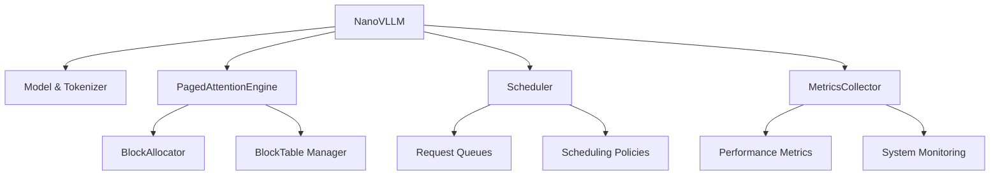

# 4.4 推理引擎核心

> 🎯 **本节目标**：深入理解 `NanoVLLM` 类的设计与实现，掌握推理引擎的核心架构和工作原理

## 🏗️ 推理引擎架构

`NanoVLLM` 类是整个系统的核心协调者，它整合了所有组件并提供统一的推理接口。

### 系统架构可视化


上图展示了 nano-vLLM 推理引擎的完整架构，包括各个组件之间的交互关系和数据流向。

### 性能优化效果


上图对比了 nano-vLLM 与传统推理方法在吞吐量、延迟和内存利用率等关键指标上的性能表现。

### 核心组件关系图



## 🔧 NanoVLLM 类详细分析

### 初始化过程

```python
class NanoVLLM:
    """nano-vLLM 推理引擎
    
    这是系统的主入口，协调所有组件的工作
    """
    
    def __init__(self, 
                 model_name: str,
                 max_model_len: int = 2048,
                 block_size: int = 16,
                 max_num_blocks: int = 1024,
                 gpu_memory_utilization: float = 0.9,
                 scheduler_policy: str = "fcfs"):
        """初始化 nano-vLLM 推理引擎
        
        Args:
            model_name: 模型名称或路径
            max_model_len: 最大序列长度
            block_size: 内存块大小（tokens）
            max_num_blocks: 最大内存块数量
            gpu_memory_utilization: GPU内存使用率
            scheduler_policy: 调度策略 (fcfs/priority/sjf)
        """
        print(f"🚀 初始化 nano-vLLM 推理引擎...")
        print(f"   📋 模型: {model_name}")
        print(f"   📏 最大序列长度: {max_model_len}")
        print(f"   🧱 块大小: {block_size} tokens")
        print(f"   💾 最大块数: {max_num_blocks}")
        print(f"   🖥️ GPU内存使用率: {gpu_memory_utilization:.1%}")
        print(f"   🚦 调度策略: {scheduler_policy}")
        
        # 🏷️ 保存配置参数
        self.model_name = model_name
        self.max_model_len = max_model_len
        self.block_size = block_size
        self.max_num_blocks = max_num_blocks
        self.gpu_memory_utilization = gpu_memory_utilization
        
        # 🖥️ 设备配置
        self.device = torch.device("cuda" if torch.cuda.is_available() else "cpu")
        print(f"   🖥️ 使用设备: {self.device}")
        
        # === 步骤1: 加载模型和分词器 ===
        print("📚 加载模型和分词器...")
        try:
            # 🤖 加载预训练模型
            self.model = AutoModelForCausalLM.from_pretrained(
                model_name,
                torch_dtype=torch.float16 if self.device.type == "cuda" else torch.float32,
                device_map="auto" if self.device.type == "cuda" else None,
                trust_remote_code=True
            )
            
            # 🔤 加载分词器
            self.tokenizer = AutoTokenizer.from_pretrained(
                model_name,
                trust_remote_code=True
            )
            
            # 🔧 配置分词器
            if self.tokenizer.pad_token is None:
                self.tokenizer.pad_token = self.tokenizer.eos_token
            
            print(f"   ✅ 模型加载成功")
            print(f"   📊 词汇表大小: {self.tokenizer.vocab_size}")
            print(f"   🔤 特殊token: PAD={self.tokenizer.pad_token_id}, EOS={self.tokenizer.eos_token_id}")
            
        except Exception as e:
            print(f"   ❌ 模型加载失败: {e}")
            raise
        
        # === 步骤2: 初始化内存管理 ===
        print("🧠 初始化内存管理系统...")
        try:
            # 🧱 创建 PagedAttention 引擎
            self.paged_attention = PagedAttentionEngine(
                block_size=block_size,
                max_num_blocks=max_num_blocks,
                device=self.device
            )
            
            print(f"   ✅ PagedAttention 引擎初始化完成")
            print(f"   💾 总内存容量: {max_num_blocks * block_size} tokens")
            
        except Exception as e:
            print(f"   ❌ 内存管理初始化失败: {e}")
            raise
        
        # === 步骤3: 初始化调度器 ===
        print("🚦 初始化请求调度器...")
        try:
            # 📋 创建调度器
            self.scheduler = Scheduler(
                policy=SchedulerPolicy.from_string(scheduler_policy),
                max_model_len=max_model_len,
                block_size=block_size
            )
            
            print(f"   ✅ 调度器初始化完成")
            print(f"   📊 调度策略: {scheduler_policy}")
            
        except Exception as e:
            print(f"   ❌ 调度器初始化失败: {e}")
            raise
        
        # === 步骤4: 初始化指标收集器 ===
        print("📊 初始化性能监控...")
        try:
            # 📈 创建指标收集器
            self.metrics_collector = MetricsCollector()
            
            print(f"   ✅ 指标收集器初始化完成")
            
        except Exception as e:
            print(f"   ❌ 指标收集器初始化失败: {e}")
            raise
        
        # 🏁 初始化完成
        print("✅ nano-vLLM 推理引擎初始化完成!")
        
        # 📊 打印系统信息
        self._print_system_info()
```

**初始化关键步骤解析**：

1. **配置验证**：检查参数合理性
2. **模型加载**：支持多种模型格式和设备
3. **内存初始化**：建立 PagedAttention 内存池
4. **调度器配置**：选择合适的调度策略
5. **监控启动**：建立性能指标收集

### 核心推理接口

```python
def generate(self, 
             prompt: str, 
             max_tokens: int = 100,
             temperature: float = 1.0,
             top_k: int = 50,
             top_p: float = 1.0,
             stop_sequences: Optional[List[str]] = None) -> str:
    """生成文本的主要接口
    
    这是用户调用的主要方法，提供简洁的API
    
    Args:
        prompt: 输入提示文本
        max_tokens: 最大生成token数
        temperature: 采样温度
        top_k: Top-K 采样参数
        top_p: Top-P (nucleus) 采样参数
        stop_sequences: 停止序列列表
        
    Returns:
        生成的文本
    """
    print(f"🎯 开始文本生成...")
    print(f"   📝 提示: {prompt[:50]}...")
    print(f"   ⚙️ 参数: max_tokens={max_tokens}, temp={temperature}")
    
    # 🔧 创建生成参数
    params = GenerationParams(
        max_tokens=max_tokens,
        temperature=temperature,
        top_k=top_k,
        top_p=top_p,
        stop_sequences=stop_sequences or []
    )
    
    # 📋 处理请求
    request_id = self.process_incoming_request(prompt, params)
    
    # ⏳ 等待生成完成
    print(f"⏳ 等待生成完成...")
    
    start_time = time.time()
    timeout = 60.0  # 60秒超时
    
    while True:
        # 🔄 执行调度周期
        self._run_inference_step()
        
        # 🔍 检查请求状态
        if self._is_request_completed(request_id):
            response = self._get_response(request_id)
            
            elapsed_time = time.time() - start_time
            print(f"✅ 生成完成! 耗时: {elapsed_time:.2f}秒")
            
            return response.generated_text
        
        # ⏰ 超时检查
        if time.time() - start_time > timeout:
            print(f"⏰ 生成超时 ({timeout}秒)")
            self._cleanup_request(request_id)
            raise TimeoutError(f"生成超时: {timeout}秒")
        
        # 🔄 短暂等待
        time.sleep(0.01)

def _run_inference_step(self):
    """执行一个推理步骤
    
    这是推理循环的核心，协调所有组件
    """
    try:
        # 🚦 执行调度
        current_batch = self.scheduler.schedule(self.paged_attention)
        
        if not current_batch:
            return  # 没有可调度的请求
        
        # 🧠 执行推理
        completed_requests = self._execute_inference_batch(current_batch)
        
        # 🏁 处理完成的请求
        if completed_requests:
            self._process_completed_requests(completed_requests)
        
        # 📊 更新指标
        self.metrics_collector.update_step_metrics(
            batch_size=len(current_batch),
            completed_count=len(completed_requests)
        )
        
    except Exception as e:
        print(f"❌ 推理步骤执行失败: {e}")
        # 在生产环境中，这里应该有更完善的错误处理
```

### 批处理推理引擎

```python
def _execute_inference_batch(self, batch: List[InferenceRequest]) -> List[Tuple[InferenceRequest, str]]:
    """执行批处理推理
    
    这是推理的核心方法，处理一个批次的请求
    
    Args:
        batch: 要处理的请求批次
        
    Returns:
        已完成的请求列表 (请求, 停止原因)
    """
    if not batch:
        return []
    
    print(f"🧠 执行批处理推理 (批次大小: {len(batch)})")
    
    # === 步骤1: 准备输入数据 ===
    batch_data = self._prepare_batch_input(batch)
    if batch_data is None:
        print("❌ 批次输入准备失败")
        return []
    
    input_ids, attention_mask, position_ids = batch_data
    
    # === 步骤2: 模型前向传播 ===
    try:
        with torch.no_grad():
            # ⏱️ 记录推理时间
            inference_start = time.time()
            
            # 🧠 执行前向传播
            outputs = self.model(
                input_ids=input_ids,
                attention_mask=attention_mask,
                position_ids=position_ids,
                use_cache=True,
                return_dict=True
            )
            
            inference_time = time.time() - inference_start
            
            # 📊 获取 logits
            logits = outputs.logits  # [batch_size, seq_len, vocab_size]
            next_token_logits = logits[:, -1, :]  # [batch_size, vocab_size]
            
            print(f"   ⚡ 前向传播完成: {inference_time:.3f}秒")
            print(f"   📊 输出形状: {next_token_logits.shape}")
            
    except Exception as e:
        print(f"   ❌ 模型推理失败: {e}")
        return []
    
    # === 步骤3: Token 采样 ===
    try:
        sampling_start = time.time()
        
        next_tokens = self._sample_next_tokens(next_token_logits, batch)
        
        sampling_time = time.time() - sampling_start
        print(f"   🎲 采样完成: {sampling_time:.3f}秒")
        
    except Exception as e:
        print(f"   ❌ Token采样失败: {e}")
        return []
    
    # === 步骤4: 更新请求状态 ===
    completed_requests = []
    
    for i, request in enumerate(batch):
        next_token = next_tokens[i]
        
        # 📝 添加新token
        request.generated_tokens.append(next_token)
        
        # 🔍 检查完成条件
        is_completed, stop_reason = self._check_completion_condition(request, next_token)
        
        if is_completed:
            # 🏁 标记请求完成
            request.finish_time = time.time()
            completed_requests.append((request, stop_reason))
            
            print(f"   🏁 请求 {request.request_id} 完成 (原因: {stop_reason})")
        else:
            # 📈 更新进度
            progress = len(request.generated_tokens)
            total = request.params.max_tokens
            print(f"   📈 请求 {request.request_id}: {progress}/{total} tokens")
    
    return completed_requests

def _prepare_batch_input(self, batch: List[InferenceRequest]) -> Optional[Tuple[torch.Tensor, torch.Tensor, torch.Tensor]]:
    """准备批次输入数据
    
    Args:
        batch: 请求批次
        
    Returns:
        (input_ids, attention_mask, position_ids) 或 None
    """
    try:
        batch_input_ids = []
        batch_attention_masks = []
        batch_position_ids = []
        
        # 📏 计算最大序列长度
        max_length = 0
        for request in batch:
            full_sequence = request.prompt_tokens + request.generated_tokens
            max_length = max(max_length, len(full_sequence))
        
        print(f"   📏 批次最大长度: {max_length}")
        
        # 🔄 构建批次数据
        for request in batch:
            full_sequence = request.prompt_tokens + request.generated_tokens
            seq_len = len(full_sequence)
            
            # 🔢 Padding 到统一长度
            padded_sequence = full_sequence + [self.tokenizer.pad_token_id] * (max_length - seq_len)
            attention_mask = [1] * seq_len + [0] * (max_length - seq_len)
            position_ids = list(range(max_length))
            
            batch_input_ids.append(padded_sequence)
            batch_attention_masks.append(attention_mask)
            batch_position_ids.append(position_ids)
        
        # 🔢 转换为张量
        input_ids = torch.tensor(batch_input_ids, dtype=torch.long, device=self.device)
        attention_mask = torch.tensor(batch_attention_masks, dtype=torch.long, device=self.device)
        position_ids = torch.tensor(batch_position_ids, dtype=torch.long, device=self.device)
        
        return input_ids, attention_mask, position_ids
        
    except Exception as e:
        print(f"   ❌ 批次输入准备失败: {e}")
        return None

def _sample_next_tokens(self, logits: torch.Tensor, batch: List[InferenceRequest]) -> List[int]:
    """对批次进行 token 采样
    
    Args:
        logits: 模型输出的 logits [batch_size, vocab_size]
        batch: 对应的请求批次
        
    Returns:
        采样得到的 token 列表
    """
    next_tokens = []
    
    for i, request in enumerate(batch):
        # 🎯 获取当前请求的 logits
        current_logits = logits[i].clone()
        
        # 🌡️ 应用 temperature
        if request.params.temperature != 1.0:
            current_logits = current_logits / request.params.temperature
        
        # 🔝 应用 top-k 采样
        if request.params.top_k > 0:
            top_k_logits, top_k_indices = torch.topk(current_logits, request.params.top_k)
            # 将非top-k的logits设为负无穷
            current_logits = torch.full_like(current_logits, float('-inf'))
            current_logits.scatter_(0, top_k_indices, top_k_logits)
        
        # 🎯 应用 top-p (nucleus) 采样
        if request.params.top_p < 1.0:
            # 按概率排序
            sorted_logits, sorted_indices = torch.sort(current_logits, descending=True)
            cumulative_probs = torch.cumsum(torch.softmax(sorted_logits, dim=-1), dim=-1)
            
            # 找到累积概率超过 top_p 的位置
            sorted_indices_to_remove = cumulative_probs > request.params.top_p
            # 保留第一个超过阈值的token
            sorted_indices_to_remove[1:] = sorted_indices_to_remove[:-1].clone()
            sorted_indices_to_remove[0] = 0
            
            # 移除不符合条件的tokens
            indices_to_remove = sorted_indices[sorted_indices_to_remove]
            current_logits[indices_to_remove] = float('-inf')
        
        # 🎲 执行采样
        probs = torch.softmax(current_logits, dim=-1)
        next_token = torch.multinomial(probs, num_samples=1).item()
        
        next_tokens.append(next_token)
        
        # 🔍 调试信息
        if len(next_tokens) <= 3:  # 只打印前几个请求的详细信息
            token_text = self.tokenizer.decode([next_token])
            prob = probs[next_token].item()
            print(f"      🎯 {request.request_id}: token={next_token} ('{token_text}'), prob={prob:.4f}")
    
    return next_tokens
```

### 完成条件检查

```python
def _check_completion_condition(self, request: InferenceRequest, next_token: int) -> Tuple[bool, str]:
    """检查请求是否应该完成
    
    Args:
        request: 推理请求
        next_token: 刚生成的token
        
    Returns:
        (是否完成, 停止原因)
    """
    # 🔢 检查最大长度
    if len(request.generated_tokens) >= request.params.max_tokens:
        return True, "max_tokens"
    
    # 🔚 检查 EOS token
    if next_token == self.tokenizer.eos_token_id:
        return True, "eos_token"
    
    # 🛑 检查停止序列
    if request.params.stop_sequences:
        # 解码当前生成的文本
        try:
            generated_text = self.tokenizer.decode(
                request.generated_tokens, 
                skip_special_tokens=True
            )
            
            # 检查是否包含停止序列
            for stop_seq in request.params.stop_sequences:
                if stop_seq in generated_text:
                    return True, f"stop_sequence: {stop_seq}"
                    
        except Exception as e:
            print(f"   ⚠️ 停止序列检查失败: {e}")
    
    # ⏰ 检查超时（可选）
    if hasattr(request, 'start_time') and request.start_time:
        elapsed = time.time() - request.start_time
        if elapsed > 300:  # 5分钟超时
            return True, "timeout"
    
    return False, ""
```

### 系统信息和监控

```python
def _print_system_info(self):
    """打印系统信息"""
    print("\n📊 系统配置信息:")
    print(f"   🤖 模型: {self.model_name}")
    print(f"   🖥️ 设备: {self.device}")
    
    if torch.cuda.is_available():
        gpu_name = torch.cuda.get_device_name(0)
        gpu_memory = torch.cuda.get_device_properties(0).total_memory / 1024**3
        print(f"   🎮 GPU: {gpu_name}")
        print(f"   💾 GPU内存: {gpu_memory:.1f}GB")
    
    print(f"   🧱 内存块配置: {self.max_num_blocks} × {self.block_size} tokens")
    print(f"   📏 最大序列长度: {self.max_model_len}")
    print(f"   🚦 调度策略: {self.scheduler.policy.name}")

def get_system_status(self) -> Dict[str, Any]:
    """获取系统状态
    
    Returns:
        包含系统状态信息的字典
    """
    try:
        # 📊 获取各组件状态
        memory_status = self.paged_attention.get_memory_status()
        queue_status = self.scheduler.get_queue_status()
        metrics = self.metrics_collector.get_current_metrics()
        
        # 🖥️ GPU状态
        gpu_status = {}
        if torch.cuda.is_available():
            gpu_status = {
                "gpu_memory_allocated": torch.cuda.memory_allocated() / 1024**3,
                "gpu_memory_reserved": torch.cuda.memory_reserved() / 1024**3,
                "gpu_utilization": self._get_gpu_utilization()
            }
        
        return {
            "timestamp": time.time(),
            "memory": memory_status,
            "queues": queue_status,
            "metrics": metrics,
            "gpu": gpu_status,
            "model_info": {
                "name": self.model_name,
                "max_length": self.max_model_len,
                "vocab_size": self.tokenizer.vocab_size
            }
        }
        
    except Exception as e:
        print(f"❌ 获取系统状态失败: {e}")
        return {"error": str(e)}

def _get_gpu_utilization(self) -> float:
    """获取GPU利用率（简化版本）"""
    try:
        # 在实际实现中，可以使用 nvidia-ml-py 或其他工具
        # 这里返回一个模拟值
        return 0.75  # 75% 利用率
    except:
        return 0.0
```

## 🔄 完整使用示例

### 基础使用

```python
def basic_usage_example():
    """基础使用示例"""
    
    print("🚀 nano-vLLM 基础使用示例")
    
    # 🏗️ 初始化引擎
    nano_vllm = NanoVLLM(
        model_name="gpt2",
        max_model_len=1024,
        block_size=16,
        max_num_blocks=512,
        scheduler_policy="fcfs"
    )
    
    # 📝 生成文本
    prompt = "人工智能的未来发展趋势是"
    
    result = nano_vllm.generate(
        prompt=prompt,
        max_tokens=100,
        temperature=0.7,
        top_k=50,
        top_p=0.9
    )
    
    print(f"📄 生成结果: {result}")
    
    # 📊 查看系统状态
    status = nano_vllm.get_system_status()
    print(f"📊 系统状态: {status}")
```

### 高级配置示例

```python
def advanced_usage_example():
    """高级配置示例"""
    
    print("🔧 nano-vLLM 高级配置示例")
    
    # 🏗️ 高级配置
    nano_vllm = NanoVLLM(
        model_name="microsoft/DialoGPT-medium",
        max_model_len=2048,
        block_size=32,
        max_num_blocks=1024,
        gpu_memory_utilization=0.8,
        scheduler_policy="priority"
    )
    
    # 📝 多轮对话生成
    conversation_history = [
        "用户: 你好，请介绍一下深度学习",
        "助手: 深度学习是机器学习的一个分支...",
        "用户: 那么深度学习有哪些应用？"
    ]
    
    prompt = "\n".join(conversation_history) + "\n助手: "
    
    result = nano_vllm.generate(
        prompt=prompt,
        max_tokens=200,
        temperature=0.8,
        top_k=40,
        top_p=0.95,
        stop_sequences=["\n用户:", "\n助手:"]
    )
    
    print(f"💬 对话回复: {result}")
```

## 📊 性能优化要点

### 1. 批处理优化

- **动态批处理**：根据内存情况调整批次大小
- **序列长度分组**：相似长度的序列组成批次
- **优先级调度**：重要请求优先处理

### 2. 内存管理优化

- **预分配策略**：提前分配常用大小的内存块
- **内存复用**：完成的请求立即释放内存
- **碎片整理**：定期整理内存碎片

### 3. 计算优化

- **KV Cache**：复用注意力计算结果
- **混合精度**：使用 FP16 减少内存和计算
- **算子融合**：合并相邻的计算操作

## 📚 小结

本节深入分析了 `NanoVLLM` 推理引擎的核心实现：

**核心特性**：
- 🏗️ **模块化设计**：清晰的组件分离和接口定义
- 🚀 **高性能推理**：批处理和内存优化
- 📊 **完整监控**：全方位的性能指标收集
- 🔧 **灵活配置**：支持多种模型和参数

**关键洞察**：
- 🔄 **协调者模式**：NanoVLLM 作为各组件的协调中心
- 🧠 **内存优先**：内存管理是性能的关键瓶颈
- 📦 **批处理核心**：批处理是提升吞吐量的关键
- 📊 **可观测性**：完整的监控对生产环境至关重要

通过理解推理引擎的核心实现，你现在可以：
- 🔧 **定制引擎**：根据需求修改和扩展功能
- 🚀 **优化性能**：识别和解决性能瓶颈
- 🐛 **调试问题**：快速定位和解决故障
- 📊 **监控系统**：建立有效的运维体系

---

> 💡 **实践建议**：尝试修改批处理大小、调度策略等参数，观察对性能的影响，这将帮助你更好地理解系统的行为特征。