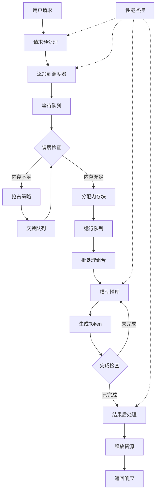

# 4.5 完整工作流程分析

> 🎯 **本节目标**：通过端到端的流程分析，理解 nano-vLLM 从接收请求到返回结果的完整数据流和控制流

## 🌊 工作流程概览

nano-vLLM 的工作流程可以分为以下几个主要阶段：

1. **请求接收与预处理** - 解析用户输入，创建请求对象
2. **调度与内存分配** - 决定执行顺序，分配计算资源
3. **模型推理执行** - 实际的神经网络计算
4. **结果后处理** - 生成最终响应，清理资源
5. **性能监控** - 收集指标，优化系统

## 📊 完整数据流程图


上图展示了 nano-vLLM 从请求接收到结果返回的完整数据流程，包括各个组件之间的交互和数据传递路径。

## 🔄 端到端流程图



## 📋 详细流程分析

### 阶段1：请求接收与预处理

```python
def process_incoming_request(self, prompt: str, params: GenerationParams) -> str:
    """处理传入的推理请求
    
    这是整个流程的入口点
    """
    # 🆔 生成唯一请求ID
    request_id = f"req_{int(time.time() * 1000)}_{random.randint(1000, 9999)}"
    
    print(f"🚀 开始处理请求 {request_id}")
    print(f"   📝 输入提示: {prompt[:50]}...")
    print(f"   ⚙️ 生成参数: max_tokens={params.max_tokens}, temp={params.temperature}")
    
    # 📊 创建请求对象
    request = InferenceRequest(
        request_id=request_id,
        prompt=prompt,
        params=params,
        arrival_time=time.time()
    )
    
    # 🔤 Tokenization - 将文本转换为token序列
    print(f"🔤 开始tokenization...")
    try:
        # 使用tokenizer将文本编码为token ID序列
        request.prompt_tokens = self.tokenizer.encode(prompt)
        prompt_length = len(request.prompt_tokens)
        
        print(f"   ✅ Tokenization完成: {prompt_length} tokens")
        print(f"   📊 前10个tokens: {request.prompt_tokens[:10]}")
        
    except Exception as e:
        print(f"   ❌ Tokenization失败: {e}")
        return self._create_error_response(request_id, "tokenization_error")
    
    # 🧮 资源需求估算
    max_sequence_length = prompt_length + params.max_tokens
    estimated_blocks = (max_sequence_length + self.block_size - 1) // self.block_size
    
    print(f"📊 资源需求估算:")
    print(f"   📏 提示长度: {prompt_length} tokens")
    print(f"   🎯 最大序列长度: {max_sequence_length} tokens")
    print(f"   🧱 预估需要块数: {estimated_blocks}")
    
    # 📋 提交到调度器
    self.scheduler.add_request(request)
    
    return request_id
```

**关键步骤解析**：
1. **ID生成**：确保请求的全局唯一性
2. **Tokenization**：文本到数字序列的转换
3. **资源估算**：提前计算内存需求
4. **调度提交**：将请求加入系统队列

### 阶段2：调度与内存分配

```python
def scheduling_cycle(self):
    """执行一个完整的调度周期
    
    这是系统的心跳，定期执行调度决策
    """
    print("💓 开始调度周期...")
    
    # === 步骤1：系统状态检查 ===
    print("🔍 检查系统状态...")
    
    # 内存使用情况
    memory_usage = self.paged_attention.block_allocator.get_memory_usage()
    print(f"   🧠 内存使用率: {memory_usage['usage_ratio']:.2%}")
    
    # 队列状态
    queue_status = self.scheduler.get_queue_status()
    print(f"   📊 队列状态: 等待={queue_status['waiting']}, 运行={queue_status['running']}")
    
    # GPU状态
    if torch.cuda.is_available():
        gpu_memory = torch.cuda.memory_allocated() / 1024**3
        print(f"   🖥️ GPU内存使用: {gpu_memory:.2f}GB")
    
    # === 步骤2：执行调度决策 ===
    print("🚦 执行调度决策...")
    
    try:
        # 调用调度器获取当前批次
        current_batch = self.scheduler.schedule(self.paged_attention)
        
        if not current_batch:
            print("   ⏸️ 当前无可调度的请求")
            return []
        
        print(f"   📦 调度批次大小: {len(current_batch)}")
        
        # === 步骤3：内存分配验证 ===
        print("🧠 验证内存分配...")
        
        allocation_success = True
        for request in current_batch:
            # 检查每个请求的内存分配状态
            if not self.paged_attention.has_sequence(request.request_id):
                print(f"   ❌ 请求 {request.request_id} 内存分配失败")
                allocation_success = False
        
        if not allocation_success:
            print("   🚨 批次内存分配不完整，跳过本轮")
            return []
        
        return current_batch
        
    except Exception as e:
        print(f"   ❌ 调度过程出错: {e}")
        return []
```

**调度决策流程**：
1. **状态评估**：检查内存、队列、GPU状态
2. **批次生成**：根据策略选择要执行的请求
3. **资源验证**：确保所有资源分配成功

### 阶段3：模型推理执行

```python
def execute_inference_batch(self, batch: List[InferenceRequest]):
    """执行推理批次
    
    这是实际进行神经网络计算的核心方法
    """
    if not batch:
        return
    
    print(f"🧠 开始执行推理批次 (大小: {len(batch)})")
    
    # === 步骤1：准备输入数据 ===
    print("📋 准备批次输入数据...")
    
    batch_input_ids = []
    batch_attention_masks = []
    sequence_lengths = []
    
    for request in batch:
        # 🔤 获取当前序列的完整token序列
        full_sequence = request.prompt_tokens + request.generated_tokens
        sequence_lengths.append(len(full_sequence))
        
        print(f"   📊 {request.request_id}: 序列长度 {len(full_sequence)}")
    
    # 📏 计算批次的最大长度（用于padding）
    max_length = max(sequence_lengths)
    print(f"   📏 批次最大长度: {max_length}")
    
    # 🔄 构建批次张量
    for request in batch:
        full_sequence = request.prompt_tokens + request.generated_tokens
        
        # Padding到统一长度
        padded_sequence = full_sequence + [self.tokenizer.pad_token_id] * (max_length - len(full_sequence))
        attention_mask = [1] * len(full_sequence) + [0] * (max_length - len(full_sequence))
        
        batch_input_ids.append(padded_sequence)
        batch_attention_masks.append(attention_mask)
    
    # 🔢 转换为PyTorch张量
    input_ids = torch.tensor(batch_input_ids, device=self.device)
    attention_mask = torch.tensor(batch_attention_masks, device=self.device)
    
    print(f"   📊 输入张量形状: {input_ids.shape}")
    
    # === 步骤2：执行前向传播 ===
    print("⚡ 执行模型前向传播...")
    
    try:
        with torch.no_grad():  # 推理时不需要梯度
            # 🧠 模型前向传播
            start_time = time.time()
            
            outputs = self.model(
                input_ids=input_ids,
                attention_mask=attention_mask,
                use_cache=True  # 启用KV Cache
            )
            
            forward_time = time.time() - start_time
            print(f"   ⏱️ 前向传播耗时: {forward_time:.3f}秒")
            
            # 📊 获取logits（下一个token的概率分布）
            logits = outputs.logits  # Shape: [batch_size, seq_len, vocab_size]
            next_token_logits = logits[:, -1, :]  # 只要最后一个位置的logits
            
            print(f"   📊 Logits形状: {next_token_logits.shape}")
            
    except Exception as e:
        print(f"   ❌ 前向传播失败: {e}")
        return
    
    # === 步骤3：Token采样 ===
    print("🎲 执行token采样...")
    
    next_tokens = []
    for i, request in enumerate(batch):
        # 🎯 获取当前请求的logits
        current_logits = next_token_logits[i]
        
        # 🌡️ 应用temperature
        if request.params.temperature != 1.0:
            current_logits = current_logits / request.params.temperature
        
        # 🔝 应用top-k采样
        if request.params.top_k > 0:
            top_k_logits, top_k_indices = torch.topk(current_logits, request.params.top_k)
            current_logits = torch.full_like(current_logits, float('-inf'))
            current_logits.scatter_(0, top_k_indices, top_k_logits)
        
        # 🎯 应用top-p (nucleus) 采样
        if request.params.top_p < 1.0:
            sorted_logits, sorted_indices = torch.sort(current_logits, descending=True)
            cumulative_probs = torch.cumsum(torch.softmax(sorted_logits, dim=-1), dim=-1)
            
            # 找到累积概率超过top_p的位置
            sorted_indices_to_remove = cumulative_probs > request.params.top_p
            sorted_indices_to_remove[1:] = sorted_indices_to_remove[:-1].clone()
            sorted_indices_to_remove[0] = 0
            
            indices_to_remove = sorted_indices[sorted_indices_to_remove]
            current_logits[indices_to_remove] = float('-inf')
        
        # 🎲 采样下一个token
        probs = torch.softmax(current_logits, dim=-1)
        next_token = torch.multinomial(probs, num_samples=1).item()
        next_tokens.append(next_token)
        
        print(f"   🎯 {request.request_id}: 采样token {next_token}")
    
    # === 步骤4：更新请求状态 ===
    print("📝 更新请求状态...")
    
    completed_requests = []
    
    for i, request in enumerate(batch):
        next_token = next_tokens[i]
        
        # 📝 添加新生成的token
        request.generated_tokens.append(next_token)
        
        # 🔍 检查停止条件
        should_stop = False
        stop_reason = None
        
        # 检查最大长度
        if len(request.generated_tokens) >= request.params.max_tokens:
            should_stop = True
            stop_reason = "max_tokens"
        
        # 检查EOS token
        elif next_token == self.tokenizer.eos_token_id:
            should_stop = True
            stop_reason = "eos_token"
        
        # 检查停止序列
        elif request.params.stop_sequences:
            generated_text = self.tokenizer.decode(request.generated_tokens)
            for stop_seq in request.params.stop_sequences:
                if stop_seq in generated_text:
                    should_stop = True
                    stop_reason = f"stop_sequence: {stop_seq}"
                    break
        
        if should_stop:
            print(f"   🏁 请求 {request.request_id} 完成 (原因: {stop_reason})")
            completed_requests.append((request, stop_reason))
        else:
            progress = len(request.generated_tokens)
            print(f"   📈 请求 {request.request_id} 进度: {progress}/{request.params.max_tokens}")
    
    return completed_requests
```

**推理执行要点**：
1. **批次准备**：统一长度，构建张量
2. **前向传播**：利用KV Cache加速计算
3. **智能采样**：支持多种采样策略
4. **状态更新**：跟踪生成进度和停止条件

### 阶段4：结果后处理

```python
def process_completed_requests(self, completed_requests: List[Tuple[InferenceRequest, str]]):
    """处理已完成的请求
    
    Args:
        completed_requests: (请求对象, 停止原因) 的列表
    """
    print(f"🏁 处理 {len(completed_requests)} 个已完成的请求")
    
    for request, stop_reason in completed_requests:
        print(f"📋 处理完成的请求: {request.request_id}")
        
        # === 步骤1：生成最终响应 ===
        try:
            # 🔤 解码生成的token为文本
            generated_text = self.tokenizer.decode(
                request.generated_tokens, 
                skip_special_tokens=True
            )
            
            print(f"   📝 生成文本长度: {len(generated_text)} 字符")
            print(f"   📄 生成内容预览: {generated_text[:100]}...")
            
            # 🧮 计算统计信息
            prompt_tokens = len(request.prompt_tokens)
            completion_tokens = len(request.generated_tokens)
            total_tokens = prompt_tokens + completion_tokens
            
            # ⏱️ 计算性能指标
            if request.start_time and request.finish_time:
                generation_time = request.finish_time - request.start_time
                tokens_per_second = completion_tokens / generation_time if generation_time > 0 else 0
            else:
                generation_time = 0
                tokens_per_second = 0
            
            # 📊 创建响应对象
            response = InferenceResponse(
                request_id=request.request_id,
                generated_text=generated_text,
                generated_tokens=request.generated_tokens,
                prompt_tokens=prompt_tokens,
                completion_tokens=completion_tokens,
                total_tokens=total_tokens,
                finish_reason=stop_reason,
                generation_time=generation_time,
                tokens_per_second=tokens_per_second
            )
            
            print(f"   📊 性能统计:")
            print(f"      ⏱️ 生成时间: {generation_time:.2f}秒")
            print(f"      🚀 生成速度: {tokens_per_second:.1f} tokens/s")
            print(f"      📊 Token统计: {prompt_tokens}+{completion_tokens}={total_tokens}")
            
        except Exception as e:
            print(f"   ❌ 响应生成失败: {e}")
            response = self._create_error_response(request.request_id, "response_generation_error")
        
        # === 步骤2：资源清理 ===
        print(f"🧹 清理请求 {request.request_id} 的资源...")
        
        try:
            # 🧠 释放内存块
            self.paged_attention.free_sequence(request.request_id)
            print(f"   ✅ 内存块已释放")
            
            # 📋 从调度器移除
            self.scheduler.finish_request(request.request_id, self.paged_attention)
            print(f"   ✅ 调度器状态已更新")
            
        except Exception as e:
            print(f"   ⚠️ 资源清理警告: {e}")
        
        # === 步骤3：指标记录 ===
        print(f"📊 记录性能指标...")
        
        try:
            # 记录成功请求的指标
            self.metrics_collector.record_request(request, success=True)
            print(f"   ✅ 指标记录完成")
            
        except Exception as e:
            print(f"   ⚠️ 指标记录警告: {e}")
        
        # === 步骤4：响应返回 ===
        # 在实际实现中，这里会通过回调或队列返回响应
        self._send_response_to_client(response)
        
        print(f"✅ 请求 {request.request_id} 处理完成")

def _send_response_to_client(self, response: InferenceResponse):
    """将响应发送给客户端
    
    Args:
        response: 要发送的响应对象
    """
    # 在实际实现中，这里可能是：
    # - HTTP响应
    # - WebSocket消息
    # - 消息队列
    # - 回调函数
    
    print(f"📤 发送响应给客户端: {response.request_id}")
    print(f"   📄 生成文本: {response.generated_text[:50]}...")
    print(f"   📊 统计信息: {response.completion_tokens} tokens, {response.tokens_per_second:.1f} t/s")
```

### 阶段5：性能监控

```python
def collect_system_metrics(self):
    """收集系统性能指标
    
    定期执行，用于监控系统健康状态
    """
    print("📊 收集系统性能指标...")
    
    try:
        # 🧮 获取综合指标
        metrics = self.metrics_collector.get_metrics(
            self.paged_attention, 
            self.scheduler
        )
        
        print(f"📈 系统性能报告 (时间: {time.strftime('%H:%M:%S')})")
        print(f"   🚀 吞吐量:")
        print(f"      📊 请求/秒: {metrics.requests_per_second:.2f}")
        print(f"      🎯 Token/秒: {metrics.tokens_per_second:.1f}")
        
        print(f"   ⏱️ 延迟:")
        print(f"      📊 平均延迟: {metrics.avg_latency:.3f}s")
        print(f"      📊 P95延迟: {metrics.p95_latency:.3f}s")
        print(f"      📊 P99延迟: {metrics.p99_latency:.3f}s")
        
        print(f"   🧠 内存:")
        print(f"      💾 GPU使用率: {metrics.gpu_memory_utilization:.1%}")
        print(f"      🧱 KV Cache使用率: {metrics.kv_cache_usage:.1%}")
        
        print(f"   📋 队列:")
        print(f"      🟡 等待: {metrics.waiting_requests}")
        print(f"      🟢 运行: {metrics.running_requests}")
        print(f"      🔄 交换: {metrics.swapped_requests}")
        
        print(f"   ✅ 成功率:")
        print(f"      📊 总请求: {metrics.total_requests}")
        print(f"      ✅ 成功: {metrics.successful_requests}")
        print(f"      ❌ 失败: {metrics.failed_requests}")
        print(f"      📊 错误率: {metrics.error_rate:.2%}")
        
        # 🚨 异常检测
        self._check_system_health(metrics)
        
        return metrics
        
    except Exception as e:
        print(f"❌ 指标收集失败: {e}")
        return None

def _check_system_health(self, metrics: SystemMetrics):
    """检查系统健康状态
    
    Args:
        metrics: 当前系统指标
    """
    warnings = []
    
    # 🧠 内存使用检查
    if metrics.gpu_memory_utilization > 0.95:
        warnings.append("GPU内存使用率过高")
    
    if metrics.kv_cache_usage > 0.9:
        warnings.append("KV Cache使用率过高")
    
    # ⏱️ 延迟检查
    if metrics.p99_latency > 10.0:  # 10秒
        warnings.append("P99延迟过高")
    
    # 📊 错误率检查
    if metrics.error_rate > 0.05:  # 5%
        warnings.append("错误率过高")
    
    # 📋 队列积压检查
    if metrics.waiting_requests > 100:
        warnings.append("等待队列积压严重")
    
    if warnings:
        print("🚨 系统健康警告:")
        for warning in warnings:
            print(f"   ⚠️ {warning}")
    else:
        print("✅ 系统运行正常")
```

## 🔄 完整生命周期示例

### 单个请求的完整生命周期

```python
def trace_request_lifecycle():
    """追踪一个请求的完整生命周期"""
    
    print("🚀 开始追踪请求生命周期...")
    
    # === 阶段1: 请求创建 ===
    print("\n📋 阶段1: 请求创建")
    prompt = "解释什么是人工智能"
    params = GenerationParams(max_tokens=100, temperature=0.7)
    request_id = nano_vllm.process_incoming_request(prompt, params)
    
    # === 阶段2: 等待调度 ===
    print("\n⏳ 阶段2: 等待调度")
    while True:
        batch = nano_vllm.scheduling_cycle()
        if any(req.request_id == request_id for req in batch):
            print(f"✅ 请求 {request_id} 已被调度")
            break
        time.sleep(0.1)
    
    # === 阶段3: 推理执行 ===
    print("\n🧠 阶段3: 推理执行")
    generation_steps = 0
    while True:
        batch = nano_vllm.get_current_batch()
        if not any(req.request_id == request_id for req in batch):
            print(f"✅ 请求 {request_id} 推理完成")
            break
        
        completed = nano_vllm.execute_inference_batch(batch)
        if any(req.request_id == request_id for req, _ in completed):
            print(f"🏁 请求 {request_id} 生成完成")
            break
        
        generation_steps += 1
        print(f"📈 推理步骤 {generation_steps}")
        time.sleep(0.1)
    
    # === 阶段4: 结果返回 ===
    print("\n📤 阶段4: 结果返回")
    response = nano_vllm.get_response(request_id)
    print(f"✅ 收到响应: {response.generated_text[:50]}...")
    
    print("\n🎉 请求生命周期追踪完成!")
```

## 📊 性能分析要点

### 1. 关键路径分析

```python
def analyze_critical_path():
    """分析关键路径的性能瓶颈"""
    
    # 🔍 各阶段耗时统计
    stages = {
        "tokenization": [],
        "scheduling": [],
        "memory_allocation": [],
        "model_inference": [],
        "token_sampling": [],
        "response_generation": []
    }
    
    # 📊 收集多个请求的统计数据
    for _ in range(100):
        # 模拟请求处理，记录各阶段耗时
        pass
    
    # 📈 分析结果
    print("📊 关键路径性能分析:")
    for stage, times in stages.items():
        if times:
            avg_time = sum(times) / len(times)
            max_time = max(times)
            print(f"   {stage}: 平均 {avg_time:.3f}s, 最大 {max_time:.3f}s")
```

### 2. 瓶颈识别

常见的性能瓶颈：

1. **内存瓶颈**：KV Cache 分配和回收
2. **计算瓶颈**：模型前向传播
3. **调度瓶颈**：复杂的调度策略
4. **I/O瓶颈**：数据传输和序列化

### 3. 优化策略

- **预分配**：提前分配内存和计算资源
- **流水线**：重叠不同阶段的执行
- **批处理**：最大化GPU利用率
- **缓存**：复用计算结果和中间状态

## 📚 小结

本节通过端到端的流程分析，深入理解了 nano-vLLM 的完整工作机制：

1. **请求处理**：从文本输入到token序列的转换
2. **资源管理**：内存分配和调度决策的协调
3. **推理执行**：批处理和并行计算的优化
4. **结果生成**：从token到文本的后处理
5. **性能监控**：全方位的系统健康检查

**核心洞察**：
- 🔄 **流水线设计**：各阶段可以并行执行
- 🧠 **内存优先**：内存管理是性能的关键
- 📦 **批处理优化**：平衡延迟和吞吐量
- 📊 **可观测性**：完整的监控和诊断能力

通过理解这个完整的工作流程，你现在可以：
- 🔧 **优化性能**：识别和解决瓶颈
- 🐛 **调试问题**：快速定位故障点
- 🚀 **扩展功能**：在合适的位置添加新特性
- 📊 **监控系统**：建立有效的观测体系

---

> 💡 **实践建议**：尝试在每个阶段添加详细的日志和指标收集，这将帮助你更好地理解系统的运行状态。