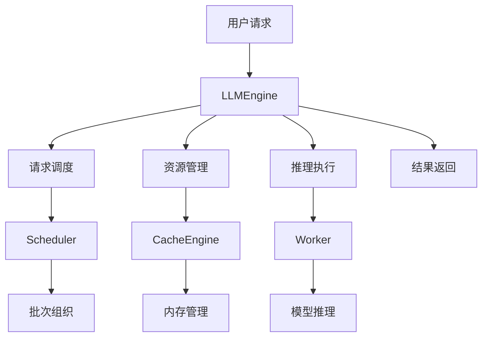

# 第二步：LLM 引擎初始化与架构理解

## 🎯 学习目标

通过本步骤的学习，你将：

1. **理解 LLM 引擎的核心作用**：掌握 LLMEngine 在整个推理系统中的协调者角色
2. **掌握引擎初始化流程**：了解各个组件的创建顺序和依赖关系
3. **理解组件间的协作机制**：学会 Scheduler、Worker、CacheEngine 如何协同工作
4. **学会配置和优化引擎**：掌握关键参数对性能的影响

## 📚 理论背景

### LLM 引擎的核心职责

LLM 引擎（LLMEngine）是整个推理系统的"大脑"，负责：



### 引擎架构设计

```
┌─────────────────────────────────────────────────────────────┐
│                        LLMEngine                            │
├─────────────────────────────────────────────────────────────┤
│  ┌─────────────┐  ┌─────────────┐  ┌─────────────────────┐  │
│  │  Scheduler  │  │ CacheEngine │  │      Worker         │  │
│  │             │  │             │  │                     │  │
│  │ • 请求队列   │  │ • KV Cache  │  │ • 模型推理          │  │
│  │ • 批次调度   │  │ • 内存分配   │  │ • 张量计算          │  │
│  │ • 优先级管理 │  │ • Block管理  │  │ • GPU 操作          │  │
│  └─────────────┘  └─────────────┘  └─────────────────────┘  │
└─────────────────────────────────────────────────────────────┘
```

## 🔧 核心概念详解

### 1. 引擎配置（EngineArgs）

引擎配置是整个系统的"蓝图"，定义了：

- **模型配置**：模型路径、数据类型、设备映射
- **调度配置**：最大批次大小、序列长度限制
- **内存配置**：GPU 内存利用率、Block 大小
- **性能配置**：并行策略、优化选项

```python
@dataclass
class EngineArgs:
    model: str                    # 模型路径
    max_model_len: int = 2048    # 最大序列长度
    max_num_batched_tokens: int = 2048  # 最大批次 token 数
    gpu_memory_utilization: float = 0.9  # GPU 内存利用率
    block_size: int = 16         # KV Cache Block 大小
    # ... 更多配置参数
```

### 2. 调度器（Scheduler）

调度器是引擎的"交通指挥官"：

- **请求管理**：维护等待队列、运行队列、完成队列
- **批次组织**：将多个请求组织成高效的批次
- **资源分配**：为每个序列分配 KV Cache Block
- **优先级调度**：根据策略决定处理顺序

```python
class Scheduler:
    def __init__(self, scheduler_config, cache_config):
        self.waiting = []      # 等待队列
        self.running = []      # 运行队列  
        self.swapped = []      # 交换队列
        
    def schedule(self) -> SchedulerOutputs:
        # 1. 处理完成的序列
        # 2. 调度等待中的序列
        # 3. 组织批次
        # 4. 分配内存块
        pass
```

### 3. 缓存引擎（CacheEngine）

缓存引擎管理 KV Cache 的生命周期：

- **Block 分配**：为序列分配连续的内存块
- **内存回收**：释放完成序列的内存
- **内存交换**：在 GPU 和 CPU 间移动数据
- **碎片整理**：优化内存使用效率

```python
class CacheEngine:
    def __init__(self, cache_config, model_config):
        self.gpu_cache = []    # GPU 缓存块
        self.cpu_cache = []    # CPU 缓存块
        
    def allocate(self, seq_group) -> List[int]:
        # 为序列组分配内存块
        pass
        
    def free(self, seq_group):
        # 释放序列组的内存块
        pass
```

### 4. 工作器（Worker）

工作器执行实际的模型推理：

- **模型加载**：在指定设备上加载模型
- **前向传播**：执行 Transformer 计算
- **KV Cache 操作**：读写注意力缓存
- **采样生成**：根据 logits 生成下一个 token

## 💻 代码实现分析

### 引擎初始化流程

```python
def __init__(self, engine_args: EngineArgs):
    # 1. 解析和验证配置
    self.model_config = ModelConfig(...)
    self.cache_config = CacheConfig(...)
    self.scheduler_config = SchedulerConfig(...)
    
    # 2. 初始化模型执行器
    self.model_executor = self._init_executor()
    
    # 3. 确定缓存配置
    self._determine_num_blocks()
    
    # 4. 初始化调度器
    self.scheduler = Scheduler(
        self.scheduler_config, 
        self.cache_config
    )
    
    # 5. 初始化缓存引擎
    self.cache_engine = CacheEngine(
        self.cache_config,
        self.model_config
    )
```

### 推理执行流程

```python
def step(self) -> List[RequestOutput]:
    # 1. 调度：决定这一步处理哪些序列
    scheduler_outputs = self.scheduler.schedule()
    
    # 2. 执行：在 Worker 上运行模型推理
    output = self.model_executor.execute_model(
        scheduler_outputs.scheduled_seq_groups,
        scheduler_outputs.blocks_to_swap_in,
        scheduler_outputs.blocks_to_swap_out,
        scheduler_outputs.blocks_to_copy,
    )
    
    # 3. 处理：更新序列状态，生成输出
    request_outputs = self._process_model_outputs(
        output, scheduler_outputs.scheduled_seq_groups
    )
    
    return request_outputs
```

## 🔍 关键代码解读

让我们深入分析 `main.py` 中的关键代码段：

### 1. 配置验证逻辑

```python
def _validate_engine_args(self, engine_args: EngineArgs):
    """验证引擎配置的合理性"""
    
    # 检查内存配置
    if engine_args.gpu_memory_utilization > 1.0:
        raise ValueError("GPU 内存利用率不能超过 100%")
    
    # 检查序列长度配置
    if engine_args.max_model_len <= 0:
        raise ValueError("最大模型长度必须大于 0")
    
    # 检查批次配置
    if engine_args.max_num_batched_tokens <= 0:
        raise ValueError("最大批次 token 数必须大于 0")
```

**为什么需要配置验证？**
- 防止无效配置导致系统崩溃
- 提前发现配置冲突
- 提供清晰的错误信息

### 2. 内存块数量计算

```python
def _determine_num_blocks(self):
    """计算可用的 KV Cache 块数量"""
    
    # 获取可用 GPU 内存
    available_memory = get_gpu_memory() * self.cache_config.gpu_memory_utilization
    
    # 减去模型权重占用的内存
    available_memory -= self.model_executor.get_memory_usage()
    
    # 计算每个块的内存大小
    block_size = self.cache_config.get_block_size_bytes()
    
    # 计算可用块数量
    num_blocks = int(available_memory // block_size)
    
    print(f"📊 内存分析：")
    print(f"   可用内存：{available_memory / 1024**3:.2f} GB")
    print(f"   块大小：{block_size / 1024**2:.2f} MB")
    print(f"   可用块数：{num_blocks}")
```

**这段代码的重要性：**
- 动态计算内存容量，避免 OOM
- 为调度器提供资源约束信息
- 实现内存的精确管理

### 3. 组件协调机制

```python
def _coordinate_components(self, scheduler_outputs):
    """协调各组件的工作"""
    
    # 1. 缓存引擎：处理内存操作
    if scheduler_outputs.blocks_to_swap_in:
        self.cache_engine.swap_in(scheduler_outputs.blocks_to_swap_in)
        print(f"🔄 交换入内存：{len(scheduler_outputs.blocks_to_swap_in)} 个块")
    
    if scheduler_outputs.blocks_to_swap_out:
        self.cache_engine.swap_out(scheduler_outputs.blocks_to_swap_out)
        print(f"🔄 交换出内存：{len(scheduler_outputs.blocks_to_swap_out)} 个块")
    
    # 2. 工作器：准备推理数据
    self.model_executor.prepare_input_tensors(
        scheduler_outputs.scheduled_seq_groups
    )
    
    # 3. 调度器：更新状态
    self.scheduler.update_running_sequences(
        scheduler_outputs.scheduled_seq_groups
    )
```

## 🧪 实践练习

### 练习 1：配置参数实验

修改 `main.py` 中的配置参数，观察对系统行为的影响：

```python
# 实验不同的内存利用率
configs = [0.7, 0.8, 0.9]
for gpu_util in configs:
    engine_args.gpu_memory_utilization = gpu_util
    # 观察可用块数量的变化
```

### 练习 2：调度策略分析

在调度器中添加日志，观察请求的调度过程：

```python
def schedule(self):
    print(f"📋 调度状态：等待 {len(self.waiting)}, 运行 {len(self.running)}")
    # 继续调度逻辑...
```

### 练习 3：内存使用监控

实现内存使用的实时监控：

```python
def monitor_memory_usage(self):
    """监控内存使用情况"""
    allocated_blocks = self.cache_engine.get_allocated_blocks()
    total_blocks = self.cache_engine.get_total_blocks()
    utilization = allocated_blocks / total_blocks * 100
    
    print(f"📊 内存利用率：{utilization:.1f}% ({allocated_blocks}/{total_blocks})")
```

## ❓ 常见问题与解决方案

### Q1: 引擎初始化失败，提示内存不足

**原因**：GPU 内存不足以同时加载模型和分配 KV Cache

**解决方案**：
```python
# 降低内存利用率
engine_args.gpu_memory_utilization = 0.7

# 减小批次大小
engine_args.max_num_batched_tokens = 1024

# 使用 CPU offloading
engine_args.device_map = "auto"
```

### Q2: 调度器性能不佳，吞吐量低

**原因**：批次组织不够高效，或者内存分配策略不当

**解决方案**：
```python
# 优化批次大小
engine_args.max_num_seqs = 32

# 调整块大小
engine_args.block_size = 32

# 启用预取
engine_args.enable_prefix_caching = True
```

### Q3: 组件间通信开销大

**原因**：频繁的数据传输和同步操作

**解决方案**：
```python
# 使用异步执行
engine_args.use_async_output_proc = True

# 批量处理操作
# 将多个小操作合并为一个大操作
```

## 📈 性能基准测试

运行 `main.py` 时，注意观察以下性能指标：

- **初始化时间**：引擎启动的耗时
- **内存利用率**：GPU 内存的使用效率
- **调度延迟**：从请求到开始处理的时间
- **吞吐量**：每秒处理的 token 数量

## ✅ 学习检查点

完成本步骤后，你应该能够：

- [ ] 解释 LLMEngine 的核心职责和架构设计
- [ ] 理解各个组件（Scheduler、CacheEngine、Worker）的作用
- [ ] 分析引擎初始化的完整流程
- [ ] 配置和优化引擎参数
- [ ] 诊断和解决常见的初始化问题
- [ ] 监控和分析引擎的性能指标

## 💭 思考题

### 基础理解
1. **组件协作**：LLMEngine 中的 Scheduler、CacheEngine 和 Worker 是如何协作的？如果其中一个组件出现故障，会对整个系统产生什么影响？

2. **初始化顺序**：为什么组件的初始化顺序很重要？如果改变初始化顺序会发生什么？

3. **配置优化**：给定一个 8GB 显存的 GPU，如何合理配置 `max_model_len`、`block_size` 和 `max_num_seqs` 参数？

### 深入分析
4. **内存管理**：LLMEngine 如何平衡模型参数、KV Cache 和激活值之间的内存分配？

5. **并发处理**：引擎如何处理同时到达的多个请求？调度策略对性能有什么影响？

6. **错误恢复**：如果在推理过程中出现 CUDA 内存不足错误，引擎应该如何优雅地处理？

### 实践应用
7. **性能调优**：如果发现引擎的 GPU 利用率只有 50%，可能的原因有哪些？如何诊断和解决？

8. **扩展性设计**：如何将单机的 LLMEngine 扩展为分布式架构？需要考虑哪些关键问题？

9. **监控指标**：除了吞吐量和延迟，还有哪些关键指标需要监控来评估引擎的健康状态？

## 🔗 相关资源

- [vLLM 官方文档 - Engine Architecture](https://docs.vllm.ai/en/latest/dev/engine/engine.html)
- [Transformer 架构详解](https://arxiv.org/abs/1706.03762)
- [GPU 内存管理最佳实践](https://pytorch.org/docs/stable/notes/cuda.html)

## 🚀 下一步

完成本步骤后，继续学习：
- **第三步**：[PagedAttention 机制与内存优化](../03_paged_attention/)
- 深入理解 KV Cache 的分块管理
- 学习注意力计算的优化策略

---

💡 **学习提示**：LLM 引擎是整个系统的核心，理解其设计思想对后续学习至关重要。建议多次运行代码，观察不同配置下的行为差异。