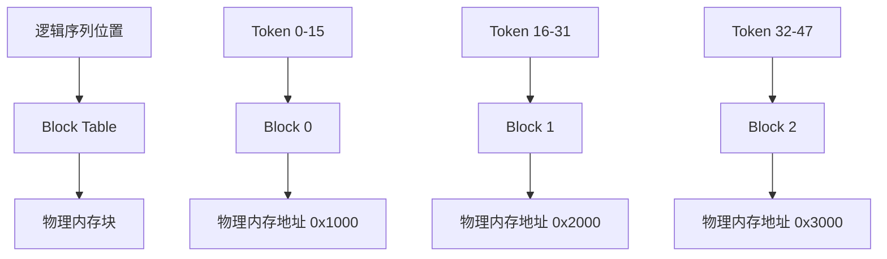

# 第三步：PagedAttention 机制与内存优化

## 🎯 学习目标

通过本步骤的学习，你将：

1. **深入理解 PagedAttention 的核心思想**：掌握如何通过分页机制解决 KV Cache 内存碎片问题
2. **学会 Block Table 的设计与实现**：理解虚拟内存到物理内存的映射机制
3. **掌握内存分配与回收策略**：学会高效的内存管理算法
4. **理解注意力计算的优化**：掌握如何在分块存储下进行高效的注意力计算

## 📚 理论背景

### 传统 KV Cache 的问题

在传统的 Transformer 推理中，KV Cache 存在严重的内存浪费问题：

```
传统方式：为每个序列预分配最大长度的连续内存

序列 A (实际长度: 100, 最大长度: 2048)
┌─────────────────────────────────────────────────────────────┐
│ 已使用 (100 tokens) │        浪费的空间 (1948 tokens)        │
└─────────────────────────────────────────────────────────────┘

序列 B (实际长度: 50, 最大长度: 2048)  
┌─────────────────────────────────────────────────────────────┐
│已使用(50)│           浪费的空间 (1998 tokens)                │
└─────────────────────────────────────────────────────────────┘

内存利用率 = (100 + 50) / (2048 * 2) ≈ 3.7%
```

### PagedAttention 的解决方案

PagedAttention 借鉴操作系统的虚拟内存管理思想，将 KV Cache 分割成固定大小的块（Block）：

```
PagedAttention 方式：按需分配固定大小的内存块

物理内存池：
┌─────┬─────┬─────┬─────┬─────┬─────┬─────┬─────┐
│Block│Block│Block│Block│Block│Block│Block│Block│
│  0  │  1  │  2  │  3  │  4  │  5  │  6  │  7  │
└─────┴─────┴─────┴─────┴─────┴─────┴─────┴─────┘

序列 A 的 Block Table: [0, 1, 2, 3, 4, 5, 6]  (7个块，112 tokens)
序列 B 的 Block Table: [7, 8, 9]              (3个块，48 tokens)

内存利用率 = (112 + 48) / (10 * 16) = 100%
```

### Block Table 映射机制



## 🔧 核心概念详解

### 1. Block 设计

每个 Block 存储固定数量的 token 的 KV Cache：

```python
@dataclass
class Block:
    block_id: int           # 块的唯一标识
    ref_count: int = 0      # 引用计数（用于共享）
    is_gpu: bool = True     # 是否在 GPU 上
    
    # 实际存储的 KV Cache 数据
    # Shape: [num_layers, 2, block_size, num_heads, head_dim]
    # 2 表示 Key 和 Value
    data: Optional[torch.Tensor] = None
```

### 2. Block Table

Block Table 是序列的"内存映射表"：

```python
class BlockTable:
    def __init__(self, seq_id: str, block_size: int):
        self.seq_id = seq_id
        self.block_size = block_size
        self.blocks: List[int] = []  # 物理块 ID 列表
    
    def get_physical_block_id(self, logical_token_idx: int) -> int:
        """根据逻辑 token 位置获取物理块 ID"""
        logical_block_idx = logical_token_idx // self.block_size
        return self.blocks[logical_block_idx]
    
    def get_block_offset(self, logical_token_idx: int) -> int:
        """获取 token 在块内的偏移"""
        return logical_token_idx % self.block_size
```

### 3. 内存分配器

```python
class BlockAllocator:
    def __init__(self, num_blocks: int, block_size: int):
        self.num_blocks = num_blocks
        self.block_size = block_size
        self.free_blocks = list(range(num_blocks))
        self.allocated_blocks = {}
        
    def allocate(self, num_blocks: int) -> List[int]:
        """分配指定数量的连续或非连续块"""
        if len(self.free_blocks) < num_blocks:
            raise OutOfMemoryError(f"内存不足：需要 {num_blocks}，可用 {len(self.free_blocks)}")
        
        allocated = []
        for _ in range(num_blocks):
            block_id = self.free_blocks.pop(0)
            allocated.append(block_id)
            self.allocated_blocks[block_id] = time.time()
        
        return allocated
```

### 4. 注意力计算适配

在分块存储下，注意力计算需要特殊处理：

```python
def paged_attention(
    query: torch.Tensor,           # [batch_size, seq_len, num_heads, head_dim]
    key_cache: torch.Tensor,       # [num_blocks, block_size, num_heads, head_dim]  
    value_cache: torch.Tensor,     # [num_blocks, block_size, num_heads, head_dim]
    block_tables: torch.Tensor,    # [batch_size, max_num_blocks_per_seq]
    context_lens: torch.Tensor,    # [batch_size]
    block_size: int,
    max_context_len: int
) -> torch.Tensor:
    """
    执行 PagedAttention 计算
    
    关键思想：
    1. 根据 block_tables 找到每个序列的物理内存块
    2. 按块读取 KV Cache 数据
    3. 执行标准的注意力计算
    4. 处理跨块的注意力权重
    """
    pass
```

## 💻 代码实现分析

### 内存分配流程

```python
def allocate_sequence_blocks(self, seq: Sequence) -> None:
    """为序列分配内存块"""
    
    # 1. 计算需要的块数量
    num_tokens = seq.get_len()
    num_blocks = (num_tokens + self.block_size - 1) // self.block_size
    
    print(f"🧮 序列 {seq.seq_id} 需要 {num_blocks} 个块 ({num_tokens} tokens)")
    
    # 2. 分配物理内存块
    try:
        physical_blocks = self.block_allocator.allocate(num_blocks)
        print(f"   ✅ 分配物理块：{physical_blocks}")
    except OutOfMemoryError as e:
        print(f"   ❌ 内存分配失败：{e}")
        # 尝试内存回收或交换
        self._try_memory_reclaim()
        physical_blocks = self.block_allocator.allocate(num_blocks)
    
    # 3. 创建 Block Table
    seq.block_table = BlockTable(seq.seq_id, self.block_size)
    seq.block_table.blocks = physical_blocks
    
    # 4. 初始化块数据
    self._initialize_blocks(physical_blocks, seq)
```

### 注意力计算优化

```python
def compute_paged_attention(self, 
                          query: torch.Tensor,
                          seq_groups: List[SequenceGroup]) -> torch.Tensor:
    """计算 PagedAttention"""
    
    batch_size = len(seq_groups)
    outputs = []
    
    for i, seq_group in enumerate(seq_groups):
        seq = seq_group.get_seqs()[0]  # 简化：假设每组只有一个序列
        
        # 1. 获取序列的 Block Table
        block_table = seq.block_table
        context_len = seq.get_len()
        
        print(f"🔍 处理序列 {seq.seq_id}：")
        print(f"   上下文长度：{context_len}")
        print(f"   使用块：{block_table.blocks}")
        
        # 2. 收集 KV Cache 数据
        keys, values = self._gather_kv_cache(block_table, context_len)
        
        # 3. 执行注意力计算
        # 这里简化为标准注意力，实际实现需要考虑块边界
        attention_output = self._compute_attention(
            query[i:i+1], keys, values
        )
        
        outputs.append(attention_output)
    
    return torch.cat(outputs, dim=0)

def _gather_kv_cache(self, block_table: BlockTable, context_len: int):
    """从分散的块中收集 KV Cache 数据"""
    
    keys = []
    values = []
    
    for block_idx, physical_block_id in enumerate(block_table.blocks):
        # 计算这个块中有效的 token 数量
        start_token = block_idx * self.block_size
        end_token = min(start_token + self.block_size, context_len)
        valid_tokens = end_token - start_token
        
        if valid_tokens <= 0:
            break
        
        # 从物理块中读取数据
        block_key = self.key_cache[physical_block_id][:valid_tokens]
        block_value = self.value_cache[physical_block_id][:valid_tokens]
        
        keys.append(block_key)
        values.append(block_value)
        
        print(f"   📦 块 {physical_block_id}: {valid_tokens} 个有效 tokens")
    
    # 拼接所有块的数据
    full_keys = torch.cat(keys, dim=0)
    full_values = torch.cat(values, dim=0)
    
    return full_keys, full_values
```

### 内存回收机制

```python
def free_sequence_blocks(self, seq: Sequence) -> None:
    """释放序列的内存块"""
    
    if not seq.block_table or not seq.block_table.blocks:
        return
    
    blocks_to_free = seq.block_table.blocks.copy()
    
    print(f"🗑️ 释放序列 {seq.seq_id} 的 {len(blocks_to_free)} 个块")
    
    # 1. 检查块的引用计数（用于 prefix sharing）
    for block_id in blocks_to_free:
        ref_count = self._get_block_ref_count(block_id)
        if ref_count > 1:
            # 块被其他序列共享，只减少引用计数
            self._decrease_ref_count(block_id)
            print(f"   📎 块 {block_id} 仍被共享，引用计数：{ref_count - 1}")
        else:
            # 块只被当前序列使用，可以释放
            self.block_allocator.free([block_id])
            print(f"   ✅ 释放块 {block_id}")
    
    # 2. 清空序列的 Block Table
    seq.block_table.blocks = []
    seq.block_table = None
```

## 🔍 关键优化技术

### 1. Copy-on-Write (COW)

对于共享前缀的序列，使用写时复制技术：

```python
def handle_sequence_fork(self, parent_seq: Sequence, child_seq: Sequence):
    """处理序列分叉（如 beam search）"""
    
    # 1. 子序列初始时共享父序列的所有块
    child_seq.block_table = copy.deepcopy(parent_seq.block_table)
    
    # 2. 增加所有共享块的引用计数
    for block_id in child_seq.block_table.blocks:
        self._increase_ref_count(block_id)
    
    print(f"🍴 序列分叉：{child_seq.seq_id} 共享 {parent_seq.seq_id} 的块")

def handle_sequence_write(self, seq: Sequence, new_token_pos: int):
    """处理序列写入（COW 触发点）"""
    
    block_idx = new_token_pos // self.block_size
    physical_block_id = seq.block_table.blocks[block_idx]
    
    # 检查是否需要 COW
    if self._get_block_ref_count(physical_block_id) > 1:
        # 需要复制块
        new_block_id = self._copy_block(physical_block_id)
        seq.block_table.blocks[block_idx] = new_block_id
        
        # 更新引用计数
        self._decrease_ref_count(physical_block_id)
        self._set_ref_count(new_block_id, 1)
        
        print(f"📝 COW 触发：复制块 {physical_block_id} -> {new_block_id}")
```

### 2. 内存交换

在 GPU 内存不足时，将不活跃的块交换到 CPU：

```python
def swap_blocks(self, blocks_to_swap_out: List[int], 
                blocks_to_swap_in: List[int]):
    """执行内存块交换"""
    
    # 1. 交换出 GPU
    for gpu_block_id in blocks_to_swap_out:
        cpu_block_id = self._allocate_cpu_block()
        
        # 复制数据从 GPU 到 CPU
        self.cpu_key_cache[cpu_block_id] = self.gpu_key_cache[gpu_block_id].cpu()
        self.cpu_value_cache[cpu_block_id] = self.gpu_value_cache[gpu_block_id].cpu()
        
        # 更新映射关系
        self.gpu_to_cpu_mapping[gpu_block_id] = cpu_block_id
        
        # 释放 GPU 块
        self.gpu_allocator.free([gpu_block_id])
        
        print(f"🔄 交换出：GPU 块 {gpu_block_id} -> CPU 块 {cpu_block_id}")
    
    # 2. 交换入 GPU  
    for cpu_block_id in blocks_to_swap_in:
        gpu_block_id = self.gpu_allocator.allocate(1)[0]
        
        # 复制数据从 CPU 到 GPU
        self.gpu_key_cache[gpu_block_id] = self.cpu_key_cache[cpu_block_id].cuda()
        self.gpu_value_cache[gpu_block_id] = self.cpu_value_cache[cpu_block_id].cuda()
        
        # 更新映射关系
        self.cpu_to_gpu_mapping[cpu_block_id] = gpu_block_id
        
        # 释放 CPU 块
        self.cpu_allocator.free([cpu_block_id])
        
        print(f"🔄 交换入：CPU 块 {cpu_block_id} -> GPU 块 {gpu_block_id}")
```

## 🧪 实践练习

### 练习 1：内存利用率对比

```python
def compare_memory_efficiency():
    """对比传统方式和 PagedAttention 的内存效率"""
    
    sequences = [
        ("seq_1", 100),   # 100 tokens
        ("seq_2", 50),    # 50 tokens  
        ("seq_3", 200),   # 200 tokens
    ]
    
    max_seq_len = 512
    block_size = 16
    
    # 传统方式
    traditional_memory = len(sequences) * max_seq_len
    
    # PagedAttention 方式
    paged_memory = 0
    for seq_id, actual_len in sequences:
        num_blocks = (actual_len + block_size - 1) // block_size
        paged_memory += num_blocks * block_size
    
    efficiency = (traditional_memory - paged_memory) / traditional_memory * 100
    
    print(f"📊 内存效率对比：")
    print(f"   传统方式：{traditional_memory} tokens")
    print(f"   PagedAttention：{paged_memory} tokens")
    print(f"   节省内存：{efficiency:.1f}%")
```

### 练习 2：Block Table 操作

```python
def test_block_table_operations():
    """测试 Block Table 的各种操作"""
    
    block_table = BlockTable("test_seq", block_size=16)
    block_table.blocks = [0, 1, 2, 3]  # 4个块，64 tokens
    
    # 测试逻辑到物理地址的映射
    test_cases = [0, 15, 16, 31, 32, 47, 63]
    
    for logical_pos in test_cases:
        try:
            physical_block = block_table.get_physical_block_id(logical_pos)
            offset = block_table.get_block_offset(logical_pos)
            print(f"Token {logical_pos}: 块 {physical_block}, 偏移 {offset}")
        except IndexError:
            print(f"Token {logical_pos}: 超出范围")
```

### 练习 3：注意力计算验证

```python
def verify_paged_attention():
    """验证 PagedAttention 计算的正确性"""
    
    # 创建测试数据
    seq_len = 48
    block_size = 16
    num_heads = 8
    head_dim = 64
    
    # 标准注意力计算
    query = torch.randn(1, 1, num_heads, head_dim)
    key = torch.randn(1, seq_len, num_heads, head_dim)
    value = torch.randn(1, seq_len, num_heads, head_dim)
    
    standard_output = torch.nn.functional.scaled_dot_product_attention(
        query, key, value
    )
    
    # PagedAttention 计算（模拟）
    # 将 KV 分块存储，然后重新组合计算
    num_blocks = (seq_len + block_size - 1) // block_size
    
    # 分块存储
    key_blocks = []
    value_blocks = []
    for i in range(num_blocks):
        start = i * block_size
        end = min(start + block_size, seq_len)
        key_blocks.append(key[:, start:end])
        value_blocks.append(value[:, start:end])
    
    # 重新组合
    reconstructed_key = torch.cat(key_blocks, dim=1)
    reconstructed_value = torch.cat(value_blocks, dim=1)
    
    paged_output = torch.nn.functional.scaled_dot_product_attention(
        query, reconstructed_key, reconstructed_value
    )
    
    # 验证结果一致性
    diff = torch.abs(standard_output - paged_output).max().item()
    print(f"🔍 计算差异：{diff:.10f}")
    print(f"✅ 结果{'一致' if diff < 1e-6 else '不一致'}")
```

## ❓ 常见问题与解决方案

### Q1: Block 大小如何选择？

**考虑因素**：
- **太小**：管理开销大，Block Table 占用内存多
- **太大**：内存碎片多，浪费严重

**推荐策略**：
```python
def recommend_block_size(model_config):
    """推荐 Block 大小"""
    
    # 基于模型参数和硬件特性
    if model_config.hidden_size <= 1024:
        return 16  # 小模型
    elif model_config.hidden_size <= 4096:
        return 32  # 中等模型
    else:
        return 64  # 大模型
```

### Q2: 内存碎片如何处理？

**解决方案**：
```python
def defragment_memory(self):
    """内存碎片整理"""
    
    # 1. 找到碎片化的序列
    fragmented_seqs = self._find_fragmented_sequences()
    
    # 2. 重新分配连续内存
    for seq in fragmented_seqs:
        old_blocks = seq.block_table.blocks
        new_blocks = self._allocate_contiguous_blocks(len(old_blocks))
        
        # 3. 复制数据
        self._copy_blocks(old_blocks, new_blocks)
        
        # 4. 更新 Block Table
        seq.block_table.blocks = new_blocks
        
        # 5. 释放旧块
        self.block_allocator.free(old_blocks)
```

### Q3: 跨块注意力计算的边界处理？

**关键点**：
```python
def handle_cross_block_attention(self, query_pos: int, context_len: int):
    """处理跨块的注意力计算"""
    
    # 1. 确定查询位置所在的块
    query_block = query_pos // self.block_size
    
    # 2. 计算需要访问的所有块
    context_blocks = list(range((context_len + self.block_size - 1) // self.block_size))
    
    # 3. 处理块边界的注意力权重
    attention_weights = []
    for block_id in context_blocks:
        block_start = block_id * self.block_size
        block_end = min(block_start + self.block_size, context_len)
        
        # 计算这个块内的注意力权重
        block_weights = self._compute_block_attention(
            query_pos, block_start, block_end
        )
        attention_weights.append(block_weights)
    
    return torch.cat(attention_weights, dim=-1)
```

## 📈 性能基准测试

运行 `main.py` 时，关注以下性能指标：

- **内存利用率**：实际使用内存 / 分配内存
- **分配延迟**：内存分配的平均耗时
- **访问延迟**：KV Cache 访问的平均耗时
- **碎片率**：碎片内存 / 总内存

## ✅ 学习检查点

完成本步骤后，你应该能够：

- [ ] 解释 PagedAttention 解决的核心问题
- [ ] 理解 Block Table 的映射机制
- [ ] 实现基本的内存分配和回收算法
- [ ] 理解 COW 和内存交换的优化策略
- [ ] 分析不同 Block 大小对性能的影响
- [ ] 处理跨块注意力计算的边界情况

## 💭 思考题

### 基础理解
1. **内存碎片**：PagedAttention 如何解决传统 KV Cache 的内存碎片问题？与操作系统的虚拟内存有什么相似之处？

2. **Block 大小选择**：Block 大小对内存利用率和计算效率有什么影响？如何选择最优的 Block 大小？

3. **映射机制**：Block Table 的映射机制是如何工作的？为什么需要逻辑块和物理块的分离？

### 深入分析
4. **COW 优化**：Copy-on-Write 机制在什么场景下最有效？如何实现高效的 COW 策略？

5. **内存交换**：CPU-GPU 内存交换的开销如何？什么时候应该触发内存交换？

6. **并发访问**：多个序列同时访问 KV Cache 时，如何保证数据一致性和访问效率？

### 实践应用
7. **性能优化**：如果发现 PagedAttention 的内存利用率仍然不理想，可能的原因和优化方案有哪些？

8. **故障处理**：如果某个物理块出现错误，如何实现故障隔离和数据恢复？

9. **扩展设计**：如何将 PagedAttention 扩展到多 GPU 环境？需要考虑哪些额外的挑战？

### 算法设计
10. **分配策略**：除了简单的顺序分配，还有哪些更智能的块分配策略？

11. **预取机制**：如何设计预取策略来减少内存访问延迟？

12. **压缩存储**：是否可以对 KV Cache 进行压缩存储？会带来什么权衡？

## 🔗 相关资源

- [PagedAttention 论文](https://arxiv.org/abs/2309.06180)
- [vLLM 官方文档 - PagedAttention](https://docs.vllm.ai/en/latest/dev/kernel/paged_attention.html)
- [操作系统虚拟内存管理](https://en.wikipedia.org/wiki/Virtual_memory)

## 🚀 下一步

完成本步骤后，继续学习：
- **第四步**：[调度器优化与批处理策略](../04-scheduler/)
- 深入理解 Continuous Batching
- 学习请求优先级和公平性调度

---

💡 **学习提示**：PagedAttention 是 vLLM 的核心创新，理解其设计思想对掌握现代 LLM 推理系统至关重要。建议通过实际代码验证理论概念。